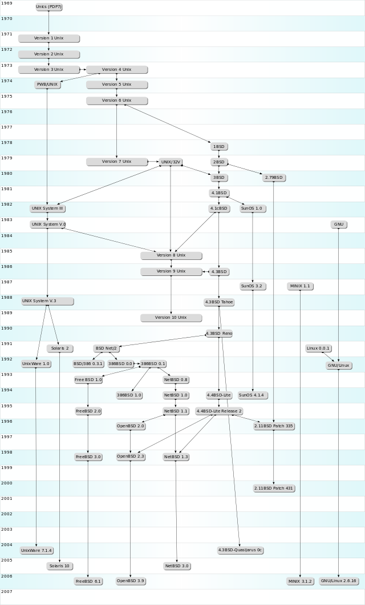

本文共2000余字，预计阅读时间8分钟，本文同步发布于知乎（账号silaoA）和微信公众号平台。
关注学习了解更多的Cygwin、Linux技术。

本博以系列文章来介绍Cygwin，想来首先讲讲发展史，对一个软件项目基因认识更深刻。

<!--more-->
<!-- [toc] -->

# 0x00 割据时代
从UNIX时代说起吧。1969年，AT&T公司旗下的贝尔实验室的天才们Ken Thompson、Dennis Ritchie和Douglas McIlroy开发了UNIX操作系统。AT&T公司一时不知道怎么用这玩意儿赚钱，初期完全是纯出于兴趣做开发，并在研究机构和大学中流传，但看到其他公司能利用其赚取利润之后，AT&T公司嗅到到商机，在70年代后开始采用法律手段保护它，禁止将UNIX源码授权给大学等学术机构使用。但此时已有多个UNIX的变种版本并被厂商采用，最流行的就是加州伯克利分校的BSD(Berkeley Software Distribution，目前在此基础上又有FreeBSD、OpenBSD、NetBSD等新的很多分支版本)，于是就有了商业公司之间的版权诉讼，UNIX版权也在多个公司间易主，在此按下不表。**各种商业并购之后，UNIX商标权现归国际开放标准组织（The Open Group）所拥有。**

各UNIX版本继续各自发展，呈现的差异越来越大，以至于相同的源代码在这版UNIX变种上正常编译运行、却在那版UNIX变种上出现错误甚至无法编译成功，即呈现出了“多种UNIX系统”割据的局面。

有个叫IEEE的组织实在看不下去了，大家各立山头是要割据的节奏，不利于UNIX软件系统的发展，于是在1985年牵头设立一个标准，叫“可移植操作系统接口”(Portable Operating System Interface，POSIX，后面的X是为了表明其对UNIX API的传承)。其目的简要说是这样：无论怎么折腾，至少保证软件系统接口规范的一致性，从而保障程序代码的兼容性。这件事情大家自然喜闻乐见，软件厂商也少了很多头疼的事。各UNIX系统厂商即使想割据，但为了兼容性以占有更大市场，也纷纷愿意加入对POSIX的支持。

# 0x01 开源英雄
一个叫Richard Matthew Stallman的大胡子美国大叔对UNIX系统封闭源码很不满意，于1984年发起了GNU计划(GNU is Not Unix，首字母递归缩写)，计划开发一个完全兼容UNIX的自由软件系统，为此专门成立了自由软件基金会(Free Software Foundation，FSF)。

FSF打算是搞成一个GNU/Hurd操作系统，其中Hurd是用来取代UNIX内核的新系统内核，GNU代表用户软件，大致是这样一个意思，表述不严谨，勿怪。FSF开发出了很多极其优秀的软件，名字和UNIX下的都相似甚至相同，从而保持软件一致性、降低用户学习成本，尤其是shell、Emacs文本编辑器、gcc编译套件、各种开发库等更让很多程序员爱不释手。但这个Hurd内核却进展缓慢，直到GNU软件完成计划的90%以上，Hurd还是没什么起色。但Hurd到今天仍然在顽强地或者，2016年12月18日发布了v0.9版本。

RMS大神宣扬的“自由软件”理念赢得了很多追随者，被视作精神领袖，大神本人也是FSF领导者。

# 0x02 天才小子
1991年，一个叫Linus Torvalds的芬兰小伙子在鼓捣他老师的Minix系统(UNIX的变种版本，一般仅用在计算机教学中)之余，对其禁止用于商业目的很不满，决定要自己写成一个操作系统并允许在i386的机器上运行。这位天才hacker把自己的成果公布在互联网上，并逐渐吸引了世界范围内众多开发者的加入，使之不断完善，大家伙一商量，就按照Linus Torvalds的名字叫它“Linux”吧。

Linux本身只是个操作系统的内核，支持POSIX标准，是一个UNIX-like系统内核，但完完全全是从零开始重写的代码，最重要的，它还是完全开源的自由软件。

这边FSF一看自己的Hurd还不知道什么时候能用呢，那边Linus Torvalds觉着GNU软件不赖，重新造轮子也累，于是众多厂商、机构、社区纷纷把GNU软件和Linux内核(以及其他的一些软件包)整合在一起组成一个完整的操作系统**发行版**，FSF表示没什么意见，只是坚持要求全称应该叫“GNU/Linux”，光叫Linux就把GNU的成果完全忽略掉了。

GNU/Linux的诞生和发展，是一件足以影响计算机行业发展史的大事。

# 0x03 帝国之踵
微软帝国靠着Windows发家致富，操作系统市场形成UNIX、GNU/Linux、Windows的主流格局，微软帝国自己声称Windows“部分支持POSIX”。

GNU那一票优秀的软件，尤其是开发工具，大家(主要是程序员)都期盼在Windows系统上也能用上，因为**Windows平台少有与此匹敌的优秀工具(谁用谁知道)**。UNIX和Linux像是近亲，但Windows就完全不同了，GNU那一票软件的源码在Windows下是无法直接编译的，二进制可执行文件复制到Windows下Windows更表示不认识。但是微软帝国就是这么牛气，什么标准不标准，俺们微软的标准才是标准。

实际上微软也曾在Windows上造一个UNIX子系统出来，但由于种种原因没什么影响力。虽然Windows占据几乎100%桌面操作系统市场，深的普通用户欢心，但Windows对POSIX API支持的匮乏，像是阿喀琉斯之踵。

# 0x04 优势互补
事情有所转机。1995年，一家叫做“Cygnus Solutions”的公司正是打算努力做这件事——把符合POSIX标准的程序搬到Windows上运行，这个项目叫做“Cygwin”。RedHat公司(小红帽)后来收购了Cygnus Solutions并继续Cygwin的开发，2018年RedHat被IBM收购，此是后话。

自此看出，**Cygwin的目标是在Windows中构建一个类似UNIX的软件环境，以方便把符合POSIX标准的软件移植到Windows下**。当我们需要享受GNU那些个杀手级工具的便捷高效却犯不着安装一个GNU/Linux系统时，Cygwin是不错的选择。与此相似的项目有Interix、MKS Toolkit、DJGPP(DOS下)、Xming、UnxUtils、GNUWin32、GNUWin II、MinGW、NuTCracker、OpenNT等，但无疑Cygwin表现出色且广为接受，并且有开源免费版本(言外之意是，还有商业许可证的收费版)。

所谓“寸有所长，尺有所短”，Windows图形界面傻瓜式的操作同样吸引着广大用户，其超高的桌面市场份额就是证明，而Cygwin把UNIX环境带到Windows中来，让一票命令行工具焕发生机。
图形界面与命令行，实现优势互补，相得益彰。

# 参考
- <http://baike.baidu.com/view/8095.htm?fr=aladdin>
- <http://zh.wikipedia.org/zh-cn/Unix>
- <http://zh.wikipedia.org/wiki/POSIX>
- <http://zh.wikipedia.org/zh-cn/GNU>
- <http://en.wikipedia.org/wiki/Cygwin>

---
**如本文对你有帮助，或内容引起极度舒适，欢迎分享转发或点击下方捐赠按钮打赏** ^_^