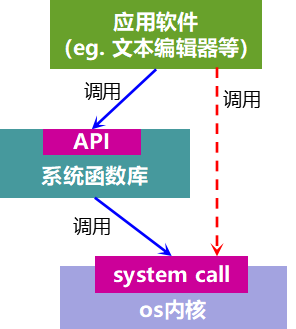
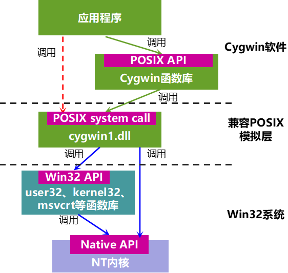

本文共2600余字，预计阅读时间11分钟，本文同步发布于知乎（账号silaoA）和微信公众号平台（账号伪码人）。
关注学习了解更多的Cygwin、Linux技术。

先一句话回答标题：Cygwin是一个可原生运行于Windows系统上的POSXI兼容环境。

<!--more-->
<!-- [toc] -->
# 0x00 前言：从软件角度理解系统
计算机世界里存在各种各样的操作系统，目前通用操作系统有主流的三大类：
- UNIX，通用操作系统鼻祖，发展出特别多衍生系统；
- Windows，微软家根基，桌面市场霸主；
- GNU/Linux，UNIX近亲，有各种发行版如Ubuntu、CentOS等。

这些系统有各自的内核，出于系统稳定性考虑是不允许用户程序直接操作内核，同时也将内核开发和应用软件开发隔离开来，系统将必要的函数封装成库供应用软件调用，约定的规范即为应用软件接口(Application Program Interface，API)。

API函数库是连接用户软件和系统内核桥梁，或者是“协议”，操作系统厂商写好函数库说明书，应用软件开发者不必关心其内部是如何实现的，用的时候对照着API手册查询就够了；应用软件也可以越过系统函数库通过system call（系统调用）直接调用os内核函数，如图中红色虚线所示，当然这种方式并不被推荐。

如果各系统平台都能提供相同的系统函数库，那么开发者在这个系统函数库基础之上编写软件代码，那么就很容易将软件移植到各个系统平台。**然而，这只是个美好的愿望**，IEEE就是为了达成这样的愿望才牵头制定POSIX标准。POSIX标准主要就是针对[UNIX API](http://www.unix.org/apis.html)而制订，**不管函数如何包装、功能如何实现，但API按照标准约定来（比如函数变量等符号名称、数据结构、参数类型与个数、基本工具命令名称等）**，Linux完全兼容POSIX标准（部分函数符合POSIX，部分函数是Linux专有，即是POSIX的超集），微软声称Windows部分兼容POSIX标准。

主流os内核通常是C语言写成，系统函数库通常以一个或多个链接库文件的形式提供，`其中最重要的是C标准库`，其他的链接库往往调用C标准库而实现，当然也可能直接调用系统内核函数，甚至混合。不同系统平台有多种主流的C标准库共存：
- [BSD libc](https://en.wikipedia.org/wiki/BSD_libc)，由BSD系统发布；
- [GNU C Library (glibc)](https://en.wikipedia.org/wiki/GNU_C_Library)，由GNU项目发布，可在Linux、多种UNIX系统上运行；
- [Microsoft C run-time library(MSVCRT.DLL)](https://en.wikipedia.org/wiki/Windows_library_files#MSVCRT.DLL,_MSVCP*.DLL_and_CRTDLL.DLL)，由微软随Windows发布，给Visual C++编辑器链接使用的；
- **[Newlib](https://en.wikipedia.org/wiki/Windows_library_files#MSVCRT.DLL,_MSVCP*.DLL_and_CRTDLL.DLL)，由Cygnus Solution公司开发，Cygwin环境中的libc.a正是此版本，目前广泛用在嵌入式系统中**；
- [dietlibc](https://en.wikipedia.org/wiki/Dietlibc)、[μClibc](https://en.wikipedia.org/wiki/UClibc)等，功能经过适度裁剪的C标准库，主要用在嵌入式系统。

# 0x01 Cygwin的组成
先辈David Wheeler大神曾经曰过：
>All problems in computer science can be solved by another level of indirection（计算机科学领域的任何问题都可以通过增加一个间接的中间层来解决）。

就如同上图，在硬件基础之上逐步堆叠了系统内核、系统函数库等中间层，在应用程序内部还可以继续细分多个层次，这样把最终用户与硬件隔离开来，增强了抽象能力、屏蔽底层细节，也让开发者分工，专注于各自层次的开发，同时降低了软件迁移的难度。

Cygwin就是在Windows中增加了一个中间层——兼容POSIX的模拟层，并在此基础上构建了大量Linux-like的软件工具。再来解释本文开头的回答，如下图，POSXI兼容环境包括以下两部分：
- cygwin1.dll，作为实现POSIX系统调用的模拟层，可原生运行在Windows中；
- 在cygwin1.dll之上构建的大量函数库、应用程序，如`libc`、`zlib`、`bash`、`gcc`、`vim`、`awk`、`sed`、`git`等等，与UNIX/Linux几乎等同\*。

\***注：Cygwin的libc是Newlib，Linux的libc是GNU libc，UNIX有的是BSD libc。**

Cygwin API首先尽可能地遵从[Single Unix Specification V3（2004版）](http://pubs.opengroup.org/onlinepubs/009695399/nfindex.html)，这个标准内容同时也是POSIX.1和IEEE Std 1003.1的标准内容，由Open Group和IEEE共同制定，最新已更新到V4（2018版），其次再尽可能地遵从Linux最佳实践。Cygwin API中还有些是Cygwin独有的，在POSIX中并未涉及。

Cygwin将`cygwin1.dll`、函数库、应用程序等文件按照UNIX/Linux的目录树架构进行组织存放，如`/bin`、`/usr`、`/lib`、`/etc`、`/var`、`/home`等等都存在于Cygwin安装路径下，用户从终端登陆进Cygwin的shell后，就可以像在UNIX/Linux系统那样使用相同的命令、工具，随着开发工作推进，越来越多的GNU、UNIX、Linux软件都移植到了Cygwin中。不仅如此，甚至像X Server、Gnome/KDE桌面环境等都移植到了Cygwin中，UNIX/Linux系统中的图形界面软件也能使用。

# 0x02 Cygwin的优点
- 首先自然是近乎一致的UNIX/Linux体验；
- 完备且相对轻量，普通用户不必安装整个Linux系统或虚拟机，就可以获得近乎一致的体验，Cygwin的程序运行与Windows互不干扰，高效的命令行工具与Windows图形界面各有所长、形成互补；
- 开源免费，cygwin1.dll本身是按照GPLv3协议发布的，其他的应用程序有GPL、LGPL、X11等多种协议；
- 安装卸载方便，Cygwin提供了包管理工具，可按需安装/卸载软件包，一个能运行起来的最小Cygwin系统只需要几十上百MB，而完全的Cygwin系统需要几十GB；
- 源码级兼容性，GNU、UNIX、Linux软件的源代码几乎不用修改就可以在Cygwin环境中编译构建成功；
- 与Windows互操作，Cygwin把Windows的磁盘挂载到/cygdrive下，如c盘就是`/cygdrive/c`、d盘就是`/cygdrive/d`，Cygwin中的应用程序可以读写Windows磁盘中的文件，Windows应用程序也可以读写Cygwin目录中的文件（但要注意不要把文件搞乱了）；Cygwin的shell中可以启动Windows程序，Windows的cmd中也可以启动Cygwin的程序，但由于字符编码不同可能造成乱码；
- 多一套可用的API，对于Windows开发者，程序代码既可以调用Win32 API，又可以调用Cygwin API，甚至混合。

# 0x03 Cygwin的不足
- 效率相对低，由于是在Win32系统之上模拟实现POSIX兼容层，应用程序在底层就多了一个层级的函数调用，效率比UNIX/Linux系统上原生的应用程序肯定低，不过这也是在效率和兼容性之间选择的一个平衡；
- 未实现二进制文件级别的兼容，Cygwin系统上的应用程序编译后仍然是Windows PE格式的可执行文件，**UNIX/Linux系统上的二进制可执行文件在Cygwin上不能运行**。
- 与Windows互操作不足，Windows原生程序并不能利用cygwin1.dll提供的与UNIX/Linux兼容的信号、pty设备等，除非改写程序代码重新编译，但这样新的程序就依赖于cygwin1.dll，就不是 **“Windows原生程序”**了。

# 0x04 Cygwin常见应用场景
Cygwin可资利用的是已经移植的大量GNU、UNIX、Linux软件和兼容POSIX的模拟层，其使用场合也就是针对这两点。

常见的应用场合包括但不限于：

**(1)Shell命令行使用**
Shell是UNIX/Linux的精华所在，骨灰级玩家可以做到不用鼠标只敲命令完成所有工作，用户最常用的大量命令在Cygwin下均可照常使用，在UNIX/Linux编写的脚本也可以几乎不加修改地在Cygwin下运行。例如安卓厨房本是在Linux-like环境下运行的脚本集合，用于修改安卓系统固件包，有了Cygwin，Windows用户也可以拿来修改安卓系统固件包。高效的命令行工具与Windows图形界面各有所长、形成互补。

**(2)交叉编译构建环境搭建**
Cygwin环境中已移植好了gcc等开发工具，大量的交叉工具链（如arm-none-gnu-eabi-gcc、arm-none-gnu-eabi-binutils）也可以在Cygwin中制作，就算只有Windows原生版本的，Cygwin shell中也能调用，那么利用Cygwin就能搭建起交叉编译构建环境；另外，使用Cygwin API，编写代码以及后续编译构建过程，与在UNIX/Linux中差异也很小了。

**(3)程序移植**
把符合POSIX标准的程序移植到Windows下，还有更多正在由个人、社区、商业公司、研究机构不断贡献的开源自由软件，造福广大Windows用户，利用已有的GNU、UNIX、Linux软件会使程序移植越来越容易。这一点不多说。

**(4)兼用POSIX API和Win32 API开发**
有的开发者可能对UNIX/Linux和Win32的API都熟悉，两套API也各有其优点，在Cygwin下开发者自己可以任意选取、混合使用。

# 参考
- <http://zh.wikipedia.org/zh-cn/Unix>
- <http://zh.wikipedia.org/wiki/POSIX>
- <http://en.wikipedia.org/wiki/Cygwin>
- <http://www.cygwin.com>
- <https://en.wikipedia.org/wiki/Linux_kernel_interfaces>
- <https://en.wikipedia.org/wiki/C_standard_library>
- <http://www.unix.org/apis.html>
  
---
**如本文对你有帮助，或内容引起极度舒适，欢迎分享转发或点击下方捐赠按钮打赏** ^_^