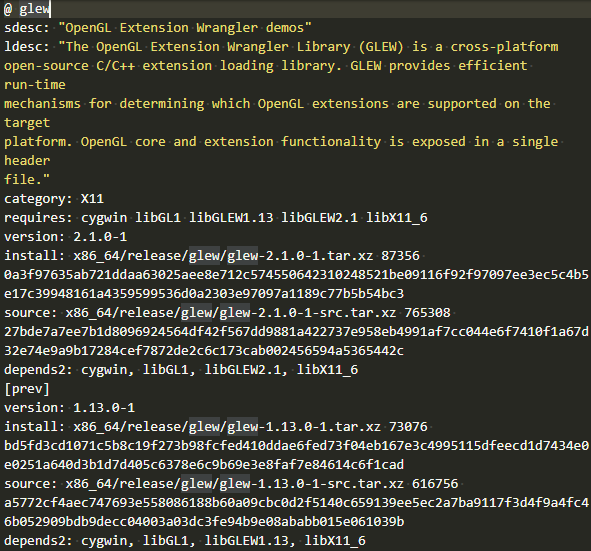
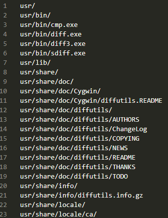

本文共2800余字，预计阅读时间10分钟，本文同步发布于知乎（账号silaoA）和微信公众号平台（账号伪码人）。
关注学习了解更多的Cygwin、Linux技术。

前文 [Cygwin系列（四）：一步一步搭建Cygwin最小系统](/2019/2019-03-06-Cygwin系列（四）：一步一步搭建Cygwin最小系统.html)中简单介绍了软件包的概念，记录了使用`setup`安装最小系统环境的全过程，本文就着`setup`继续讨论几个软件仓库、软件包相关配置文件，并介绍一个Cygwin包管理相关的实用工具——`cygcheck`。

<!--more-->
<!-- [toc] -->

# 0x00 软件仓库
在大众更熟悉的Windows系统上，安装软件过程就是到网上找到文件下载链接，Down下来双击运行，然后就是傻瓜式地点击“下一步”直到完成，就差不多了。这个点击下一步到底做了些什么呢？通常有文件程序自解压、选定安装组件和安装路径（个别不让选择路径）、添加注册表项等等，完成以后双击启动运行，卸载时找安装路径下的uninstall或者控制面板里卸载。还有更简单的，直接以压缩包或者不压缩的exe文件形式提供，双击就直接启动运行，不需安装，这种通常称为“绿色软件”。以exe文件形式提供的软件是Windows特色的软件包组织方式。这种方式下，软件**分散**各处，用户通常要满世界去找下载链接，可能是软件商官网，也可能是各种盗版站点。

UNIX、GNU/Linux等则与此不同。
- 软件包组织方式上，是将可执行程序、程序库、手册页等多种类型文件打包压缩提供，内容上一般分为预先编译好的二进制包和程序源码包两种；
- 软件包管理方式上，不同开发者开发的软件，被打包**集中统一**存放在官方维护的**软件仓库**中，这个**软件仓库**就是一个**软件源**，和iOS/Android系统上的AppStore/应用市场等概念很像，Windows也开始使用“Windows Store”；除此外，第三方在遵守相关协议的前提下**镜像**（mirror）官方**软件仓库**成为**镜像源**，系统提供专门的**软件包管理器**用于从**软件源**下载、安装和卸载软件包。

**软件源**集中统一存放软件包，一方面避免用户满世界乱跑找下载链接的麻烦，另一方面官方可以对软件包的安全性做进一步审核，发现漏洞或恶意代码后通过及时更新，及时限制恶意软件对用户系统的破坏。

# 0x01 Cygwin软件源的目录架构
Cygwin官网页面<https://cygwin.com/mirrors.html>列出了世界各地提供的镜像源站点，中国大陆地区也有很多公司、大学提供Cygwin镜像源。镜像源不定期通过同步操作保持与官方软件源更新，仅有稍许时间延迟，内容与官方软件源一致。

**Cygwin的软件包仅支持x86（32位）和x86_64（64位）两种指令集架构**，在软件源路径下就有x86、x86_64两个子目录分别存放软件包，还有少量软件包与指令集架构无关，放在noarch子目录中。x86、x86_64和noarch子目录，各自含有release子目录，release子目录下再放不同的软件包目录。Cygwin软件源的目录架构大致如下图。
```
<Cygwin_Mirror_Root>
├── md5.sum
├── sha512.sum
├── noarch/
│   └── release/
│       ├── packageA_dir/
│       ├── packageB_dir/
│       └── ...
├── x86/
│   ├── release/
│   │   ├── packageX_dir/
│   │   ├── packageY_dir/
│   │   └── ...
│   └── setup.ini
└── x86_64/
    ├── release/
    │   ├── packageX_dir/
    │   ├── packageY_dir/ 
    │   └── ...
    └── setup.ini
```

# 0x02 Cygwin软件包相关配置文件
## setup.ini
注意到Cygwin软件源站点x86和x86_64子目录下，各含有一个`setup.ini`文件，它可以看作是软件源中所含**软件包清单**，起到索引（index）作用。`setup.ini`本身是文本文件，包括header和package两节，package节按序依次记录各软件包的名称、描述、类别、版本、依赖、二进制和源码文件存放路径等相关信息，网页<https://sourceware.org/cygwin-apps/setup.ini.html>给出了文件格式的详细内容。


如上图中随机截取了package节glew软件包的记录：
- @字段后面跟随的是软件包名称，glew；
- sdesc和ldesc字段是对glew包的短描述（short description）和长描述（long description），这也是在`setup`界面中Description栏展示的文字内容；
- category字段是该软件包被划分的类别，，这也是在`setup`界面中Categories栏列出的类别，glew属于X11；
- requires字段列出该软件包的依赖；
- install字段给出该软件包二进制文件的存放路径、大小（字节）、md5值；
- source字段给出该软件包源码文件的存放路径、大小（字节）、md5值；
- depends2意义同requires，但更复杂；
- prev小节，如果软件源中保留了该软件包旧的历史版本，就有prev小节，字段含义同上。

可以看出，**setup.ini文件记录了软件仓库中所有的软件包及其依赖关系**。随着软件源中软件包的增减和版本更新，`setup.ini`文件随之更新，使用`setup`时选定镜像源站点后，`setup`便先更新`setup.ini`文件至本地。

## setup.rc
GNU/Linux发行版常用的**软件包管理器**包括`apt`、`yum`、`pacman`、`dnf`等，Cygwin官方提供的**软件包管理器**就是`setup`，[Cygwin系列（四）：一步一步搭建Cygwin最小系统](/2019/2019-03-06-Cygwin系列（四）：一步一步搭建Cygwin最小系统.html)中已介绍过用法。

`setup`的默认行为受配置文件控制，这个配置文件便是`setup.rc`，位于`/etc/setup/`路径下。`setup.rc`是纯文本文件，存储了若干字段和值，较为关键的有：
- last-cache字段，记录最近一次选定的软件包保存路径，即镜像站点缓存路径；
- last-mirror字段，记录最近一次选定的镜像站点地址；
- mirrors-lst字段，记录可供选择的镜像站点列表，也就是`setup`运行时“选择站点”界面展示的内容；
- net-method字段，记录连接类型，直连或者代理，也就是`setup`运行时“选择连接类型”界面展示的内容。

除了`setup`，其他程序也用到了`setup.rc`文件，将在后续文章说明。

## installed.db
在`/etc/setup/`路径下可看到还有个`installed.db`，从文件名称推测是个**记录已安装软件包的数据库**。`installed.db`确确实实起到了这个作用，不过文件格式是纯文本，每行一个条目记录已安装的软件包及版本。`setup`在安装软件包后，会在这里插入相应的记录，下次再安装时如发现已有记录便不会重复下载安装。

## <package.lst.gz>
在`/etc/setup/`路径下，还有大量形如`package.lst.gz`的文件，随机找一个，用`gunzip`解压得到形如`package.lst`的纯文本文件，以`diffutils.lst`为例，如下图，可以看出该文件其实是记录`diffutils`**软件包的文件清单**，也就是说该软件包安装后会在本地安装这些文件，不仅包含`/usr/bin/`目录下的二进制程序文件，还包括`usr/share/`目录下的man、info手册页等文档。


# 0x03 包管理实用工具——cygcheck
`setup.ini`、`installed.db`等文件虽然记录了软件包的相关信息，但要查看并不很方便，cygwin官方提供了一个实用工具命令`cygcheck`查找并展示这些信息。老规矩，`cygcheck --help`查看用法，此处不再列出，仅介绍几个常见的。

- `cygcheck -c [PACKAGE]`，检查（check）软件包安装完整性，如未指定PACKAGE参数，则检查系统中已安装的所有软件包；若检查出某个软件包“Incomplete”，则应重新安装。
- `cygcheck -f FILE [FILE]...`，查找（find）文件所属的软件包，如`cygcheck -f /usr/bin/cygcheck.exe`可以看出`cygcheck.exe`属于`cygwin-3.0.1-1`包。这个功能对于查找某个头文件、库文件所属软件包比较有用，比如用户A在构建程序过程中遇到报错“xx符号未定义的引用”，极有可能就是缺少某个开发库，但要安装开发库首先得查出它属于哪个包，这时可在另一个用户B的系统里通过`grep`查找xx符号所在的头文件，再通过`cygcheck -f`找到该文件所属的包，指导用户A安装。
- `cygcheck -l [PACKAGE]...`，列出（list）软件包内的文件清单，即上文`package.lst`的文件内容，如未指定PACKAGE参数，则列出系统中已安装的所有软件包的文件清单；
- `cygcheck -p REGEXP`，查询（package-query）软件包名称，在记不清软件包确切名称（通常带版本号）情况下，该命令搜索整个镜像站点查找匹配表达式的所有软件包名称。
- `cygcheck [-v] PROGRAM`，该命令与软件包管理管理较小，但作用很大，层次化展示某个程序依赖的库文件，有助于程序打包发布，脱离Cygwin使用；加上`-v`选项，输出结果更详细。该命令比`ldd`更直观，可以取代`ldd`，示例如下。
```bash
$ cygcheck.exe /bin/ls
D:\Cygwin64\bin\ls.exe
  D:\Cygwin64\bin\cygwin1.dll
    C:\Windows\system32\KERNEL32.dll
      C:\Windows\system32\ntdll.dll
      C:\Windows\system32\KERNELBASE.dll
  D:\Cygwin64\bin\cygintl-8.dll
    D:\Cygwin64\bin\cygiconv-2.dll
```

---
**如本文对你有帮助，或内容引起极度舒适，欢迎分享转发或点击下方捐赠按钮打赏** ^_^