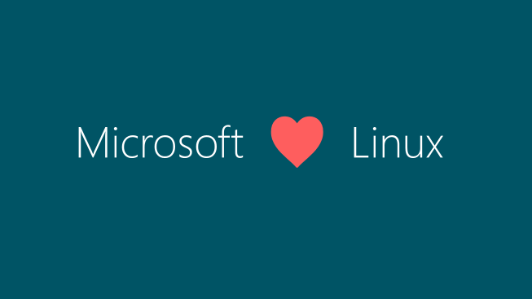

本文共3700余字，预计阅读时间12分钟，本文同步发布于知乎（账号silaoA）和微信公众号平台（账号伪码人）。
关注学习了解更多的Cygwin、Linux技术。

本篇接上篇[Cygwin系列（二）：初窥Cygwin背后](2019-02-21-Cygwin系列（二）：初窥Cygwin背后.html)介绍Cygwin背后实现的思路。

<!--more-->
<!-- [toc] -->
鉴于UNIX/Linux与Windows之间巨大的差异性，要想让UNIX/Linux的应用程序运行在Windows上，或者相反地在UNIX/Linux系统上运行Windows程序，都是在想尽办法弥补这个差异。再次祭出David Wheeler大神的名言：
>All problems in computer science can be solved by another level of indirection（计算机科学领域的任何问题都可以通过增加一个间接的中间层来解决）。

不同项目所做的工作也就是制造“一个间接的中间层”做桥梁，只是用到的原材料、技术手段不一，**使用虚拟化技术的本文忽略**。

# 0x00 与Cygwin相似的
## POSIX subsystem、SFU、WSL
把UNIX/Linux程序移植到Windows上来扩大Windows的软件生态圈，这事儿微软也很早就考虑过。

早在1993年，比Cygwin项目还早2年的时候，Windows NT发布第一个版本时就搭载了`Microsoft POSIX subsystem`，与`Win32子系统`、`OS/2子系统`和`安全子系统`并为4大基本子系统。`Microsoft POSIX subsystem`支持POSIX.1标准，使用`psxss.exe`和`psxdll.dll`两个文件作中间层，模拟POSIX环境，但是这个子系统**不提供和用户交互的部分**，比如`ls`这样的命令是没有的，真是bug到没朋友。

一个名叫“[PTC Inc.](https://www.ptc.com)”的计算机软件公司搞出来[MKS Toolkit](https://www.mkssoftware.com)，将很多UNIX/Linux程序移植到了Windows上，起先是为MS DOS准备的，后来支持了Windows NT，是商业软件，到现在一直都有更新。微软就是用`MKS Toolkit`在Windows NT上又造出来一个子系统———`SFU（Windows Service For UNIX）`取代了上述`POSIX subsystem`，于1999年发布了SFU 1.0、2000年发布了SFU 2.0，从3.0起SFU内部换成了`Interix`，这是微软收编的一家公司的产品，微软将其改名为`Subsystem for UNIX-based Applications (SUA)`。**顺带吐槽下微软，真是热衷改名，素有“改名部”之称，专门负责给各种产品重命名。**最终SFU在2004年发布3.5版后就逐渐淡出视线了。反正由于诸多问题，SFU的用户可能还没Cygwin的多。

但是，微软岂是等闲辈？2016年，微软在Windows 10周年更新中，引入了新的子系统`WSL（Windows Subsystem for Linux）`，刚出来的时候叫`“Bash on Ubuntu on Windows”`还是测试版，到Win10 1709版时变为正式版并**更名**为`WSL`。`WSL`使用的技术源自`Astoria`项目，旨在允许Windows 10 Mobile系统上运行安卓程序。与`SFU`、`Cygwin`不同，**`WSL`直接在二进制层面兼容Linux系统，Linux上的程序、函数库在WSL里都能运行，根本就省了“移植”的概念了。**`WSL`迅速赢得众多用户青睐，特别是开发者，乃至被戏称“最佳Linux发行版”。能玩得动这个黑科技的，只有微软，因为Windows NT内核只有他才清楚。

## MinGW/MSYS
MinGW/MSYS经常拿来和Cygwin对比，很多人对此傻傻分不清，但其实二者有根本不同。

MinGW是“Minimalist GNU for Windows”的缩写，即只是一个自由开源的**最小开发工具集**：mingw-gcc编译工具链、mingw软件包管理器（mingw-get），用于开发Windows原生程序。第一版的mingw-gcc是利用早期的Cygwin套件编译而成，这个过程和[Cygwin系列（二）：初窥Cygwin背后](2019-02-21-Cygwin系列（二）：初窥Cygwin背后.html)中Cygwin DLL构建类似，随后mingw-binutils、mingw-make等其他工具链也都逐渐移植成功，MinGW逐渐完全脱离了Cygwin。

MinGW中的程序是不依赖POSIX兼容层的Windows原生程序，MinGW项目并不打算造一个POSIX兼容层，工具链工作的时候也是将程序直接与Windows系统自带的函数库（`user32`、`kernel32`、`gdi32`、`MSVCRT`等DLL）链接，还有编译Windows资源文件的能力。MinGW项目中包含了`w32api-header`包、`w32api-runtime`包便于开发者利用`Win32 API`。

**MinGW项目强调简洁和性能，放弃POSIX兼容性，Cygwin重视POSIX兼容性而放弃性能。此外，二者在版权协议上也有差异。可以把MinGW视为MS Visual C++/Studio的开源替代品。**

更颠覆认知的是，`MinGW`被移植到UNIX/Linux、Cygwin上，成为其中的一个 **“交叉”工具链**，从而允许开发者在UNIX/Linux、Cygwin上交叉开发Windows原生程序。有的项目，如TDM-GCC、Windows版的Qt Creator也集成了`MinGW`。

`MSYS`和`MinGW`两者有较大的独立性。MSYS是“Minimal SYStem”的缩写，是一个基于`Bourne Shell`的命令行系统，用于替代Windows中的`cmd.exe`，提供一个像Linux/UNIX的命令行环境。**MSYS是基于Cygwin早期版本（v1.3）发展而来**，包含了少部分Linux/UNIX程序，没有编译工具链，而且与Linux/UNIX原生程序或Cygwin程序相较丢失了很多功能特性，运行依赖于POSIX兼容层（`msys-1.0.dll`）。

如果没有`MSYS`，在cmd中也可以正常运行`MinGW`程序，但`MinGW`和`MSYS`配合起来，就组成了一个类似Linux/UNIX的、包含常用程序和完整开发工具的轻量但完备的系统环境，`MinGW`的安装路径可以挂载到`MSYS`目录树中任何位置。

## MinGW-w64/MSYS2
`MinGW`项目仅支持32位程序，对C89标准不完全支持、无法支持C99标准等缺陷给移植程序带来很多问题，项目本身也发展缓慢。2005年，`MinGW-w64`项目基于`MinGW`创建，改善了`MinGW`的相关缺陷，并既支持32位程序又支持64位程序。`MinGW-w64`项目开发活跃，被很多Linux发行版采用为交叉工具链，而`MinGW`事实上已被抛弃。

`MSYS`项目仅支持32位程序，项目本身也发展缓慢。`MSYS2`基于最新版的Cygwin而创建，完全独立于`MSYS`而重写的版本（项目名字里的2就是区别于原MSYS），并既支持32位程序又支持64位程序，POSIX兼容层为`msys-2.0.dll`。`MSYS2`由`msys2`、`mingw32`、`mingw64`三个子系统组成，`mingw32`、`mingw64`对应于`mingw-w64`的32位和64位版本。还有一个特色就是，`MSYS2`移植了Arch Linux中的包管理器——`pacman`，清华大学还提供了`MSYS2`软件镜像源。

**可以认为，MinGW-w64/MSYS2是MinGW/MSYS更先进的替代者。**

## UWIN、GnuWin32、UnxUtils
这几个项目做着和Cygwin、MinGW/MSYS类似的工作，但比他们都差，逐渐淡出视线。

# 0x01 与Cygwin相反的
## ReactOS
ReactOS并不是一个在UNIX/Linux系统运行Windows应用程序的“间接中间层”，而是一个全新的操作系统，而且它与前文MinGW-w64及下文要介绍的Wine、Longene有着密切联系，在此先介绍。

大约1995~1996年的时候，正值微软的Windows 95系统大获成功，一群开源爱好者、Windows发烧友认为Windows非常优秀，但唯一的缺点就是不开源！于是这群狂热分子讨论开发一版与Windows完全兼容的新系统，项目名叫“FreeWin95”，但难度较大，长时间并未产出什么东西。

项目成员在1998年重新发起了一个项目，就是ReactOS，目标是从零实现一个开源版的Windows NT。为了保证ReactOS完全自由开源不受污染，项目组还专门花了几年时间审查代码库，剔除逆向Windows而来的代码。历经20年ReactOS项目依旧活跃，2018年发布了0.4.10版，高度兼容Windows的硬件驱动、应用程序。

ReactOS的内核独立于UNIX/Linux/Windows的任何API，完全是凭借对Windows“连蒙带猜”的理解从零开始写，并基于这个内核实现Win32子系统，Win32子系统、子系统之上的函数库和服务参考/使用了很多Wine项目的源代码。

ReactOS为在其他系统（如UNIX/Linux）上构建Windows兼容环境提供了宝贵的技术路线和经验，如接下来要说的Wine和Longene。

## Wine
1993年，Linux发行版已初步拥有了一些用户，微软相继发布了16位的Windows 3.0和3.1，其图形界面操作简单的特点取得巨大成功。Bob Amstadt发起了Wine项目，目的是在Linux系统上运行16位的Windows程序。随着计算机软件发展，Wine也一路跟随兼容到32位、64位Windows程序，Wine所支持的运行系统从Linux扩大到BSD等POSIX兼容的系统上，甚至Android。

Wine是“Wine Is Not an Emulator”的递归简写，字面意思为Wine不是模拟器，它的工作原理是在运行时通过一个**Wine Server进程**将Windows系统调用 **“翻译”**成为POSIX兼容的等价调用，比如Windows的PushButton（按钮）翻译为X11协议的对应控件。在这一点上，Wine和WSL很类似，只是作用方向相反。

Wine在Linux/UNIX系统的用户空间重建了Windows系统的目录结构，重新实现Windows系统函数库、系统服务、IE、注册表等重要组件。此外还提供了`Winelib`辅助Windows程序移植，其作用类似于`Cygwin DLL`，只是作用方向相反；源代码从链接Windows DLL切换到链接`Winelib`重新编译，生成（Linux系统上）ELF格式的二进制程序，获得更高的效率。可以说，**Wine是一个开源、自由的Windows兼容层，从二进制到源代码都兼容，甚至Windows上的bug特征都保持一致。**

由于Windows闭源，大量API、文件格式、协议等不对外提供说明文档，外界无从得知Windows内部的逻辑、确切的API列表及功能，而且由于版权，Wine项目必须另外自行实现一套Windows系统的DLL库，同时保持兼容性，相当于只凭借模糊不清的照片重建一栋功能、外观一致的房子。这项工作难度很大，Wine直到15年后的2008年才发布1.0稳定版，项目依旧活跃，2018年发布最新的4.0稳定版。尽管已经高度兼容，但由于Windows体系架构、设计概念与Linux/UNIX迥异，Wine不能完全模拟Windows环境，Windows原生设备驱动程序就不能运行。

总结起来，要让Windows程序在Linux/UNIX系统上运行，通过Wine有2种办法：
①让Wine启动二进制程序文件，但如果程序调用了未被微软公开的Windows API，Wine的系统函数库无法提供，运行失败；
②有程序源代码，修改配置文件让链接库指向[Winelib](https://wiki.winehq.org/Winelib_User%27s_Guide)，重新编译生成（Linux系统上）ELF格式的二进制程序，同样，[Winelib](https://wiki.winehq.org/Winelib_User%27s_Guide)不可能覆盖100%的Windows API，可能编译失败；通过源代码编译，程序可以同时使用POSIX API和Windows API，这和Cygwin上一样。

Wine官网上有个[AppDB](https://appdb.winehq.org)，列出了可以在Wine上运行较为良好的Windows程序。

Wine项目受到CodeWeavers公司赞助，后者售卖基于Wine的商业化产品——CrossOver，国内制作的Deepin Linux发行版，经商业合作内置CrossOver。

## Longene
Wine项目的思路是在Linux用户空间造兼容层，未触及Linux内核，缺点是效率低，既然Linux内核与Windows迥然不同，何不干脆进一步多改点内容，在Linux内核空间里实现Windows兼容层，把Window内核一并实现了？

2005年，大名鼎鼎的《Linux内核源代码情景分析》《Windows内核情景分析：采用开源代码ReactOS》的作者、浙江大学教授毛德操发起了Linux兼容内核（Linux Unified Kernel）自由软件项目，也叫Longene，中文翻译“龙井”，受浙大网新有限公司赞助。

毛德操教授在网上发表了《Linux兼容内核》《漫谈兼容内核》《漫谈Wine》等系列文章，指出项目的开发路线。Longene主要做以下三方面工作：
①以可运行的Wine为起点，以Linux内核函数为材料，在内核空间逐步替换Wine在用户空间的功能组件（如Wine Server等），但运行Windows程序仍需要Longene版的Wine支持，剔除了Wine Server；
②借鉴ReactOS、NDISWrapper项目，实现Windows设备驱动框架；
③借鉴ReactOS、NDISWrappe项目和Linux内核，实现Windows内核API；

最终的目标是实现一个同时支持Linux和Windows的“兼容内核”。

2008年，一个中文Linux发行版MagicLinux 2.1采用了Longene 0.2.2内核。2013年至2014年初Longene发布了1.0-rc1和rc2版。但后来项目逐渐停滞，官网<www.Longene.org>也关闭了，相关代码公开在[GitHub](https://github.com/tsuibin/longene)上。

# 参考
- <https://en.wikipedia.org/wiki/Microsoft_POSIX_subsystem>
- <https://en.wikipedia.org/wiki/MKS_Toolkit>
- <https://en.wikipedia.org/wiki/Windows_Services_for_UNIX>
- <https://www.mkssoftware.com>
- <https://en.wikipedia.org/wiki/Windows_Subsystem_for_Linux>
- <https://docs.microsoft.com/en-us/windows/wsl/about>
- <http://www.mingw.org>
- <http://mingw-w64.org/doku.php>
- <https://github.com/msys2/msys2/wiki>
- <https://reactos.org>
- <https://www.winehq.org>
- <https://github.com/tsuibin/longene>

---
**如本文对你有帮助，或内容引起极度舒适，欢迎分享转发或点击下方捐赠按钮打赏** ^_^