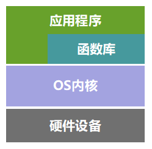

本文共4700余字，预计阅读时间15分钟，本文同步发布于知乎（账号silaoA）和微信公众号平台（账号伪码人）。
关注学习了解更多的Cygwin、Linux技术。

有读者反馈Cygwin系列文章对初学者门槛较高，需要理解Linux基础概念作为前提。应此需求，撰写本文介绍（我认为）合理的Cygwin学习路线，穿插介绍值得参阅的网站和书目。以下内容或许并不像具体的技术学习路线，更偏向一种学习方法。

<!--more-->
<!-- [toc] -->

# 0x00 改变认知
## 操作系统的认识
本节内容主要针对仅使用过Windows的人群。个人计算机在中国开始流行起来，大约是在1990年代，彼时“wintel联盟”（Windows操作系统+Intel x86 CPU）在PC市场大获成功，走向技术垄断，这也导致我国的计算机教育环境是从Windows系统入门，**乃至在很多人的认知里，用电脑等于用Windows，甚至意识不到Windows**，根本没听说**其他**操作系统。

**作为非计算机科班人员，嗯，在很长一段时间里，我的认知也是这样。**直到大约10年前，跟随学长学习过程中了解到Ubuntu、Linux，看到了飞一般的命令行操作，不啻打开了另一个世界的大门，颠覆了我的认知。那时经常在图书馆翻看UNIX、Linux系统有关的书籍，嗯，**通常只看目录和第一章 绪论/前言，以求快速获得粗浅了解**。

到此做个小结，**PC上除了常见的微软出品的Windows系统，还有各色GNU/Linux发行版和UNIX系统，后两两种是近亲，Windows在设计理念、操作方式等多方面与其迥异**。Windows假设用户“你什么都不懂，必须按照我搭好的框架去做”，Linux/UNIX假设用户“你清楚地知道每一个动作是干什么，并接受相应后果”。那么，这和要学习的Cygwin有什么关系？为了同时发挥Windows和Linux/UNIX特长，Cygwin在Windows之上提供了UNIX模拟层。参阅前述文章 [Cygwin前传：从割据到互补](/2019/2019-02-05-Cygwin前传：从割据到互补.html) 和 [Cygwin系列（一）：Cygwin是什么](/2019/2019-02-14-Cygwin系列（一）：Cygwin是什么.html)进一步了解Cygwin与二者关系。


## 图形界面vs命令行
Windows以图形界面见长，傻瓜式操作，对初学者很友好，几乎没有学习成本，软件生态先进；Linux/UNIX以命令行见长，运行高效，开发环境友好，需要熟知各种命令，软件生态相对落后。图形界面的优势是操作简单直观，集成度高，鼠标乱点一通也能对软件功能摸个七七八八出来，用文字描述就显繁琐；命令行的优势是描述精确，掌控力强，消耗资源少，小而精悍，堪称瑞士军刀，要用图形界面描述则臃肿复杂。

**寸有所长尺有所短，两类系统均无法完全替代对方**，Windows在桌面领域长期以来是绝对霸主，Linux/UNIX则在服务器领域把Windows差不多完全挤出市场。

从Windows入门的人群可能对命令行心怀畏惧，而熟悉Linux/UNIX的老鸟则容易对Windows嗤之以鼻，特别是`王垠`大神在2003年一篇《完全用GNU/Linux工作》盛赞GNU/Linux、贬低Windows，得到Linux粉高度推崇，狂热粉甚至由此而生出“用Linux比Windows高级”的优越感。但是，我想说不管哪种系统，都只是工具，为工作服务，能快速高效干活的工具就是好工具。10年后的`王垠`大神写了篇[《谈 Linux，Windows 和 Mac》](http://www.yinwang.org/blog-cn/2013/03/07/linux-windows-mac)，态度也有所转变。事实上，Windows和Linux/UNIX也在不断吸收对方的优点，Linux/UNIX中也有各式图形环境，为争取Windows用户起到了很大作用；微软，特别是在印度人Satya Nadella执掌帝国以来，对开源社区态度发生180度转变，不再视Linux为毒瘤，开始以实际行动践行“Microsoft love Linux”的誓言，努力完善命令行这块短板。虽如此，两方都有几十年历史，要发生根本性的变化是不可能的，各自的特色已经沉淀在了基因里。

为避免陷入图形界面（Windows）vs 命令行（Linux/UNIX）的口水战，在此引用《神雕侠侣》剑冢部分内容供思考。
>第一柄是一柄青光闪闪的无名利剑，「凌厉刚猛，无坚不摧，弱冠前以之与河朔群雄争锋」。
>第二柄是「紫薇软剑，三十岁前所用，误伤义士不祥，乃弃之深谷」。
>第三柄是玄铁重剑，「重剑无锋，大巧不工。四十岁前恃之横行天下」。
>第四柄是柄已腐朽的木剑，「四十岁后，不滞于物，草木竹石均可为剑。自此精修，渐进于无剑胜有剑之境。」


不管用什么，最高境界是「不滞于物，草木竹石均可为剑」。

## 分层架构
计算机技术体系是由不同技术组件抽象、堆叠而形成有机的系统，粗略分可以用下图表示，事实上大的层次中可以继续细分更多小的层次，各层之间有相应的规范、协议、API约定。用户/开发者**通常**只工作在其中某一个层次，但要深刻理解第N层技术，往往需要对N-1层的内容有所掌握。


再次不吝引用David Wheeler大神的著名论断：
>All problems in computer science can be solved by another level of indirection（计算机科学领域的任何问题都可以通过增加一个间接的中间层来解决）。


Cygwin就是为了弥合Windows与UNIX直间的差异而打造的“间接的中间层”，要了解Cygwin上下的层级，请参阅前述文章 [Cygwin系列（一）：Cygwin是什么](/2019/2019-02-14-Cygwin系列（一）：Cygwin是什么.html)。

# 0x01 明确需求与Cygwin局限
准确来说，用户既不是在用计算机、也不是在用操作系统，而是在**使用某些应用程序或服务**，但操作系统是应用程序的支撑，决定了应用程序具备功能特性的上限。

使用Cygwin的目的，可能是为了在Windows上日常使用Shell命令行作为补充、可能是为了搭建开发环境、可能是移植软件程序等等。这些确实都能在Cygwin中完成，但同时需要搞清楚Cygwin的局限。

**Cygwin是利用Windows提供的Win32 API构建的UNIX模拟层（`cygwin1.dll`）与在此基础上构建的Linux-like程序、函数库的集合。** Cygwin的本质，决定了Cygwin中应用程序功能特性的上限。
- Cygwin依靠DLL模拟UNIX内核，**绝大部分**程序命令、脚本从Linux/UNIX切换到Cygwin均可照常运行，但注意到Cygwin**不是**在二进制层级与Linux/UNIX兼容（ABI），因此**Linux/UNIX系统上原生的二进制程序无法在Cygwin中运行，反之亦然**；
- Cygwin依靠DLL模拟UNIX内核，终究不是真正的内核，因此Cygwin中所有的命令程序、函数库跟真正Linux/UNIX系统上的版本相较，效率要低一个级别，也就是说**在Cygwin中使用Shell命令行程序会比在Linux/UNIX系统上慢**，在计算机硬件飞速升级的今天，有的程序慢了不一定能被人察觉出来，速度慢不影响可以考虑Cygwin；
- Cygwin依靠DLL模拟UNIX内核，在此基础之上构建的命令程序，**无法完全支持Linux/UNIX的内核特性**，造成Linux/UNIX上有的程序在Cygwin中可能不存在，程序在Linux/UNIX上支持的某些选项在Cygwin中可能不存在或行为不一致，如果这些与真实Linux/UNIX系统的差异无影响，可以考虑Cygwin；
- Cygwin依靠DLL模拟UNIX内核，用户能得到**近乎一致**的UNIX/Linux开发体验，不仅如此，程序代码可以同时调用`Win32 API`和`Cygwin API`，但开发工具（`gcc`、`gdb`、`binutils`等）的输出仍然是Windows PE格式，并且依赖于`cygwin1.dll`，如果不需要开发生成的程序在其他系统运行，可以考虑Cygwin；
- Cygwin只能在源码层级兼容Linux/UNIX API，且做不到100%兼容，有关Linux/UNIX内核特性的函数调用，`cygwin1.dll`未能完全模拟出来，程序代码若涉及到则无法在Cygwin中编译成功，更无法hack Linux内核，程序移植存在一定困难；

综上所述，Cygwin可以满足大部分对Linux Shell的使用需求，对照上述局限，如有符合，可在真实的Linux/UNIX系统及与Cygwin近似的软件项目中选取，参阅[Cygwin系列（三）：盘点与Cygwin相似和相反的项目](/2019/2019-02-26-Cygwin系列（三）：盘点与Cygwin相似和相反的项目.html)。

# 0x02 理论vs实践
**理论指导实践，没有理论支撑，实践就比较盲目，能不能成纯属运气。** 初学者看到教程通常比较喜欢对照教程一顿操作，出了错却找不清原因，不知道如何排错。深究其原因，应是初学者对前提的理论概念理解缺失，急于做完事情而慌不择路，抓到一个教程就赶紧照搬，如果搞不定那就再换别的教程继续照搬。（我认为）正确的姿势是实操暂停、理论先行：先通读教程，理解教程每一步骤的真实意图，如确信已理解那再对照操作，如遇到不理解的概念，应该停下来找其他参考书目学习理论概念做铺垫，如下伪代码所示。
```C
while(通读教程时不理解理论概念)
{
    参阅其他书目学习; //初期只做粗浅理解，实操完成之后再深入
}
理解教程每一步骤真实意图;
对照教程实操;
```

拿学习Cygwin来说，本系列文章的[Cygwin系列（四）：一步一步搭建Cygwin最小系统](/2019/2019-03-06-Cygwin系列（四）：一步一步搭建Cygwin最小系统.html)算是一个搭建Cygwin环境的教程，涉及了Windows中未遇到的概念，如「软件包」、「包管理器」、「镜像源」，教程可能对这些概念介绍不细致、不透彻，读者就需要搜索关键字查找网页理解，比较好的工具是[维基百科](https://en.wikipedia.org)、[百度百科](https://baike.baidu.com)，或者找Linux系统相关书籍。

在进一步学习如何使用命令行程序时，又会遇到「控制台」、「终端」、「伪终端」、「Shell」、「脚本」、「文件权限」、「路径」、「工作目录」等一系列UNIX/Linux中才遇到的基本概念，本博推出了[Linux Cygwin知识库（一）：一文搞清控制台、终端、shell概念](/2019/2019-04-04-Linux Cygwin知识库（一）：一文搞清控制台、终端、shell概念.html) 、[Linux Cygwin知识库（二）：目录、文件及基本操作](/2019/2019-05-04-Linux Cygwin知识库（二）：目录、文件及基本操作.html)文章对相关概念做了解释，并会在今后继续增加系列文章。如仍不能理解，需要参阅Linux入门相关书籍，比如对新手很友好的[《鸟哥的Linux私房菜》](http://cn.linux.vbird.org)等。

在使用具体命令行程序时，本博系列文章并未花很多篇幅讲述某个命令的用法，只花少量篇幅介绍少数几个关键命令（如`man`、`info`）的常见用法，介绍了命令行程序的基本规则，希望以此做基础，新手能够学会**自主探索任何命令的用法**，就像在Windows中点几下鼠标去摸索图形界面程序的大致功能，这个过程就像是学会怎么查字典，而不是罗列字典的词条。如确实需要像字典内容一样清晰的用法介绍，可以看看[Linux命令大全](https://ipcmen.com)、[explainshell](https://explainshell.com)这样的网页，也可以看[《鸟哥的Linux私房菜》](http://cn.linux.vbird.org)、《linux命令行与shell脚本编程大全》相关章节。

有人是想把Cygwin作为C/C++编程的实践环境，在Cygwin最小系统搭建完成以后，不知道从何处编写、运行程序，习惯了Visual C++、Visual Studio这样一站式的IDE。实际上，应该在最小系统基础上安装开发环境，理解程序从源代码到可执行文件所经历预编译、汇编、编译、链接全过程，以及开发及调试中间所调用的工具。那么这就需要Cygwin软件包管理、GCC工具链作为铺垫，可以参阅[《Linux C编程一站式学习》](http://docs.linuxtone.org/ebooks/C&CPP/c/)、《程序员的自我修养——链接、装载与库》等。

# 0x03 合理提问和交流
不耻下问是值得肯定的学习态度，但要**合理提问**。新手提问，往往只说“xx为什么出错？”“xx该怎么做？”，这样没有任何背景说明的提问，其他人见到也是一头雾水，更别提有兴趣来回答。而且，新手往往**对问题本身的表述都是错的**，需要他人连续追问才能明白真正问题是什么。

（我总结出）提问时要把握以下几个原则：
1、说明目的；
2、说明方法、步骤、环境状态，特别是自己尝试除错的过程，不要一无所知只做伸手党；
3、说明出错的现象，最好有截图、代码；
4、**要具备交流讨论的前提基础**，就像提问“如何以xx为题写作文”，交流前提就是识字、造句、看图说话已经会了，否则就算他人回答再好，提问者也不会应用，而其他人没有教识字造句的义务，这要靠提问者自己积累；

示例：
为了实现/解决xx（说明目的），我尝试了以下办法：xx（说明方法、步骤），我的环境是xx（说明操作系统、软件版本等信息），结果在xx的时候出错了（贴出截图、代码），麻烦帮我看看是哪里不对，感谢。

最后，如果真的不想操心，那就付费请人解决。

# 参考
* [王垠博客：当然我在扯淡](http://www.yinwang.org)
* [《鸟哥的Linux私房菜》](http://cn.linux.vbird.org)
* [Linux命令大全](https://ipcmen.com)
* [explainshell](https://explainshell.com)
* Richard Blum，Christine Bresnahan·linux命令行与shell脚本编程大全[M]·人民邮电出版社，2012·
* [《Linux C编程一站式学习》](http://docs.linuxtone.org/ebooks/C&CPP/c/)
* 俞甲子，石凡，潘爱民·程序员的自我修养——链接、装载与库[M]·电子工业出版社，2009·

# 更多阅读
* [Cygwin前传：从割据到互补](/2019/2019-02-05-Cygwin前传：从割据到互补.html)
* [Cygwin系列（一）：Cygwin是什么](/2019/2019-02-14-Cygwin系列（一）：Cygwin是什么.html)
* [Cygwin系列（三）：盘点与Cygwin相似和相反的项目](/2019/2019-02-26-Cygwin系列（三）：盘点与Cygwin相似和相反的项目.html)
* [Cygwin系列（四）：一步一步搭建Cygwin最小系统](/2019/2019-03-06-Cygwin系列（四）：一步一步搭建Cygwin最小系统.html)
* [Linux Cygwin知识库（一）：一文搞清控制台、终端、shell概念](/2019/2019-04-04-Linux Cygwin知识库（一）：一文搞清控制台、终端、shell概念.html) 
* [Linux Cygwin知识库（二）：目录、文件及基本操作](/2019/2019-05-04-Linux Cygwin知识库（二）：目录、文件及基本操作.html)


---
**如本文对你有帮助，或内容引起极度舒适，欢迎分享转发或点击下方捐赠按钮打赏** ^_^