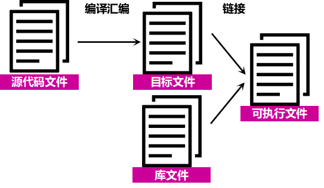
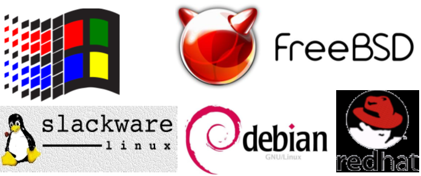
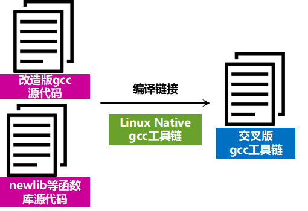
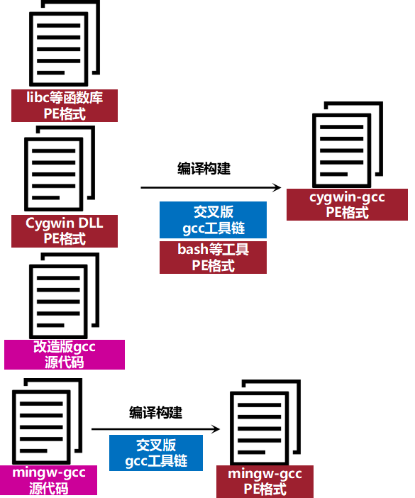

本文共2200余字，预计阅读时间9分钟，本文同步发布于知乎（账号silaoA）和微信公众号平台（账号伪码人）。
关注学习了解更多的Cygwin、Linux技术。

本篇接上篇[Cygwin系列（一）：Cygwin是什么](/2019/2019-02-14-Cygwin系列（一）：Cygwin是什么.html)介绍Cygwin背后实现的思路。

<!--more-->
<!-- [toc] -->
# 0x00 前言：跨平台移植实现
一个程序软件从诞生到运行起来，粗略地分，要经历以下几个过程：
①　编写源代码；
②　源代码编译、链接；
③　系统加载程序文件；

3个阶段的主导角色分别是：文本编辑器（Editor）、编译工具链（Tool chain，链的意思是一系列工具而不止一个）、程序加载器（Loader）。要实现跨平台移植，就要从这三方面入手。

## 编写过程
源代码是纯文本，在不同的系统平台（如Windows、UNIX、Linux）差异除了换行符其他可以忽略不计，而且文本编辑器通常也能设定换行符，再退一步，还有工具实现文本中换行符的转换。可以认为，源代码编写过程在不同系统平台没有差异。

## 编译链接过程
程序源代码文件经过编译汇编生成二进制的目标文件，目标文件就包含了机器指令、数据等内容，目标文件再与必要的库文件链接最终形成可执行文件。

不同的系统平台（如Windows、UNIX、Linux）上目标文件、可执行文件格式是不同的，库文件是已有目标的归档包（archive），不同的系统平台所拥有的库文件（比如[Cygwin系列（一）：Cygwin是什么](/2019/-02-14-Cygwin系列（一）：Cygwin是什么.html)中所提到的C标准库）也是不一样的。

**一言以蔽之，系统A上的目标文件、库文件、可执行文件在系统B上一般是不可直接识别的；如果他们能做到相互识别，那可称这两个系统ABI（Application Binary Interface，应用程序二进制接口）兼容。**

## 加载过程
os内核创建一个新的进程，装载器，或者叫加载器，在内存开辟一片区域，从外部存储空间（如磁盘）中复制可执行文件内容到内存相关的段（segment）中，再跳转到程序入口并执行。

不同的系统平台（如Windows、UNIX、Linux）加载过程大致类似，但细节上有诸多不同。

此外，上述过程中的编译工具链（Tool chain）、程序加载器（Loader），这些程序本身在不同的系统平台也是不一样的。

# 0x01 Cygwin是怎么做到的？
1995年，Windows已经启用Windows NT内核、发布Windows 95并获得了巨大的成功。另一头，Linux发行版如Slackware、Debian、Red Hat，UNIX-like发行版如4.4BSD、FreeBSD等也都拥有了众多的用户。UNIX和Linux是近亲，在API层面兼容（由POSIX标准保证），而Windows与UNIX/Linux是API、ABI均不兼容。如果程序能够在不同操作系统上运行，那便能大大丰富软件生态。

Cygwin取巧的步骤是上图的**编译链接过程**。

1995年，Cygnus Solutions公司的工程师注意到Windows NT和Windows 95的目标文件使用COFF格式，Windows系统的可执行文件格式PE（Portable Executable）和Linux系统的可执行文件格式ELF（Executable Linkable Format）都是COFF的变种，而且此时GNU项目的gcc编译工具链已经支持COFF格式和newlib C标准库。

这位工程师灵光一闪，可否改造gcc编译工具链产生一个交叉工具链，进而能够生成Windows系统原生的目标文件和可执行文件呢？得益于gcc良好的跨平台支持特性，这项工作很快就完成了，这个 **“交叉”版的gcc**运行于Linux系统，但生成Windows系统的目标文件，正因运行系统（host）和目标系统（target）不同，所以它才叫“交叉”工具链。

接下来，第二项重要工作，是要把这个“改造”版的gcc进一步改造，使其能够运行在Windows系统上。要让这个Windows版的gcc真正运行起来，还依赖于bash、POSIX兼容的系统调用等等系列程序和环境，一种思路是把这些依赖程序使用Win32 API重写、再编译构建，但这要花大量的时间将每一个程序都重写。

Cygnus Solutions公司放弃了这种思路，干脆使用Win32 API重写一个函数库（Cygwin DLL），提供Win32 API所缺少的必要的POSIX API，如fork、spawn、signals、select、sockets等，事实上Cygwin DLL还调用了部分Windows Native API，并且**由于os设计理念上的差异，以及Windows中有大量未对外公开的Win32 API、Windows Native API，有些POSIX API根本无法用它们模拟，Cygnus Solutions公司只能完全从零重写，而且为了处理POSIX和Windows中的差异还写了一部分Cygwin专有的函数。**再进一步，将相关程序链接到此DLL，交叉编译出Win32版的bash等依赖程序以及libc等函数库。

现在，兼容PSOIX的模拟层、构建gcc所依赖的bash等工具都已齐备，“改造”版的gcc移植到Windows系统几乎是水到渠成的事情了。

至此，兼容PSOIX的模拟层以及基于此模拟层的bash、gcc编译工具链、函数库等所组成的开发工具集已能在Windows 95/NT系统上运行起来。紧接着，Cygnus Solutions公司改写配置脚本，逐步把众多GNU、BSD及其他自由软件都移植到Windows 95/NT系统上，并按照UNIX/Linux的目录树架构组织存放，使得Cygwin环境越来越完备，UNIX系统上标准工具在Cygwin中都有了可用的版本。到1996年10月，Cygwin已完全自足，发布17.1 beta版。

# 0x02 Cygwin随后的发展
整个Cygwin工具集开始是作为一个单独的安装包提供，到2000年4月，项目宣布了新的发布方式，额外提供一个不依赖于Cygwin的Windows原生程序——`setup.exe`，具有图形界面，用于安装、更新、卸载软件包，因此可视为Cygwin软件包管理器，此后`setup.exe`和`Cygwin DLL`分别独立开发。

2009年Cygwin DLL v1.7发布，抛弃了对老版本Windows（Windows 95/98/Me）的支持，充分利用Windows NT的新特性，如文件名大小写敏感、IPv6支持等。随后，Cygwin DLL、setup.exe都有了64位版本。Cygwin软件包按照用途分类组织，方便管理。Cygwin项目还提供了一系列系统工具，如`cygpath`、`cygrunsrv`、`cygcheek`、`cygstart`等，以便更好地操作管理Windows系统。

越来越多的开发者也加入了Cygwin项目，帮助将GNU、BSD及其他自由软件移植到Cygwin并打包。越来越多的机构、公司将Cygwin官方的软件仓库同步镜像过来，由此在世界各地形成众多Cygwin镜像站点，共世界各地的用户下载Cygwin的软件包，中国的比如网易、阿里、清华、中科大、华科等均提供Cygwin镜像站。

# 参考
- <http://www.cygwin.com>
- <http://en.wikipedia.org/wiki/Cygwin>
- <https://en.wikipedia.org/wiki/Linux_kernel_interfaces>
- 俞甲子，石凡，潘爱民·程序员的自我修养——链接、装载与库[M]·电子工业出版社，2009·
  
---
**如本文对你有帮助，或内容引起极度舒适，欢迎分享转发或点击下方捐赠按钮打赏** ^_^