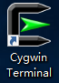
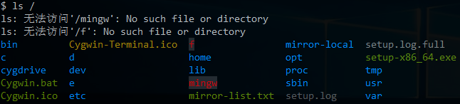
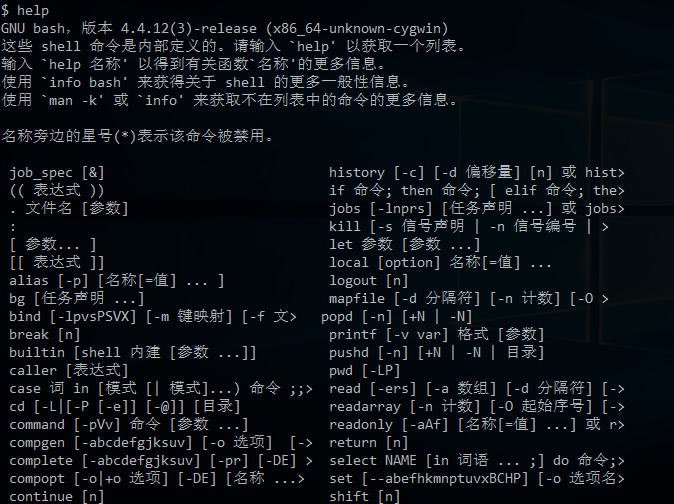
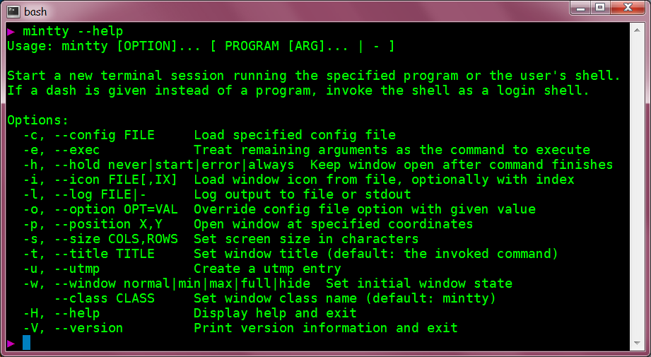
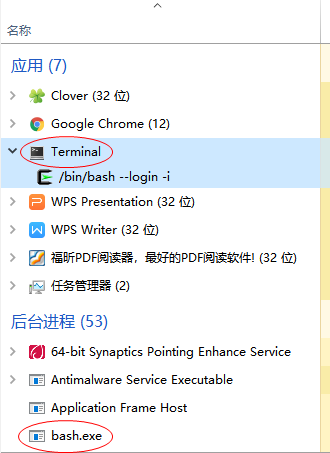
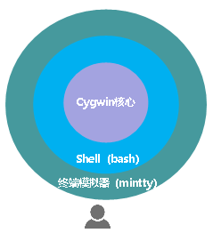
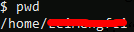

本文共4300余字，预计阅读时间15分钟，本文同步发布于知乎（账号silaoA）和微信公众号平台（账号伪码人）。
关注学习了解更多的Cygwin、Linux技术。

前一篇文章[Cygwin系列（四）：一步一步搭建Cygwin最小系统](/2019/2019-03-06-Cygwin系列（四）：一步一步搭建Cygwin最小系统.html)中已建立了最小系统环境，本篇将初步体验Cygwin的Shell命令行。

<!--more-->
<!-- [toc] -->
# 0x00  牛刀初试
利用`setup`安装完最小系统后，桌面上建立了一个名为“Cygwin Terminal”的快捷方式。

双击运行，弹出一个黑框框，初次运行还会自动帮用户做一些配置工作，如建立用户目录等。最后，打印一个形式如“xxx@yyy ~ $”的提示符，紧跟着是闪烁的光标，等待用户输入。如果直接按回车，黑框框里就换行继续打印出同样的提示符，同样跟着是闪烁的光标，继续等待用户输入。

那，可以做点什么呢？换句话说，我们能运行什么命令？先试试`ls  /`，本人的输出结果如下图，注意到本人因做了额外配置，因此显示内容、颜色与你的可能不同，注意“s”和“/”之间有空格隔开。

再来解释这个命令，`ls`是命令名称，是list的简写，用于列出指定路径下的文件，而“/”就是指定的“路径”。那么，“/”指的哪个路径？如果稍稍留意输出结果，可以推测出“/”就是指Cygwin安装的顶层路径。好像没什么稀奇的，Windows下用Explorer也看看到指定路径下的文件，而且更直观。

不着急，再继续，试试`help`，输出如下，结果比较长，截图只有一部分。这个命令貌似是告诉用户一些命令的用法。

初次体会到此结束，接下来并不想要你在黑框框里盲目乱敲，让我们暂且开启高空俯视视角，避免迷失在暗黑森林。

# 0x01  台前幕后
好奇心驱使我去了解双击“Cygwin Terminal”快捷方式后，Windows帮我做了些什么。查看快捷方式的属性，其中“目标”字段的值为“D:\Cygwin64\bin\mintty.exe -e /bin/bash --login -i”，从这里可以推断，快捷方式实际运行的是`mintty.exe`，它就在Cygwin安装目录（D:\Cygwin64）的`bin`子目录中，那么`mintty`是什么？后边的“-e /bin/bash --login -i”又是什么意思？

查询[mintty官网](https://mintty.github.io)上有文档介绍，`mintty`是用于Cygwin、MSYS、Msys2等项目的“终端模拟器（Terminal Emulator）”，顾名思义，它就是用来模拟终端的，但是终端自身仅具有基本输入输出能力，并不会执行程序指令。

再接着看，看到下面这张图，`mintty`的help输出中有一行“-e --exec	Treat remaining arguments as the command to execute”，也就是“/bin/bash --login -i”是`mintty`启动后要执行的命令，这是要`mintty`启动`bash.exe`的节奏，还顺带传递了--login和-i选项，再一查“bash”，大名鼎鼎的`Bourne Again Shell`。再结合`mintty`的`help`输出的头两行“Start a new session running the specified program or user’s shell”，也就是说**mintty启动的时候，会开启一个终端会话运行指定的程序或用户Shell，上述“/bin/bash --login -i”正是“指定的程序”。** 更多详情，mintty官网给了详细的[手册页]( https://mintty.github.io/mintty.1.html)。

进一步，打开Windows任务管理器，看到一个“应用”Terminal和一个“后台进程”bash.exe，右键Terminal，转到详细信息，正是mintty.exe。

至此，可以初步确定，**双击快捷方式实质是启动了mintty，而mintty又启动了后台进程bash，我们看到的前台窗口是mintty，而幕后则有bash在干活。**

经过一番操作（此处省略一万字......），了解到终端、终端模拟器、Shell的概念，可以总结如下：
①终端自身并不执行用户输入的命令，它只是负责把输入的内容传给系统，并把结果呈现在窗口上给用户看；
②终端模拟器是一个模拟终端的图形界面软件，mintty就是一个终端模拟器实例；
③Shell是负责解释执行用户命令的解释器，bash就是一个Shell实例，它是由mintty在后台启动的。

从操作关系角度，可以简要绘制如下示意图，其中Cygwin核心是更深层幕后工作者，为mintty、bash的运行提供环境支撑。

# 0x02  概念与规则
好了，现在理清楚了，在`mintty`输入的内容实际都交给了Shell（bash）在处理，输入的内容即为“命令”。俗话说“没有规矩不成方圆”，`bash`自有其一套语法规则，不合规则的输入内容不能视作合法命令，Shell（bash）无法处理。

## 命令的形式
**每条命令大体上遵循“<命令名称> <选项> <选项值> <参数>”的形式**，命令名称（command）、选项（option）、选项值（value）、参数（argument）之间用空格隔开。除了命令名称，其他部分都不是必需的，比如在本文最开头执行的`ls /`，其中`ls`是命令名称，`/`是参数，`help`就仅包含命令名称，`mintty --help`只包含命令名称和选项，没有选项值和参数。

计算机发明之初，存储器是很稀有的资源，为了尽量减少存储空间，也为了方便用户记忆，**命令名称都是单词简写**，十分简洁，这个传统基本上被保留下来。

命令名称描述要做什么（Do What），这个好理解，参数描述的是作用对象（to Whom），也比较好理解，而选项和选项值则具体描述怎么做（How to Do），这就比较复杂了。事实上，各个命令描述最多的地方就是选项和选项值。

选项有单个连字符（-）与字母组成的**短选项风格**（UNIX风格）和两个连字符（--）与单词组成的**长选项风格**（GNU风格），很多命令两者都支持，而且部分短选项和长选项等效，还有少数命令支持“+”与字母组成的选项，甚至与这些风格都不符的选项。

大部分命令都有“-v”和“-h”这两个选项，或等价的“--version”和“--help”，用于显示版本信息和帮助信息。熟悉应用程序，最主要地就是熟悉不同选项和不同参数配合作用，并加以掌握。对某个程序命令完全不了解或者是忘记了，都可以尝试“-h”、“--help”、“-v”、“--version”选项去了解。

## 有哪些命令
Shell能识别的命令大致分为3类：
①**内建(built-in)命令**，仅与Shell自身有关，不同的Shell（如sh、bash、zsh、fish等）支持的内建命令；
②**用户定义函数（function）、别名（alias）等**，用户可自定义一些Shell函数，给命名设置别名等；
③**外部命令**，额外安装的可执行程序越多，可供执行的外部命令就越多，比如ls就是外部命令。

要查询某个命令属于哪种，执行`type -a <命令名称>`即可；要看当前Shell支持哪些内建命令，执行`help`即可，其中`type`、`help`就是`bash`等Shell都会提供的内建命令。在刚安装完Cygwin最小系统时，`bin`子目录下大量可执行文件，除去一些DLL文件，其余都是Shell外部命令。

## 工作路径
文件都是存放在具体某个路径下的，Shell在工作的时候也是处在某个路径下，要查询当前工作路径（current working directory）是什么，可以通过内建命令`pwd`打印出来，内建命令`cd <路径>`可以切换工作路径。

Shell刚启动的时候，默认切换到当前用户目录作为初始工作路径，前文提到的提示符中，`~`就是当前用户目录，试下`pwd`如图，结果为`/home/<用户名>`。其中，`home`是Cygwin安装目录下的子目录，`<用户名>`是登录当前Shell的账号，在Cygwin中登录当前Shell的账号就是登录到Windows系统的用户名，这个子目录是首次启动Shell时自动建立的。

为什么要强调“当前”？因为UNIX/Linux是真正的多用户系统，允许多个用户同时登录到系统中取得使用权，系统给每个用户在`/home`目录下建立各自的用户目录，这样每个用户的环境彼此隔离、互不干扰。Windows是号称多用户系统，虽然也给每个用户建立各自的用户目录，在`C:\Users`下，但是Windows一次只允许一个用户登录。

# 0x03  命令急救箱
以上洋洋洒洒长篇大论，除了开头演示`ls /`、`help`和中间穿插介绍的`type`、`cd`、`pwd`，就没介绍几个命令用法。本节也只打算介绍几个关键命令，记住这几个，就可以去从零了解各个命令用法。

## help
`help`是Shell内建命令，可以查看各个内建命令的用法。如果不带参数，`help`输出当前Shell支持的所有内建命令；如果带参数，`help <参数1> <参数2> ···`则按参数逐个尝试查找帮助主题，通常所有参数应当为内建命令或者能匹配内建命令的模式，比如h*匹配所有以h开头的内建命令：`help`、`history`。

## -h或--help选项
对于绝大多数外部命令，都支持至少“-h”和“--help”选项之一，用于显示该命令的用法，即使“-h”可能用作他途，但“--help”绝对是显示用法。

也有少数命令不支持“-h”或“--help”选项，而是在没有任何选项参数或者出错的时候显示用法。

## man
`man`是POSIX规定的帮助手册程序，是mannual的简写。软件包中除了程序本身，还带了大量用户文档，在UNIX/Linux系统中，手册页是最常见的用户文档之一，`man`手册页用特殊的格式写成并压缩，通过man命令浏览。系统安装的软件包手册页通常在`/usr/share/man/`目录之下，按照章节分门别类地放在man1~man8子目录中。

参照上面的说明，试试`man --help`，如下图`man`支持的选项很多，<章节>参数可以是1~8，指定man查找的章节。一般使用场景中不需要任何选项，直接`man <主题>`即可，`man`从1~8所有章节去查找，主题不限于命令名称，还可以是系统调用、函数库等。

在man查看手册页时，空格键向下翻页，PgUp/PgDn键向上/下翻页，↑/↓键向上/下移动一行，g/G跳转到页面顶部/底部，q退出，h查看帮助操作。更多详情，试试“man man”。

## info
用户文档除了`man`手册页，还有info格式的手册页，由GNU项目引入，通过`info`（information的缩写）命令浏览，一般UNIX/Linux系统同时支持`man`和`info`两种风格的手册页。

Info手册页按照节点（node）组织，每个手册页文件是一个节点，手册页内支持链接到其他节点，如此组织犹如一张网，和网页类似。Info手册页一般存放在`/usr/share/info`目录下，其中`dir`文件是Top节点，相当于网站中的index首页。

老规矩，`info --help`试试怎么用，如图，`info`也支持较多选项，给出的例子中，直接`info <主题>`，和`man`类似。不加主题参数时，`info`默认打开Top节点。

在info浏览手册页时，空格向下翻页，PgUp/PgDn键向上/下翻页，↑/↓键向上/下移动一行，b/e跳转至当前节点页首（begin）/页末（end），q退出，Enter跟踪链接，p/n/u跳转至与当前节点关联的前一个（previous）/后一个（next）/上一级（up）节点，l回退至上次（last）页面，m/g跳转至本节点内菜单（menu）项，Ctrl-g取消当前要执行的动作。更多详情，试试`info info`命令。

# 0x04  其他提示
- UNIX、GNU、BSD的程序软件数不胜数，而且数量不断增长，我们**不可能记住每个程序怎么用，也不应试图去背、去记忆**，常用的命令和常见的用法只有一小部分，**熟能生巧**。不熟悉的话，试下`--help`选项、`man`、`info`命令，配合网上应用案例，也能摸清个大概了。
- UNIX、GNU、BSD的命令行程序功能单一而强悍，Shell可以巧妙灵活地将其组织起来，发挥出更加强大的功效，用多用熟悉了才能体会到。
- **英语真的比较重要，英语水平不需要很高，但要能够阅读手册页等文档。**
- Shell有很多特性，对于初学者来讲，最有用莫过于Tab键补全。在终端中输入命令、路径、文件等名称的时候，记得不准确，字符多了容易出错，Tab补全是一大福音。比如输入“m”，Shell会列出所有匹配以“m”开头的命令；再紧接着输入“a”，Shell列出所有匹配以“ma”开头的命令，这样逐渐缩减范围，直至唯一匹配。同样也适用于目录和文件补全，文件或目录名字很长时非常容易出错又难于检查，Tab键补全可以省去不少敲键盘的时间，还避免了错误，文件或目录名补全支持中文。
- **为练习本文内容，建议针对/bin目录下所有命令逐个尝试--help选项、查看man/info手册。**

# 参考
- <https://en.wikipedia.org/wiki/Comparison_of_command_shells>
- <https://mintty.github.io>

---
**如本文对你有帮助，或内容引起极度舒适，欢迎分享转发或点击下方捐赠按钮打赏** ^_^