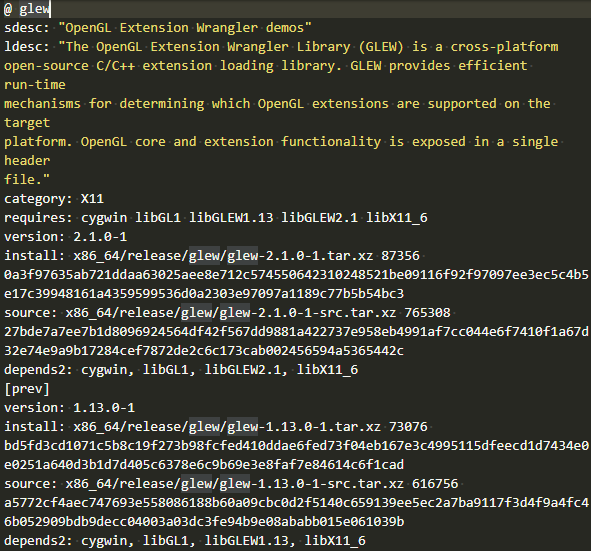

本文共2500余字，预计阅读时间9分钟，本文同步发布于知乎（账号silaoA）和微信公众号平台（账号伪码人）。
关注学习了解更多的Cygwin、Linux技术。

前文 [Cygwin系列（四）：一步一步搭建Cygwin最小系统](2019-03-06-Cygwin系列（四）：一步一步搭建Cygwin最小系统.html)和[Cygwin系列（七）：Cygwin软件包管理相关配置](2019-05-12-Cygwin系列（七）：Cygwin软件包管理相关配置.html)着重介绍了`setup`作为包管理器的使用方法、相关配置文件，本文介绍Cygwin中另一个值得尝试的**命令行包管理器**——`apt-cyg`。

<!--more-->
<!-- [toc] -->

# 0x00 初识apt-cyg
`setup`是Cygwin中图形界面的包管理器，操作上基本是傻瓜式的点击“下一步”；与之对应，存在命令行包管理器。

GNU/Linux世界里常用有`apt-get`、`yum`、`pacman`等著名的命令行包管理器，成熟稳定、强大无比，Cygwin下则有`apt-cyg`这个友好易用的命令行包管理器，从名字一看便是模仿`apt-get`。Github上托管了[39种shell语言版的apt-cyg](https://github.com/search?l=Shell&q=apt-cyg&type=Repositories&utf8=%E2%9C%93)，点击连接便可看到，本文要说的是搜索结果排第一的[transcode-open/apt-cyg](https://github.com/transcode-open/apt-cyg)，遵循MIT开源协议发布，2016年发布v1版本后便再未更新过。它其实就是一个Shell脚本，帮助用户查找、安装、卸载软件包，还可以根据文件名称反向查找所属的软件包。

# 0x01 安装apt-cyg
[transcode-open/apt-cyg](https://github.com/transcode-open/apt-cyg)页面上推荐的安装步骤为：
```bash
lynx -source rawgit.com/transcode-open/apt-cyg/master/apt-cyg > apt-cyg
install apt-cyg /bin
```
第1行是使用`lynx`命令将`apt-cyg`脚本从网站下载保存至当前目录的apt-cyg文件，第2行是使用`install`命令将apt-cyg文件安装至`/bin`目录下，这一步其实包含了两个动作：①将apt-cyg文件复制到`/bin`目录，②增加`/bin/apt-cyg`文件可执行权限，这样用户可以在任意位置使用`apt-cyg`命令。

也可以手工的方式用浏览器下载`apt-cyg`脚本至本地，通过`cp`命令复制到`/bin`目录，再通过`chmod`命令增加`/bin/apt-cyg`文件可执行权限。

`apt-cyg`运行过程中依赖`bash`、`tar`、`wget`、`bzip2`、`gawk`、`xz`软件包中的命令来完成文件下载、文本分析、压缩/解压等基本功能，需要先在Cygwin中安装好这些软件包。其中，`bash`、`tar`、`wget`、`gawk`属于Base类，在安装最小系统时已包含；`bzip2`、`xz`属于Archive类，需要通过`setup`先装上，确保后续运行`apt-cyg`不出错。

# 0x02 基本使用
老规矩，先试试`apt-cyg --help`看用法提示，可看出`apt-cyg`命令形式为`apt-cyg [operation] [options] [targets]`，其中operation代表所支持的15个操作，以下逐一说明。查看`apt-cyg`文件脚本源码，可以发现脚本实际是通过相应函数一一实现这15个操作，并且`apt-cyg`和`setup`共用了一套配置文件。

## mirror
`apt-cyg mirror [url]`可以查看/设置镜像源地址。如果未给url参数，`apt-cyg`查找`/etc/setup/setup.rc`文件中`last-mirror`项并打印出来，以此作为镜像源地址；如果给定了url参数，则将`/etc/setup/setup.rc`文件中`last-mirror`项的值修改为url。

## cache
英文cache的意思是缓存，不管是`setup`还是`apt-cyg`，安装软件包时，均需从镜像源站点下载文件，保存到本地的位置即称“缓存”，并且本地缓存的目录结构和镜像站点保持一致。

`apt-cyg cache [path]`可以查看/设置本地缓存顶层路径。如果未给path参数，`apt-cyg`查找`/etc/setup/setup.rc`文件中`last-cache`项并打印出来，以此作为本地缓存顶层路径；如果给定了path参数，则将`/etc/setup/setup.rc`文件中`last-cache`项的值修改为path。

在使用`setup`或`apt-cyg`时，允许每次设定不同的镜像源，本地缓存顶层路径之下，会给不同的镜像源建不同的目录，保存文件不会造成混乱。**但一般不建议这么做**，每个镜像源站点同步时间有先有后，保存的软件包清单和依赖就不一样，在安装时可能造成版本混乱。

## install/remove
`apt-cyg install [targets]`和`apt-cyg remove [targets]`分别是安装、卸载软件包，targets参数指定软件包名称，可以同时多个。

`apt-cyg`会从`/etc/setup/installed.db`文件中查找本地系统中已经安装的软件包记录，如果已安装，再次install则跳过，也就是说`apt-cyg`**不会自动更新软件包至最新版本**；同理，如果未安装，却要remove则也跳过。

如果`installed.db`中没有记录，那么install操作便会触发下载、解压至根目录、执行安装后脚本等一系列动作，最后在`installed.db`中增加该软件包的记录。`apt-cyg`还支持**依赖解析**，安装软件包过程中，递归地安装每一个依赖。但remove操作不会把卸载软件包的依赖。

## update
`apt-cyg update`是更新软件源的软件包清单，即根据`/etc/setup/setup.rc`中配置的`last-mirror`项和本地Cygwin的指令集架构版本（x86或者x86_64），调用`wget`去镜像站点下载最新的`setup.ini`文件至本地缓存。

在进行install操作时，会自动先update。

## download
`apt-cyg download [targets]`仅将软件包下载到本地缓存但不安装，targets参数指定软件包名称，可以同时多个。在进行install操作时，下载动作实质就是download。

## show
`apt-cyg show targets`展示软件包基本信息，targets参数指定软件包名称，可以同时多个。`apt-cyg`调用`awk`、`sed`在本地缓存的`setup.ini`文件中查找匹配的软件包的名称、版本、描述、依赖等信息。如[Cygwin系列（七）：Cygwin软件包管理相关配置](2019-05-12-Cygwin系列（七）：Cygwin软件包管理相关配置.html)所举例的glew软件包。


## depends/rdepends
`apt-cyg depends targets`查找软件包的依赖，`apt-cyg rdepends targets`查找依赖该软件包的更高层软件包，均以树形展示，targets参数可同时指定多个软件包名称。

依赖/反向依赖的解析，实质是调用`awk`、`sed`在本地缓存的`setup.ini`文件中根据软件包名称暴力搜索匹配。

## list
`apt-cyg list targets`在`/etc/setup/installed.db`文件中查找与targets参数匹配的已安装软件包的名称，targets参数为正则表达式，可以同时多个。如果未指定targets参数，则列出所有已安装软件包。例如：
```bash
$ apt-cyg list xz bzip2
xz        #匹配xz

bzip2     #匹配bzip2
libzip2   #匹配bzip2
```

## listall
与list类似，但`apt-cyg list targets`是在本地缓存的`setup.ini`文件中查找与targets参数匹配的软件包的名称，targets参数为正则表达式，可以同时多个。那么，不论本地是否已安装，只要镜像站点中包含，listall均列出，即listall查找范围更广。例如：
```bash
$ apt-cyg listall bzip2
bzip2
bzip2-debuginfo
libzip2
mingw64-i686-bzip2
mingw64-x86_64-bzip2
pbzip2
```

## listfiles
`apt-cyg listfiles targets`是查找指定软件包所含的文件清单，功能与`cygcheck -l`相同，targets参数指定软件包名称，可以同时多个。`apt-cyg`是通过查看`/etc/setup/`下`package.lst.gz`的文件实现这个功能的。

## category
`apt-cyg category targets`列出某个类别下的所有软件包名称，targets参数为类别名称（如Base、Archive），类别名称见`setup`运行界面。例如：
```bash
$ apt-cyg category Base
alternatives
base-cygwin
base-files
bash
coreutils
crypto-policies
cygutils
cygwin
dash
diffutils
editrights
file
findutils
gawk
getent
grep
gzip
hostname
info
ipc-utils
libreadline7
libssl1.1
login
man-db
mintty
ncurses
openssl
rebase
run
sed
tar
terminfo
tzdata
util-linux
vim-minimal
which
_autorebase
```

## search/searchall
`apt-cyg search targets`在本地缓存中查找匹配targets的软件包名称，过程相当于是listfiles反向暴力搜索匹配，`apt-cyg searchall targets`在<https://cygwin.com/cgi-bin2/package-grep.cgi>查找内容与targets匹配的软件包，targets参数为正则表达式，可以同时多个。searchall和`cygcheck -f`功能相同，但后者查找范围仅包括本地已安装软件包，前者范围更广。这对于查找某个头文件、库文件所属软件包比较有用，在构建程序过程中遇到报错“xx符号未定义的引用”，极有可能就是缺少某个开发库，但要安装开发库首先得查出它属于哪个包。


对比命令行和Web页面查询两种方式，在<https://cygwin.com/cgi-bin2/package-grep.cgi>查找结果更准确，命令行经常无匹配或者匹配过多，对比http请求提交参数，疑似对特殊符号处理不同，应是`apt-cyg`脚本本身不够完善。


## 选项说明
- `--nodeps`选项，用于忽略依赖解析，不建议使用。
- `--version`选项打印版本信息。
- `--help`选项或不带任何参数和选项，用于打印使用方法。


# 0x03 使用感受及建议
使用`apt-cyg`过程，体验确实比`setup`轻量、快捷不少，命令行简洁高效，图形界面操作简易，二者各有所长，常用操作一般是install、remove、show、listfiles、searchall。

但在通过`apt-cyg`安装软件包时，偶尔遇到执行完命令发现仅在`/etc/setup/installed.db`增加记录实际却未安装的经历。安装执行完后建议`cygcheck -c`，检查软件包安装完整性，如不完整则用`setup`重新安装。另外，上文对比了`apt-cyg searchall`和网页查询的结果，后者更加准确，建议使用网页查询替代`apt-cyg searchall`。

---
**如本文对你有帮助，或内容引起极度舒适，欢迎分享转发或点击下方捐赠按钮打赏** ^_^