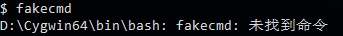
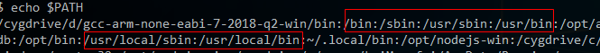
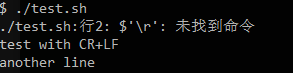
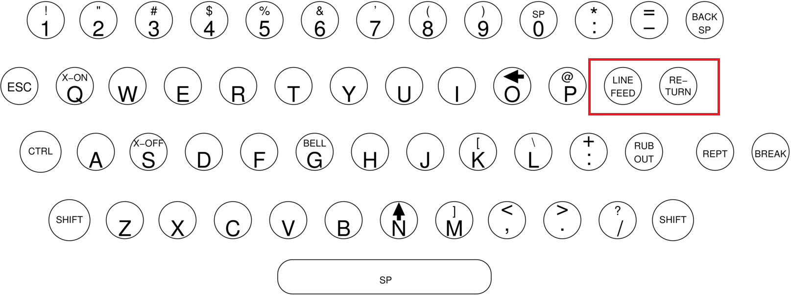
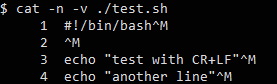
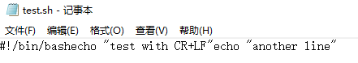
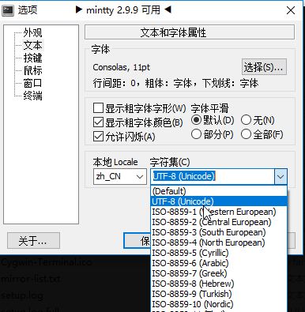
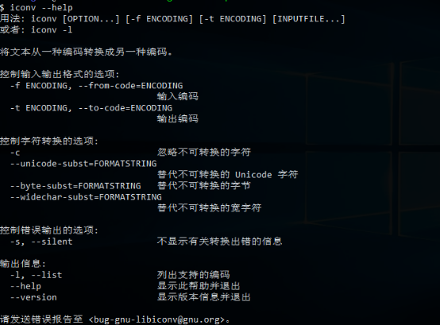
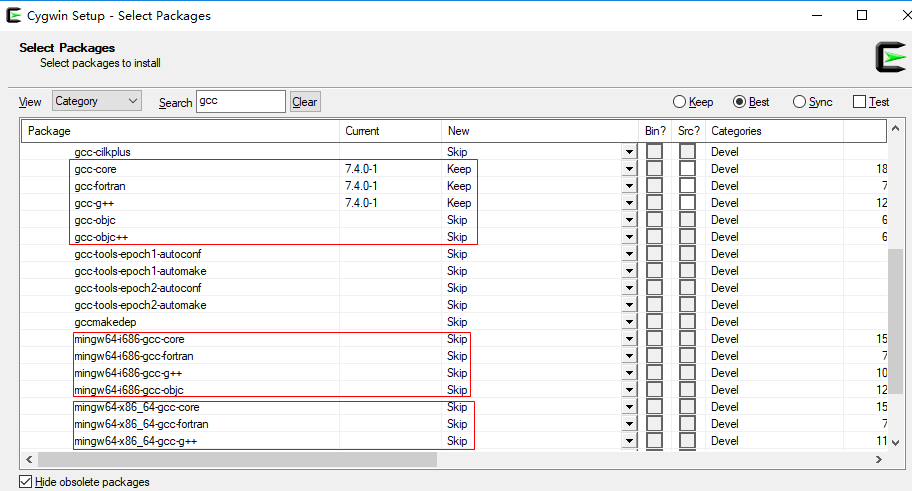

本文共3700余字，预计阅读时间13分钟，本文同步发布于知乎（账号silaoA）和微信公众号平台（账号伪码人）。
关注学习了解更多的Cygwin、Linux技术。

在本人使用Cygwin/Linux以及与群友、粉丝交流过程中，有些比较共性的问题，多次解答采坑背后的原因和应对措施，深感必要对这些典型的共性问题专门写文归纳，本着“折腾自己造福大家”的精神，写下此文。

<!--more-->
<!-- [toc] -->

# 0x00  “未找到命令”
在执行某些命令的时候，经常遇到恼人的“未找到命令”报错。为何别人教程里可以正常运行，到自己这里就不行了呢？因为软件环境不同。


[Cygwin系列（五）：Shell命令行初体验](2019-03-13-Cygwin系列（五）：Shell命令行初体验.html)中已介绍过Shell中可以执行的指令可分为3类：
①**内建(built-in)命令**，仅与Shell自身有关，不同的Shell（如sh、bash、zsh、fish等）支持的内建命令；
②**用户定义函数（function）、别名（alias）等**，用户可自定义一些Shell函数，给命名设置别名等；
③**外部命令**，额外安装的可执行程序越多，可供执行的外部命令就越多，比如ls就是外部命令。

对于用户的输入，Shell**按照②①③的顺序依次查找**匹配命令名称，一旦匹配就执行该命令（执行是否成功是下一步的事情暂忽略），即使可能有多个匹配结果也不再继续匹配，如果无法找到就报错“未找到命令”。内建命令的名称是固定的，用户自定义的别名、函数等，在Shell加载完配置文件后也是固定的，而外部命令则是不可预期的，Shell到哪里去找呢？答案是PATH环境变量。

为让用户灵活使用Shell以及在Shell中运行其他命令，Shell允许用户定制一组变量，称为“环境变量”，PATH是其中之一。PATH值是一组路径，路径之间用“:”分隔，Shell就是根据PATH的值逐个路径依次搜索外部命令名称，一旦匹配就执行，即使可能有多个匹配结果也不再继续匹配。值得注意的是，**出于安全考虑，当前路径“.”强烈不建议写入PATH中**，经常有人cd到某个路径下再输入“xxx”，虽然明明看到xxx就在这个路径下，结果很遗憾Shell仍然报错“未找到命令”，正确的姿势应该是cd到这个路径后输入“./xxx”，也可以不cd，输入命令时把文件路径写全。

回到问题本身，未找到命令无外乎两个原因：
①未安装必要的软件包，命令压根儿不存在；
②安装好了必要的软件包，但命令所在的路径不在PATH变量中。

对于①，参照教程 [Cygwin系列（四）：一步一步搭建Cygwin最小系统](2019-03-06-Cygwin系列（四）：一步一步搭建Cygwin最小系统.html)。对于②，可以把下列语句写在配置文件中，比如`~/.bashrc`（如果使用的Shell是Bash）、`~/.zshrc`（如果使用的Shell是zsh）。
```bash
PATH="<你想添加的路径>:$PATH"
export PATH
```
也可以合并为一句
```bash
export PATH="<你想添加的路径>:$PATH"
```
上述语句，也可以在Shell中输一遍，但是只对本次Shell会话有效，终端关了下次就不起作用。写入配置文件的话，每次打开终端运行Shell，Shell会自动读取。为什么上述语句不是单单写要添加的路径完事，而是要在末尾添加“$PATH”呢？解释一下，PATH这个变量系统中可能有多处设置，我们不能在添加自定义路径时把原有值覆盖掉了，导致系统工作不正常，“$PATH”就是对原有值的引用，即在原有值基础上“追加”。写成`”$PATH:<你想添加的路径>”`的形式也可以，只是Shell搜索的先后顺序不同。


Windows系统中同样也存在PATH环境变量，用于`cmd`查找外部命令。需指出，Cygwin中Shell的PATH变量值，与Windows系统的PATH变量值相互独立，但是**Cygwin中Shell的PATH初始值继承自Windows系统的PATH变量值，用户可以在此基础上继续定义，这也是为什么在Cygwin的Shell中可以执行Windows原生命令的原因！**通常，至少`/bin`、`/usr/bin`、`/usr/local/bin`这些标准路径都应该在Shell的PATH中。

# 0x01  换行符
在执行Shell脚本时候，有时会遇到下面的报错，根本的原因是Windows和Linux换行符不兼容！


在机械打字机时代，打字机上有个“打印头（print head）”的零部件，打印时从左往右自动移动，满一行时需要手动推到最左边，这个动作叫“回车（Carriage Return）”，同时卷轴需要向上卷使纸张上移一行，打印头相对于纸张就是下移一行，这个动作叫做“移行（Line Feed）”。


在计算机发明早期，电传打字机键盘上仍有这2个键位，在终端操作光标就类似于在打字机上操作打字头。ANSI标准规定，转义字符“\r”指代CR，“\n”指代LF，计算机系统早期广泛采用CR+LF指示换行。UNIX系统时代存储资源很贵，仅采用1个字符“\n”指示换行，而MS-DOS出于兼容性采用“\r\n”指示换行，后来搬到了Windows上，而Mac系统则采用“\r”指示换行，Linux、Cygwin照搬了“\n”。于是，主流的几大系统上换行符各不相同。“\r\n”换行的文本文件在Windows显示正常，在UNIX、Linux、Cygwin中行末多出1个“^M”，“^M”指真实的Ctrl-M组合字符；“\n”换行的文本文件在UNIX、Linux、Cygwin显示正常，在Windows中整个文件显示为一行。



Shell在逐行分析内容时，遇到“\n”，认为是一行内容结束。对于“\r\n”换行的文本，解析过程中发现，“\r”就在行末，既不是关键字，也不是命令或者参数什么的，只能当作是不识别字符了，于是报错。

解决办法，就是将文本文件中的换行符全局替换掉：
- `dos2unix dos_file`，`dos2unix`专门用于将‘\r\n’替换为‘\n’，有个与之作用相反的命令是`unix2dos`，将‘\n’替换为‘\r\n’；
- `tr -d ‘\r’ dos_file > unix_file`，`tr`本是字符“翻译（translate）”工具，其中`-d`选项专门用于删除特定字符，处理后的结果输出到`unix_file`；
- `sed -i ‘s/^M//g' dos_file`，`sed`是行编辑工具，这条命令是将每行文本的‘^M’替换为空，亦即删除‘^M’，其中‘^M’在终端的输入方式是Ctrl-V（指示后续按字面含义输入不转义），然后Ctrl-M；
- Windows平台的某些编辑器，如Notepad++、VS Code、VIM、Emacs等可以设置默认换行符，也可以在打开文件后转换为其他换行符保存；

再扯点换行符在C语言中的实现，比如`printf(“Hello, World\n”); `这个语句往标准输出`stdout`中打印一句话并使用“\n”换行，分别在Linux和Windows上编译源码并执行，好像并未出现换行符不兼容的问题。事实是，**C语言中虽然也有转义字符‘\r’、‘\n’，但并不保证与ASCII码CR、LF等价**，在文本模式下，写入‘\n’由系统底层翻译成换行符，读入文本时换行符再由系统底层翻译为‘\n’。UNIX系统正是C语言写出来的，系统底层就使用LF作换行符，系统内外表示一致不需翻译；而MS-DOS、Windows系统底层，则在系统内外需要进行‘\n’与CR+LF的转换工作。

# 0x02  文件/终端显示乱码
字符编码属计算机公共基础知识，网上有足够多的教程，推荐阮一峰大神的博客 [字符编码笔记：ASCII，Unicode 和 UTF-8](http://www.ruanyifeng.com/blog/2007/10/ascii_unicode_and_utf-8.html)，由浅入深通俗易懂。

如果文本中仅含ASCII码字符，其他字符编码一般保持着对ASCII码兼容性而不会出现乱码；如果含有其他字符，必然要用超出ASCII表示范围的字符编码，比如中文常用的GB2312、GBK、UTF-8等。

文件显示乱码的根本原因是：文件保存使用的编码方式和解读时使用的编码方式不一致！终端显示乱码的根本原因是：被操作文件的编码方式、程序输出流的编码方式、终端设定的编码方式不一致。
**建议：各处都使用UTF-8编码方式，文本换行符统一LF。**

## 终端的设置
mintty是Cygwin默认的终端，在顶部鼠标右键》选项，即可看到设置界面，其中“文本”就是字体、语言环境设置项。


## 系统（Shell）的设置
Linux、Cygwin是支持多语言环境的系统，语言环境由语言、地区、字符集三元组合唯一指示，命名规则为“<语言>_<地区>.<字符集编码>”，比如zh_CN.UTF-8，zh表示中文，CN指中国大陆地区，UTF-8指使用UTF-8字符编码；en_US.UTF-8，en表示英语，US指美国。

Linux、Cygwin通过`locale`程序和一组环境变量为设置特定的语言环境。`locale -a`命令可列出系统支持的所有语言环境。一组环境变量包括：`LANG`、LC_起始的12个类别（日期时间、数字、电话号码、货币等表示习惯）变量、`LC_ALL`，优先级依次降低。因此在`~/.bashrc`（如果使用的Shell是Bash）、`~/.zshrc`（如果使用的Shell是zsh）直接写好LC_ALL即可。
```bash
#locale设置，包含12大类的locale属性，优先级LC_ALL > LC_*(12个) >LANG
# LANG
# LC_CTYPE
# LC_NUMERIC
# LC_TIME
# LC_COLLATE
# LC_MONETARY
# LC_MESSAGES
# LC_PAPER
# LC_NAME
# LC_ADDRESS
# LC_TELEPHONE
# LC_MEASUREMENT
# LC_IDENTIFICATION
# LC_ALL
export LC_ALL="zh_CN.UTF-8"
```

## 文本编辑器设置
参照文本编辑器手册设置字符编码。

## 转换工具
有的文本编辑器不仅可以设置为按照某种字符编码去解析、存储文本，还支持文本在不同字符编码之间直接转换。

Linux、Cygwin上有个移植GNU的程序——`iconv`，用于将文本文件从一种字符编码转换为另一种字符编码，对于Cygwin，这个命令在`libiconv`包中。老规矩，看`--help`选项了解怎么用。


`-l`选项（list）可以列出支持的所有字符编码，`iconv`对字符编码有着较严格的名称约定，如果在使用时与之不一致就会报错。实际转换时最常用的命令为：
```bash
iconv -f  输入编码  -t  输出编码  输入文件 > 输出文件
```
默认情况下，`iconv`输出到`stdout`，上述命令将`stdout`重定向至新文件。

# 0x03  怎么安装软件包
参照教程 [Cygwin系列（四）：一步一步搭建Cygwin最小系统](2019-03-06-Cygwin系列（四）：一步一步搭建Cygwin最小系统.html)。

# 0x04  选哪个gcc
`gcc`是源码编译构建时必备的命令，Cygwin的`setup`中能搜素到多个包含`gcc`字样的软件包，那么该选哪个呢？

`gcc`早期仅支持c语言，那时`gcc`就单指GNU C Compiler，后来`gcc`支持了c以外的c++、fortran、object-c等编程语言，就演变为指代GNU Compiler Collection。Cygwin中，有关`gcc`的软件包被分拆为核心组件包`gcc-core`（仅支持c语言）和语言支持包如`gcc-g++`、`gcc-fortran`、`gcc-ada`、`gcc-objc`、`gcc-objc++`等多个。


再介绍两种编译构建方式：
①**原生（native）编译构建**，即编译构建命令所运行（host）的系统环境和编译构建输出目标（target）的系统环境一致；
②**交叉（cross）编译构建**，上述target和host不一致，即在A系统环境构建出在B系统上运行的目标，这在嵌入式开发中尤为多见。

系统环境指的什么？GNU的构建工具链中使用CPU指令集架构、厂商、系统内核的三元组合来指示系统环境，很多构建工具的名称都带上了这个系统环境前缀，比如`x86_64-pc-cygwin-gcc`、`x86_64-unknown-cygwin-pkg-config`等。

native和cross方式编译构建所需的软件包自然不一样。因此，如果是要native构建，直接找`gcc-core`、`gcc-g++`就对了；如果是要cross构建，比如在Cygwin上构建出Windows原生程序，选`mingw64-i686-gcc-core`、`mingw64-i686-gcc-g++`等或者`mingw64-x86_64-gcc-core`、`mingw64-x86_64-gcc-g++`等，其中`mingw64-i686`和`mingw64-x86_64`指示target系统环境。

除了`gcc`，还有其他的开发工具类软件包，比如`binutils`、`llvm`、`qt4`、`qt`5等，在Cygwin中既有给native构建使用的，也有给cross构建使用的。

**未完待续篇。。。**

# 参考
- <http://www.cygwin.com>
- [阮一峰  字符编码笔记：ASCII，Unicode 和 UTF-8](http://www.ruanyifeng.com/blog/2007/10/ascii_unicode_and_utf-8.html)

---
**如本文对你有帮助，或内容引起极度舒适，欢迎分享转发或点击下方捐赠按钮打赏** ^_^