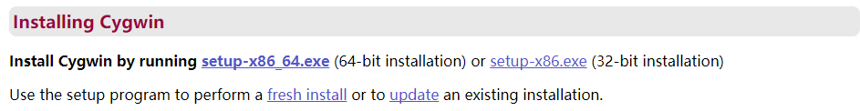
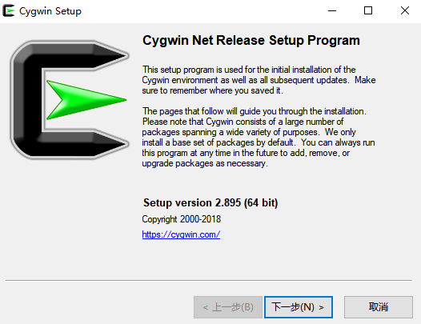
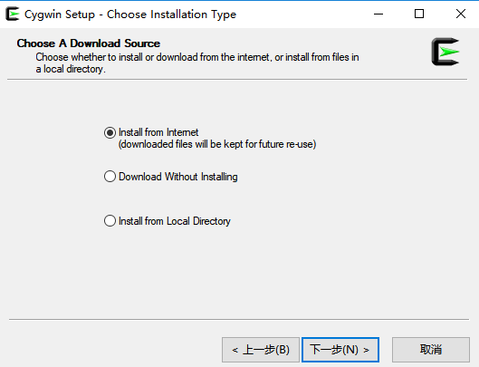
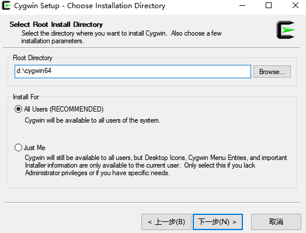
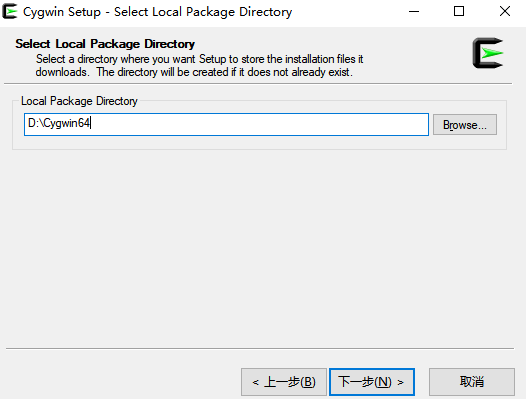
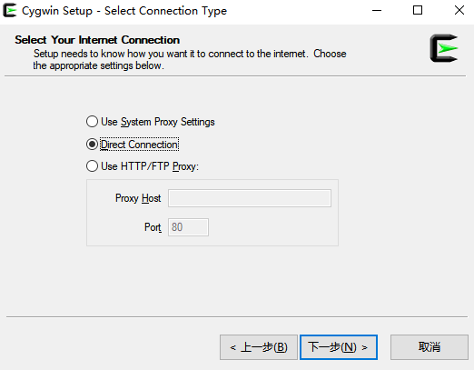
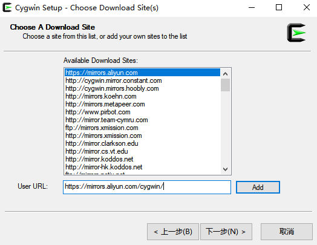
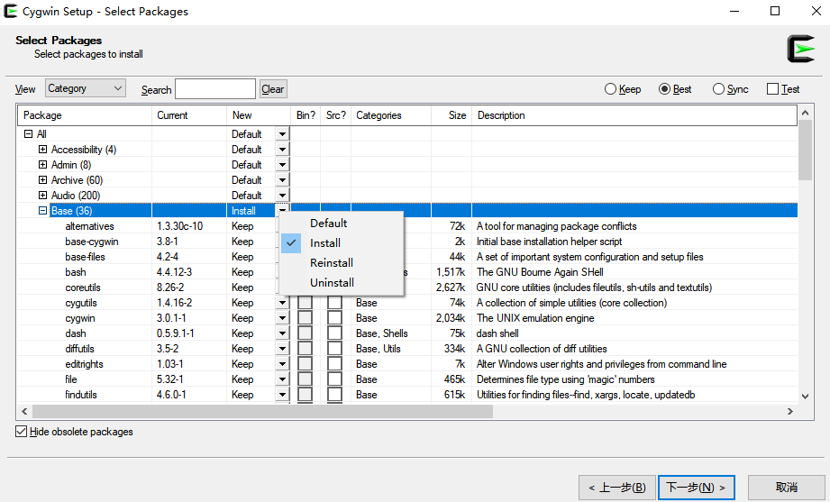
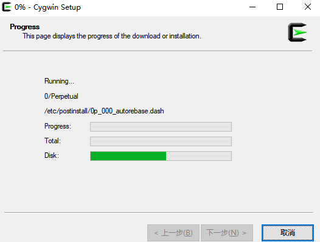

本文共3000余字，预计阅读时间10分钟，本文同步发布于知乎（账号silaoA）和微信公众号平台（账号伪码人）。
关注学习了解更多的Cygwin、Linux技术。

经过前面连续4篇文章对Cygwin的充分介绍，相信你对Cygwin也有了初步认识，本文将一步一步介绍搭建Cygwin最小系统环境。

<!--more-->
<!-- [toc] -->

# 软件包和包管理器
UNIX/Linux系统上，二进制程序文件、函数库、文档、源代码等通常是按照软件包（Package）的形式组织，一个软件包是**一个或多个**应用程序、函数库、帮助手册页、文档组成的压缩档。Cygwin继承了先辈UNIX/Linux系统的优良传统，也采用这种方式。

Cygwin由核心的`Cygwin DLL`（被包装在cygwin包中）和基于`Cygwin DLL`移植GNU、BSD等开源项目的海量软件包组成。那么，怎么有效管理这些软件包呢？一股脑全部一起打包发布不是一个明智的选择，不仅要消耗很大的网络流量和硬盘空间，而且用户也不是所有的软件包都需要用到。[Cygwin系列（二）：初窥Cygwin背后](2019-02-21-Cygwin系列（二）：初窥Cygwin背后.html)中说过，2000年4月，项目宣布了新的发布方式：额外提供一个不依赖于Cygwin的Windows原生程序——`setup.exe`，与`Cygwin DLL`独立，用于安装、更新、卸载软件包。从功能角度讲，`setup`有点“名不符实”，或许叫“Package Manager”更恰当。

Cygwin发展到支持64位，包管理器、软件包也自然分成32位和64位两套。32位的包管理器程序为`setup-x86.exe`，64位的为`setup-x86_64.exe`，x86和x86_64分别是32位和64位指令集代称。以下未明确32/64位硬件平台时，`setup`泛指其中一个。

为特别区别于Windows程序安装卸载习惯，在此再强调，**setup不是一次性的安装卸载程序，而是可用于安装、更新、卸载软件包的包管理器，负责软件包在本地从生到死！后期对软件包的所有管理操作都可以通过setup完成。**

# Step 0：事前准备工作
进入[Cygwin官网](http://www.cygwin.com)找到“Installing Cygwin”，下方文字介绍中有`setup-x86.exe`和`setup-x86_64.exe`链接，按自己需求选择其中一个下载即可，建议选择64位版本。

为使文件不显得杂乱，在d盘新建一个文件夹`Cygwin64`，把`setup-x86_64.exe`也放入其中，当然也可以把文件放在任何其他地方，**但路径最好不含空格**。为方便描述，以下称“d:\Cygwin64”为`CYG_ROOT`，`$CYG_ROOT`表示对字符串“d:\Cygwin64”的引用。

# Step 1：选择安装方式
双击运行setup，可以看到`setup`自身的版本是“2.895(64 bit)”。

点击“下一步”，如图显示3种安装方式：
①“Install from Internet”是指从Internet下载并安装，下载的安装包同时也保留在硬盘中并不删除；
②“Download Without Installing”意思是仅下载，供后期再安装；
③“Install Local Directory”是指从本地安装，如果前期选择了②，现在选择③即可。

把②和③两步合并，效果就是①；此处由于是从零开始，选择①。

# Step 2：路径设置
点击“下一步”之后进入**Step2**，选择安装顶层路径——Root Directory。`setup`可以探测到自己所处的路径，即`$CYG_ROOT`，一般不用再更改；默认勾选为所有用户安装(Install for All Users)。

点击下一步，选择本地软件包存放路径，同样可按照默认设置为`$CYG_ROOT`。

# Step 3：选择网络连接方式
点击“下一步”之后进入**Step3**，网络连接类型按默认选择，即直接连接(Direct Connection)即可。

# Step 4：添加/选择下载站点
点击“下一步”之后进入**Step4**，选择下载站点，除了Cygwin官方网站，还有很多站点提供了软件仓库(repository)的镜像，分布于世界各地，`setup`内部记录了很多已有的站点，但没有大陆地区。用户还可以自行添加，界面右下角的Add按钮就是用来添加新站点的。

仅列出国内几个比较常用、速度较快、连接较稳定的Cygwin镜像站点：
- 网易开源镜像站  <http://mirrors.163.com/cygwin/> ；
- 阿里巴巴开源镜像站  <https://mirrors.aliyun.com/cygwin/> ；
- 华为开源镜像站  <https://mirrors.huaweicloud.com/cygwin/> ；
- 清华大学开源镜像站  <https://mirrors.tuna.tsinghua.edu.cn/cygwin/> ；
- 中科大开源镜像站 <http://mirrors.ustc.edu.cn/cygwin/> ；
- 华中科技大学开源镜像站 <http://mirror.hust.edu.cn/cygwin/> ；
- 东软开源镜像站 <http://mirrors.neusoft.edu.cn/cygwin/> ；

将镜像站点URL地址填入编辑框，点击“Add”按钮，镜像站名称即出现在选择列表中，下一次再来直接选择就行，**注意到列表显示内容移除了URL路径，只保留了协议和主机名**。此时发现，`setup`建立了`$CYG_ROOT\var\log`路径，用于记录本次安装过程相关日志。

点击“下一步”，setup开始下载站点的`setup.ini`文件，这个文件最终保存在`$CYG_ROOT\https%3a%2f%2fmirrors.aliyun.com%2fcygwin%2f\x86_64`路径下，其中`https%3a%2f%2fmirrors.aliyun.com%2fcygwin%2f`是按照站点主机名建立的目录，但这并不是乱码，`%3a`实质是十六进制`0x3a`，即ASCII字符「:」，而`%2f`是十六进制`0x2f`，即ASCII字符「/」，因字符「:」、「/」不是文件名的合法字符，`setup`在建本地目录时做了替换，故这个目录真实含义为 https://mirrors.aliyun.com/cygwin/ 。

每个站点上同时有x86(32位)和x86_64(64位)两套软件仓库，所以在站点名后面有继续建立`x86_64`文件夹。`setup.ini`记录着软件包功能描述、版本、依赖等信息，可看做是一个软件包索引数据库。

# Step 5：筛选软件包及操作
点击“下一步”之后进入**Step5**，筛选软件包及操作。Cygwin软件包被按照用分类组织，点击“View”旁边下来框，选择“Category”，看到有Accessibility、Admin、Base、Devel、Doc等多个类别，一个软件包可以属于一个或多个类别。点击类别前的「+」，可展开查看下面的各个软件包。

软件包信息分成了几栏展示：
- Package栏是软件包名称；
- Current栏是软件包版本；
- New栏表示要执行的动作，包括Install(安装)、Reinstall(重新安装和升级)、Uninstall(卸载)、Skip(忽略)、Keep(保持不变)、特定版本号，动作可以针对整个类别，也可以针对单个软件包进行；对于未安装的软件包，setup默认动作是Skip，对于已安装过的软件包，默认动作是keep；**老版本的setup将Current、New两栏合并在一起，通过单击双箭头图标切换要执行的动作**；
- Bin栏表示二进制文件、Src栏表示源代码，老版本的setup界面上Bin和Src栏中间“x”表示选中、空表示不选、“n/a”表示没有(not available)，新版本setup不用管这两栏；
- Categories栏描述软件包所属功能类别；
- Size栏是软件包文件大小；
- Description是对软件包的简要描述。

为构建最小系统，这里选中**Base(基本)类别**，执行动作为Install，看到Base类别中包含了`alternatives`、`base-cygwin`、`base-files`、`bash`、`coreutils`、`cygwin`、`mintty`、`util-linux`等等最36个软件包。点击“下一步”，`setup`开始针对软件包进行依赖解析(依赖信息就存储在`setup.ini`文件中)，并把软件包依赖的所有软件包也全部添加进来，可以看到“依赖”中有大量以“lib”开头的库文件。

# Step 6：执行安装
点击“下一步”之后进入**Step6**，执行安装。`setup`开始下载软件包，并在左上角显示整体进度百分比。可以看到`$CYG_ROOT \ https%3a%2f%2fmirrors.aliyun.com%2fcygwin%2f\x86_64\release\`目录下多了很多子目录，子目录按照软件包独立组织，里面就存放着软件包的压缩文件。

`setup`自动进行下载、安装，安装完成后自动跳转至最后一步，选择是否创建快捷方式和添加到开始菜单，可以都勾选上，最小系统的整个安装过程就此结束。

安装结束后，可以看到在`$CYG_ROOT`目录下，增加了`bin`、`dev`、`etc`、`home`、`lib`、`tmp`、`usr`子目录，软件包主要安装到`bin`、`lib`、`usr`中，配置文件安装到`dev`、`etc`中，`home`下子目录存放各个用户的个人文件。

# 让系统跑起来
安装完成后，桌面上多了一个名为“Cygwin Terminal”的快捷方式，双击运行，看到一个黑色框框里面输出一些已创建文件的信息，并打印提示符，等待用户键入命令。这个黑框框便是**终端模拟器——mintty，mintty启动了shell与用户交互**。输入`help`并回车看看得到什么，再输入`ls  /`并回车看看得到什么，如果没有报错说明最小系统已经能跑起来。

第一次使用时，`home`目录下创建了一个以Windows登陆用户命名的文件夹，被称为**用户个人目录（$HOME）**，个人文件都默认放在这里，Cygwin的shell启动后默认进入的工作路径也是这里。

# 后记
从整个安装过程也看出，**setup本质是一个软件包的管理工具，亦即“包管理器”**，用户通过图形界面可以方便地进行安装、卸载、重装、升级等工作。setup也支持在命令行中运行。
最小系统跑起来以后，**后期还想安装其他的软件包，重复Step 1至6的过程，中间注意选择要安装的软件包即可。**

最小系统经过压缩，其大小不过约几十MB。Cygwin技术交流群（374791536）共享文件中同时提供64位和32位最小系统，解压即可用。

**UNIX/Linux/Cygwin上的逻辑、操作习惯与Windows有着巨大差异，在Cygwin中要培养以shell命令行为中心的操作习惯，暂时抛开Windows下的惯性思维。**

# 参考
- <http://www.cygwin.com>

---
**如本文对你有帮助，或内容引起极度舒适，欢迎分享转发或点击下方捐赠按钮打赏** ^_^