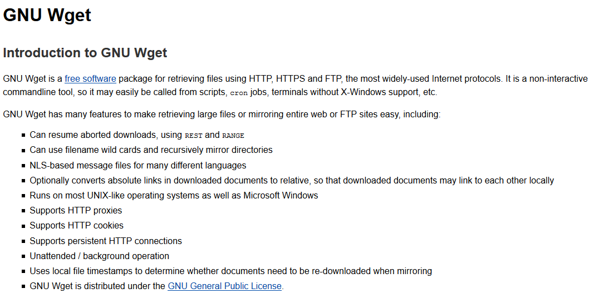
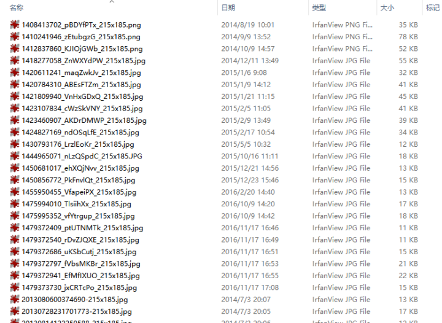

本文共3600余字，预计阅读时间12分钟，本文同步发布于知乎（账号silaoA）和微信公众号平台（账号伪码人）。
关注学习了解更多的Cygwin、Linux技术。

知乎上见到太多的爬虫入门案例，多是用Python、Java实现，若只是抓取特定的网页链接，何不用`GNU Wget`试试呢？

本文在Cygwin环境，参照`wget`的`man`和`info`手册，尝试编写调用`wget`爬取静态图片。如对wget已很了解，跳过第一节，直接看**爬虫尝试**一节。以下内容，建议照着敲代码实践，如只是看一遍说明书，感觉都记得了，so what？
<!--more-->
<!-- [toc] -->
# wget的使用
`wget`是Unix/GNU Linux中广泛使用的非交互式（意味着不需要用户干预）命令行下载工具，本文在Cygwin环境下使用。`wget`支持命令行、Shell扩展、HTTP(S)/FTP协议、HTTP Cookie、HTTP代理、递归下载等等丰富的功能特性。


话不多说，老规矩直接看`wget`的帮助，结合代码说明，`wget --help`输出略。`wget`支持的选项非常多，常用的只需要其中几个即可。以下按照help输出的选项归类及个人认为合理的逻辑顺序说明，内容参考`wget`的`man`和`info`手册。

## 共性说明
`wget`同时支持短选项和长选项以及混合使用，由于使用`gnuopt`库读取选项和参数值的，因此，**选项先后顺序没关系、短选项和值之间的空格可以忽略，多个无值的短选项可合并（此条虽不出错但并不建议这么做，容易混乱）**。

## 什么选项都不用
```bash
wget www.zhihu.com
```
`wget`会自动分析站点的网页，并抓取`index.html`下载到本地。给定的url如果使用了Shell扩展符，`wget`会尝试抓取所有符合扩展规则的的页面。如下
```bash
wget www.xxx.com/yy/zz{a,b,c,d}.html #匹配4个url，更复杂的情况自行编写
```
## 日志和输入文件
- `-i<file>` 或者`--input-file=<file>`，`wget`从`<file>`中读取URL，每个1行，逐行读取并下载页面，示例如下。
```bash
wget -i url_list.txt #从<file>逐行读取URL地址并下载
```
这种方式适合大量下载任务，比如预先把站点上**有规律的**页面地址处理好并存起来，然后一次性下载。

- `-o<log>`或者`--output-file=<log>`，把wget的日志信息写入`<log>`文件，如果很关心wget下载站点时的行为并用来分析，可以使用这个选项。如果`<log>`文件不存在，wget会自动创建，-o选项直接**覆写**`<log>`文件。
- `-a<log>`或者`--append-output=<log>`，与-o选项类似，但是是把日志信息**追加**到`<log>`文件结尾，用在多次下载或者断点续传的场景下。

## 下载控制
- `-t<NUM>`或`--tries=<NUM>`，在网络不好的情况下，多次尝试连通服务器，`<NUM>`是尝试次数。再加上`--retry-connrefused`选项， 即使拒绝连接也重试。
- `-T<SEC>`或`--timeout=<SEC>`，设置连接超时为`<SEC>`秒，`<SEC>`为数字。

以下是示例。
```bash
wget -t5 -T3 www.google.com  #最多重试5次、超时限制为3秒
```
- `-O<file>`或者`--output-document=<file>`，将下载的文件写入`<file>`。注意，这里的写入不是简单的重命名，可等效为重定向。一般下载文件时，时间戳保留为服务器上的时间戳，而-O选项则把时间戳改写为了当前时间。-O选项与后面要介绍的-N选项有矛盾的地方，注意分辨。
- `-N`或`--timestamping`，只获取比本地文件新的文件。当多次下载某个网站上的资源时，网站更新后，使用该选项也可以立即更新，若把`wget`添加为定时任务并配合-N选项可保证本地文件与网站同步。
- `-nc`或`--no-clobber`，不要下载本地已存在的文件。在多次重复下载同一个站点时或者存在站点多个网页引用同一个资源时，常用。
- `-c`或`--continue`，断点续传，文件资源较大或网络连接不好时，此选项可使wget从上次断点继续下载，常用。 

以下是示例。
```bash
wget -t5 -T3 -c -nc -N www.somesite.com/path/to/big-file.iso  #最多重试5次、设置3秒超时、断点续传，当somesite上资源更新时，本地也更新
```
- `-w<SEC>`或`--wait=<SEC>`，等待时间为`<SEC>`秒。访问网站过于频繁，网站可能采取限制甚至禁止访问的反制措施，可用此选项；`--random-wait`，在访问过程中随机等待。
- `-Q`或`--quota=<size>`，设定下载上限为`<size>`字节，`<size>`可加k、m、g作单位；`--limit-rate=<RATE>`，设定下载速率上限为`<RATE>`。

**wait、quota、limit-rate都是规避被网站禁止访问的策略。**

- `--ignore-case`，匹配文件/目录时忽略大小写，如jpg、JPG匹配结果相同。

## 递归下载
个人认为这是配置下载内容的**精华及重点**，可与上述文件匹配、规避禁止访问选项配合使用。爬虫是“下载网页-分析网页内容-保存/舍弃-下一步动作”的过程，`wget`的递归下载选项相当于起到了分析过滤和进一步下载的作用。

- `-r`或`--recursive`，递归地下载整个站点，`wget`采用**广度优先**策略，即先下载好当前页面，然后分析当前页面中存在的链接，再去逐个下载链接的页面，再进一步分析链接页面中的二级链接，如此循环，关于广度优先和深度优先的区分在此不深入讨论。
- `-l<NUM>`或`--level=<NUM>`，设置递归深度，注意 **<NUM>为0或inf时表示无穷递归**，使用-r选项后，**若不显示指明-l选项值，wget默认为5级深度**。
- `-k`或`--convert-links`，将页面中的链接路径转换为本地路径，方便在本地离线打开时直接浏览网页，比如网站上页面中的链接，`href`用的是服务器端的路径`http://www.xxx.com/yy/zz.html`的形式，下载到本地时，`wget`根据路径关系，转换为本地的相对路径，这样即使离线也可直接浏览。
- `-K`或`backup-converted`，在转换文件X前先将它备份为X.orig，这样把原始的文件和经过链接路径转换的文件都保存了。

递归下载示例。
```bash
wget -r -k <url>
#无论<url>是否写到多少层级路径，-r都将递归下载<url>中主机上的页面，默认为5级递归
#-k把网页中的链接转换为了本地路径，在当前目录建立与<url>主机同名目录，文件都存放其中

wget -t5 -T3 -c -r -k -N <url> # 断点续传、递归下载，配合 -N选项，仅下载比本地更新（newer）的文件
```
- `-m`或`--mirror`，镜像网站，等效为`-N -r -l inf`，在经常针对某个站点使用时，相当于把把网站镜像到本地且保持更新，原原本本地保留网站的目录结构和内容，所以才叫**镜像**。
```bash
wget -m <url> # 等效为wget -r -N <url>
```
- `-p`或`--page-requisites`，仅保留所有用于显示页面中必要元素，包括、图片文字等，本文未详细分析究竟哪些元素属 “必要”，起初本文理解是`wget`把图片、js脚本、css等文件独个地下载下来，后来试验发现仅仅是保留着网页中的这些标签，并没有独个文件地下载，偏离了“爬”图片文件的初衷。
- `-A`或`--accept=<list>`，仅接受下载`<list>`列表指示的扩展名，`<list>`中多个扩展名用逗号隔开，如`.jpg,.jpeg,.gif`。
- `--accept-regex=<re>`，仅接受匹配正则表达式的文件。
- `-R`或`--reject=<list>`，及`--reject-regex=<re>`，语法与`-A`和`--accept-regex`相同，含义相反。
```bash
wget -p -k <url> #下载<url>页面中必要元素并转换链接路径
wget -A.jpg,.jpeg,.png,.gif -R.js,.css -r -k <url> #递归下载<url>，接受几种图片类型、过滤掉js脚本和css样式表文件 
```
- `-D`或`--domains=<list>`，仅访问`<list>`列表指示的域名，网站资源相互链接是常见现象，递归下载过程中如不想下载到未知的、其他域名上的内容，或者避免递归后内容过多，可用此选项；--exclude-domains=<list>，语法与上同，但含义相反；
- `-H`或`--span-hosts`，允许跨主机下载，递归下载页面时，允许转向连接至其他的主机下载资源。
- `--follow-tags=<list>`，递归下载时跟踪html页面中的`<list>`指示的标签，多个标签用逗号隔开，如`--follow-tags=img,link`，**这是把文件独个地下载下来的好办法**；`--ignore-tags=<list>，语法同上但含义相反。
```bash
wget -k -r -l2 -H --follow-tags=img --ignore-tags=a,area,scripts,link <url>
#递归2级深度、转换链接路径、跟踪img标签、忽略掉a/area/scripts/link等标签的链接，这与网站爬图片已经很近了！
#和前文下载控制提及的等待、超时等选项配合起来，更像爬虫！
```
- `-I`或`--include-directories=<list>`，仅接受下载`<list>`列表指示的目录中的内容，`<list>`中多个扩展名用逗号隔开；-X或--exclude-directories=<list>，语法同上但含义相反；
- `-np`或`--no-parent`，递归下载时不追溯至父目录。

## 保存路径
前文所述命令下载的内容，默认保存在当前路径下，而且递归下载时保留了整个的网站多层次目录，爬虫中多数情况是简单地丢到一个大目录中，共后续数据分析。

- `-nd`或`--no-directories`，本地不创建目录层次。
- `-x`或`--force-directories`，本地强制按照<url>路径创建目录或递归下载时主机上的目录层级。
- `-nH`或`--no-host-directories`，本地不创建主机这一级目录，如<url>较长则仅保留主机后的路径。
- `-P<prefix>`或`--directory-prefix=<prefix>`，创建`<prefix>`路径，下载内容（可能含目录）放在`<prefix>`之下。
```bash
wget -k -r -l2 -H --follow-tags=img --ignore-tags=a,area,scripts,link -Pdownload -nd <url> #递归2级深度、转换链接路径、跟踪img标签、忽略掉a、area、scripts、link标签的链接，下载内容全放到download路径下并且不创建目录层次
```

## HTTP、FTP支持（高级选项）
- `--user=<u> --password=<p>`，同时设置http和ftp用户名、密码，也可用`--http-userr=<u1> --http-password=<p1>`和`--ftp-user=<u2> --ftp-password=<p2>`分别设置；`--ask-password`，询问输入密码；
- `--proxy-user=<u> --proxy-password=<p>`，设置代理的用户名和密码。
- `-U<ua>`或`--user-agent=<ua>`，将访问标识为`<ua>`而非默认的`Wget/版本`，这样对网站伪装为浏览器身份，爬虫必备手段（网站也有反爬手段。。。）。关于User-Agent，在此不深入讨论。
- `--load-cookies=<file>`，会话开始前加载cookies；`--save-cookies=<file>`，会话结束后保存cookies；`--no-cookies`，不使用cookies。常有需要登录的网站（如知乎），登录后针对用户加载个性化网页，和未登录时有不同，浏览器把这些个性化的信息存在指定路径下，不同浏览器不同，在此不深入讨论。

## 其他
`--spider`，仅试探站点上是否确实存在相应的文件，不是真下载 。

其他更多选项，实在无法列举全，请读一遍man或info手册。

# 爬虫尝试
爬虫开始，目标是尝试下载指定网站上的图片文件，并统一丢到固定路径下，当然这类网站最好是专门放图片的，如<http://www.wmpic.me/meinv/beautywget>，尽量伪装得像浏览器。为方便使用，把命令写成一个脚本，选项用变量存储。注意，**shell变量赋值，等号两侧不能有空格，尽量用字符串，字符串内用到引号的需要转义**。
```bash
#! /bin/bash

# test for getting pictures from specific website using GNU wget

INPUT_URL=""  # -i <FILE>，此处空，url由site指定
SITE="www.wmpic.me/meinv/beauty"  #换个其他网站也行 #SITE="www.d5yuansu.com/2016/11/13/118183.html"
OUT_DIR=${SITE%'.'}  #OUT_DIR为存储路径，也就是选项中的<prefix>
OUT_DIR="-P ${OUT_DIR//'/'/'_'}"  # replace '/' with '_'

# options for control
VERBSE_OPT="-v"  # or -q(--quiet) -nv(--no-verbose)
TRY_OPT="-t 5"   #尝试次数
TIMEOUT="-T 3"   #超时时间
WAIT="--random-wait" #等待时间随机
CONTINUE="-c"    #断点续传
CLOBBER="-nc" # --no-clobber，不重复下载而覆盖

# options for recursive download
#ACCEPT_TYPE="-A \"*.jpg,.jpeg\""  # -A、-R不知为何与--follow-tags不合作，不解
#REJECT_TYPE="-R \"*.gif\""
FOLLOW_TAG="--follow-tags=img"
IGNORE_TAG="--ignore-tags=a,area,scripts,link"
CASE_SENSE="--ignore-case"

WGET_OPTS="$INPUT_URL $OUT_DIR $VERBSE_OPT $TRY_OPT $TIMEOUT $WAIT $CONTINUE $CLOBBER $ACCEPT_TYPE $REJECT_TYPE $FOLLOW_TAG $IGNORE_TAG $CASE_SENSE"

RECURSE_LEVEL="-nd -r -l2" #递归2层、不创建目录
CONVERT_LINK=""  # "-k(--convert-links)" to convert into local style of links
CONVERT_BACK=""  # "-K(--backup-converted)" to backp original version
HOST_LIMIT="-H"    #"-H(--span-hosts)"to allow any host or "-D<list>" to limit

WGET_OPTS="$WGET_OPTS $RECURSE_LEVEL $CONVERT_LINK $CONVERT_BACK $HOST_LIMIT"

USER_NAME=""   # --http-user=    or --ftp-usr=
PASSWORD="" # --http-password=   or --ftp-password=

WGET_OPTS="$WGET_OPTS $USER_NAME $PASSWORD"

UA_OPT="--user-agent \"Mozilla/5.0 (Windows NT 10.0; WOW64; rv:45.0) Gecko/20100101 Firefox/45.0\""

WGET_OPTS="$WGET_OPTS  $SITE"  #这个ua不知为何老出错，放弃

# run the command
cmd="wget $RECURSE_LEVEL $WGET_OPTS";echo "$cmd" && $cmd
```
脚本运行之后，确实下载下来许多目标图片，存放在与url相关的路径下，如下。


# 后记
`wget`的选项众多，此脚本有很大改进的空间，`-p`或`--page-requisites`、`-A`或` --accept`、`-R`或`--reject`理解仍不清晰，cookies、ua、限速、限流量都还没用上。总体上，已经像个简单爬虫了，可容易配置为专门爬数据、pdf文档等静态资源。

`wget`自身分析链接毕竟不如用代码分析精确，存在有目标内容漏匹配或误匹配等情况，这可以通过`grep`、`awk`、`sed`等工具来加强分析功能，不过那就是用shell打造爬虫了。

# 参考
- <https://www.gnu.org/software/wget>
---
**如本文对你有帮助，或内容引起极度舒适，欢迎分享转发或点击下方捐赠按钮打赏** ^_^