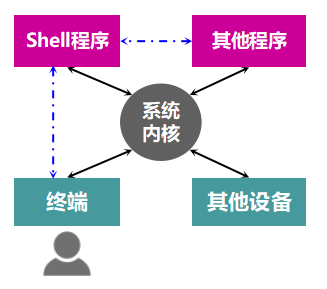
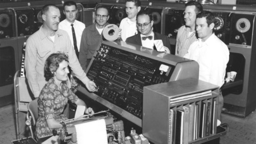
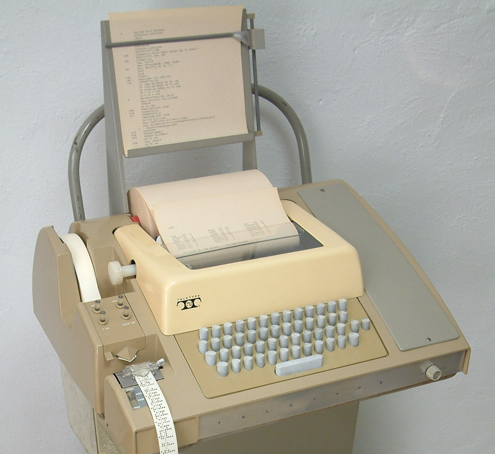
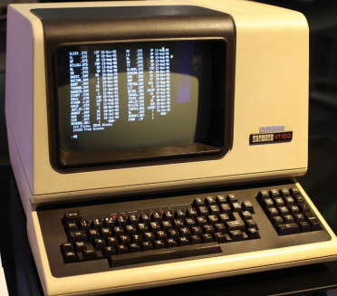
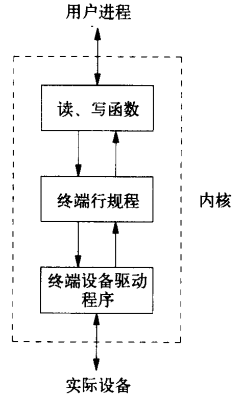
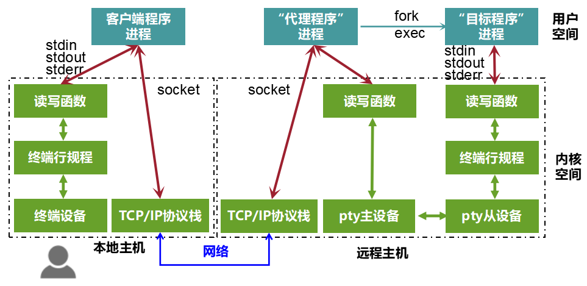
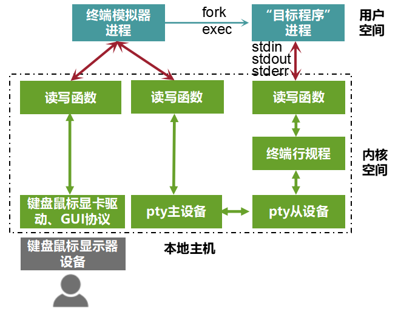
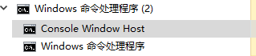

本文共4300余字，预计阅读时间15分钟，本文同步发布于知乎（账号silaoA）和微信公众号平台（账号伪码人）。
关注学习了解更多的Cygwin、Linux技术。

控制台、终端、shell是命令行界面（CLI）系统中极重要的几个概念，而计算机软件系统中最普遍的思想是分层，这几个事物就在不同层次中，搞清楚概念才能理解软件程序工作在哪一层，本文将带你梳理清楚控制台、终端、shell相关概念及其关系。
<!--more-->
<!-- [toc] -->
# 0x00 关系概览
先总体上简要概括这几个名词在计算机系统中所扮演的角色。

控制台、终端、虚拟终端是一类输入输出设备的总称，拥有将用户指令输入给操作系统和将操作系统返回结果输出给用户的基本功能，电传打字机（teletypewriter，缩写为tty）是该类设备的具体实例。终端模拟器（Terminal Emulator）是一类应用程序，用来模拟终端设备的功能，未具体说明情况下，“终端”泛指真实终端设备或终端模拟器。伪终端（pseudo tty，缩写为pty）是UNIX/Linux内核中驱动程序模块，是一个软件中间层，用于克服真实终端设备在现代应用场景中的不足。

Shell是UNIX/Linux系统中最为重要的应用程序之一，负责解释执行用户指令，打印结果，和用户交互，进行着REPL（Read-Evaluate-Print Loop）。sh、bash、zsh、fish等都是Shell的具体实例。

系统内核接管计算机资源，设备和程序**在系统内核的调配下运转**，他们之间的关系可用下图表示。用户实际用到的是具体程序，是难以感知内核的存在的，所以看起来就像是Shell在帮助用户调用程序。

# 0x01 控制台、终端、串口终端
计算机发明初期很贵且庞大，一台计算机占地要数间房子，被放置在玻璃房门里，一般人“可远观而不可亵玩”。如此的庞然大物有一个专门的操作台，陈列各种仪表盘、指示灯、按钮、电线，操作人员通过这个操作台控制计算机的启动、运行、停止，结果同时反馈到操作台，这个操作台就叫“控制台（Console）”。这时的计算机真的就是跟工厂机器一样，需要专业的师傅专门操作，师傅叫做“操作员（Operator）”。

控制台可以实现对计算机的完全操控，用来管理计算机，但不方便给用户服务。后来计算机技术发展，计算能力不断提升并出现了多用户操作系统（特别是UNIX），允许每个用户通过终端设备（Terminal）与主机连接，操作系统管理员给每个用户分配一个账户，“登录”到系统获得计算机使用权，这时计算机才算实现了服务用途。

按照计算机组成划分，终端设备仅仅是一个IO外设——将用户的指令输入给主机，将主机的返回结果输出给用户，而电传打字机（teletypewriter）能够完成这一功能。UNIX/Linux系统常将登陆到系统的终端抽象为`/dev/ttyN`（N为数字），tty即源自teletypewriter缩写。但是电传打字机的输出印在纸上，用户输入的字符就像打字机一样也是删不掉的，而且用户输入什么就会立刻传给主机。从1970年代末期开始，电子视频终端（video terminal）开始取代电传打字机成为主流的终端设备，带缓存功能，允许用户在传给主机之前修改输入信息，1978年Digital公司生产的VT100时至今日仍然是终端的事实标准。

UNIX/Linux内核中有3个模块共同支持终端设备：读写函数、**终端行规程**（terminal line discipline，也有译作“终端线路规程”）、字符设备驱动。应用程序通过tty_read、tty_write等函数对终端字符设备发起读写操作，**终端行规程**作用类似于过滤器，对读写的字符做特殊处理，比如将按键Ctrl-C、Ctrl-Z等特殊字符解释成相关信号发给前台进程，并不让应用程序读到，真正可读写的字符才会进一步传递给应用程序或tty字符设备驱动程序，驱动程序再去操作设备本身。**终端行规程可看作是人机交互的通用规范。**

tty字符设备驱动程序维护着输入和输出两个队列，终端按键输入的字符经终端行规程处理后送到输入队列，应用程序按先入先出原则在队列中读到字符；应用程序发起写操作，输出的字符经行规程处理后送到输出队列，驱动程序按先入先出原则将输出队列的字符在终端上显示出来。如果终端配置成回显（Echo）模式，那么输入队列中字符被送给应用程序的同时送到输出队列，因此用户在终端按键的时候，字符不仅被应用程序读到，同时也在终端回显。回显（Echo）正是终端通常设置的工作模式。

终端设备通过显示卡、键盘口等接口与主机直连，终端设备的驱动程序实现了纷繁复杂的IO模式、规范等，以便命令行程序充分利用终端设备的各种功能。

后来计算机发展出串行端口（Serial Port），彼时串口的最大用途就是连接终端，计算机就把连接到串口的外设看作字符设备，外设称为“串口终端（Serial Port Terminal）”，串口在Linux系统中对应着设备`/dev/ttyS1`、`/dev/ttyS2`......等，Windows下`COM1`、`COM2`概念相对应，对串口的读写操作最后都反映到与之相连的外设上。

# 0x02 虚拟终端、终端模拟器、伪终端
如今，PC已成为消费级电子产品，电传打字机、电子视频终端已基本淘汰，控制台、终端不再是各自独立的外设，PC上的键盘、显示器被整合为控制台/终端。

一台PC通常只有一套键盘和显示器，也就是只有一套物理终端设备，Linux内核将这一套键盘和显示器映射为6个字符终端设备文件，即`/dev/tty1~tty6`，称为“虚拟终端（Virtual Terminal）”，可通过`Ctrl-Alt-F1~F6`切换。`/dev/tty0`则指向用户当前正在使用的虚拟终端，如用户切换到`/dev/tty4`，那么`/dev/tty0`就指向`/dev/tty4`。

终端模拟器（Terminal Emulator）是基于系统中已有的键盘、显示驱动而构建的图形界面程序，其根本用途只有一个——模拟电子视频终端的功能，前文所述的VT100就是被广泛模拟的对象，实际支持的操作比真实终端设备要高级得多。xterm是X11图形窗口系统（被很多Linux、UNIX发行版采用）下的标配终端模拟器。

终端、虚拟终端、串口终端是有真实物理设备相对应的，一方面数量有限制，另一方面在远程执行主机上的应用程序（比如sh、vi等）时，终端虽然通过基于TCP/IP协议的socket接口与主机连接了，但远程主机上的程序的标准输入、标准输出、标准错误无法关联到socket上，同时主机上的程序只有对终端设备操作才能正常运行，socket无法提供和终端设备兼容的IO模式、规范等。

那么，该怎么弥补这之间的差异？又双㕛叒叕一次祭出David Wheeler大神的名言：
>All problems in computer science can be solved by another level of indirection（计算机科学领域的任何问题都可以通过增加一个间接的中间层来解决）。

伪终端（pseudo tty，缩写为pty）就是这样一个中间层，是UNIX/Linux内核中一对双向互联的设备，分为主设备（pty master）和从设备（pty slave），也称作“伪终端对（pty pair）”。回到上面提到的执行远程主机上应用程序的场景，有了伪终端设备支持，本地终端并不直接和目标程序连接，而是通过“代理程序”替它操作：

①“代理程序”进程同时打开socket和pty主设备，监控这两路数据；
②“目标程序”进程（**通常**是“代理程序”创建）则打开pty从设备，而pty主从设备互联，这样他们充当了“代理程序”进程和“目标程序”进程的双向管道，**pty从设备表现与真实终端设备完全一致**，“目标程序”进程的标准输入、标准输出、标准错误均能关联到pty从设备；
③本地的指令通过socket发送到代理程序进程，代理程序进程将socket上的数据写入pty主设备，最后被映射到目标程序进程对pty从设备的标准输入；
④“目标程序”进程对pty从设备的标准输出、标准错误，最后传送到代理程序，并通过socket返回到本地。

**在实际应用场景中，“代理程序”可能是ssh/telnet server，目标程序可能是shell，本地用户就通过本地主机ssh/telnet客户端程序远程登录到主机shell。**从上图和文字可以看出：“代理程序”名副其实地主要起着代理作用，双向传递数据，这个流程能走通的关键是pty从设备能够和真实终端设备表现一致。**从功能上讲，伪终端取代了**原始终端设备与主机连接模型中的**通信线缆，而且是在内存中实现高速通信**，设备由于不是真实硬件，系统中打开的数量名义上可以无限（内核可配置）。

对于本地主机的终端模拟器，除了模拟终端本身还承担着上图“代理程序”的角色，“目标程序”则可能是某个登陆Shell，如下文要提及的bash、zsh，也可能是上文提及的ssh/telnet客户端程序等。

历史上，UNIX系统伪终端的著名实现有System V（UNIX 98）和BSD两种风格，而且接口互不兼容，但是前者更易使用，[Single Unix Specification V3（2004版）](http://pubs.opengroup.org/onlinepubs/009695399/nfindex.html)所规定的伪终端是基于System V（UNIX 98）接口的，现代的许多UNIX以及Linux同时支持两者。

由于设计理念不同，Windows内核不支持[Single Unix Specification](http://pubs.opengroup.org/onlinepubs/009695399/nfindex.html)中规定对终端、伪终端，而是提供两大类应用程序的API：Console应用程序和GUI应用程序。前者在Windows系统自带的命令提示符窗口中，由cmd解释执行。Windows系统上有多种优秀的第三方终端模拟器，利用Console API、Cygwin API等手段在用户空间模拟pty特性。**2018年，微软在Windows 10新版本上开始搭载Windows Pseudo Console（ConPTY）API，提供类似于UNIX伪终端设备的支持。**

# 0x03 Shell
终端自身并不执行用户输入的命令，它只是负责把输入的内容传送到主机系统，并把主机系统返回的结果呈现给用户。负责解释执行用户输入的命令并返回结果的，正是Shell！它是沟通用户和系统内核的中间桥梁。

从这个功能讲，广义上的Shell可以是图形界面的也可以是命令行界面的。比如Windows上的Explorer，双击文件名为什么可以让一个程序打开这个文件？其实可以理解为Explorer捕捉到了“鼠标双击文件名”这个事件，然后根据文件名去请求Windows内核启动了一个关联程序，并传入相关参数(文件名等信息)，然后这个程序自己再“打开”用户双击的文件，呈现到屏幕上。Windows上运行“命令提示符”时，在任务管理器中可以看到运行了两个进程：Console Windows Host和cmd，前者是终端模拟器（console host在用户启动cmd的时候由Windows系统自动创建），后者则是Shell程序。除了图形、命令行交互，未来还可能出现更加高级的Shell，比如语音、动作等等。

狭义的Shell仅指字符界面的命令解释器，在UNIX/Linux系统上广泛应用，所做的工作主要是：
①读入用户输入（Read）；
②解释执行（Evaluate）；
③打印执行结果和提示符（Print）；
④回到①循环（Loop）。

这种工作方式被称为交互式Shell（Interactive Shell），Shell通常还支持批处理方式（Batch），用户提前写好要执行的命令，形成脚本（Shell Script），Shell一次性把脚本中的命令执行完。

UNIX/Linux系统上存在多种字符界面的Shell，比较著名的有：
- sh（Bourne Shell），1977年由Steve Bourne开发，成为各种UNIX的标配，兼容POSIX的sh在1992年开发；
- csh（C Shell），1978年由Bill Joy开发，随BSD UNIX发布，语法和C语言相似；
- tcsh（TENEX C Shell），1983年开发，兼容POSIX是csh的增强版本，支持命令补全等特性，在FreeBSD、Mac OS X等系统上替代csh；
- ksh（Korn Shell），由David Korn开发，兼容sh并添加了很多csh引入的特性，是现代各种UNIX的标配，这些系统上sh实际是指向ksh的符号链接；
- bash（Bourne Again Shell），1989年由GNU项目开发，与POSIX标准保持一致，同时兼容sh，是Cygwin、Linux系统的标配，这些系统上sh实际是指向bash的符号链接；
- zsh（Z Shell），1990年由Paul Falstad开发，在兼容bash基础上引入ksh、tcsh的多种特性，如自动补全、智能提示等，配置高度自由，被称为终极shell；
- fish（Friendly Interactive Shell），2005年开发，目标是易于使用、记忆命令，和zsh是对手。

# 参考
- W.Richard Stevens，Stephen A.Rago·Advanced Programming in the UNIX Environment[M]·尤晋元，张亚英，戚正伟  译，2005·
- Michael Kerrisk·The Linux Programming Interface : A Linux and UNIX System Programming Handbook[M]·孙剑，许从年，董健 孙余强  译，2014·
- <https://en.wikipedia.org/wiki/Pseudoterminal>
- <https://en.wikipedia.org/wiki/Comparison_of_command_shells>
- [Windows Command-Line: Introducing the Windows Pseudo Console (ConPTY)](https://blogs.msdn.microsoft.com/commandline/2018/08/02/windows-command-line-introducing-the-windows-pseudo-console-conpty/)

---
**如本文对你有帮助，或内容引起极度舒适，欢迎分享转发或点击下方捐赠按钮打赏** ^_^