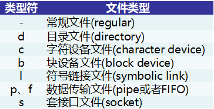

本文共5500余字，预计阅读时间18分钟，本文同步发布于知乎（账号silaoA）和微信公众号平台（账号伪码人）。
关注学习了解更多的Cygwin、Linux技术。

**“一切皆文件”**是UNIX的设计哲学，硬件设备、套接字、目录、程序等都被**抽象**为“文件”，内核提供一套API给用户应用程序（user application），用于操作上述对象，都被抽象为对文件的读写操作，这样设计最大的好处就是**内核可以保持API的一致性，屏蔽对象细节**。Linux、Cygwin自然继承了这一点，用户在使用操作系统过程中实际就是文件操作。

<!--more-->
<!-- [toc] -->
# 0x00 文件相关的概念
## 文件类型
Linux将一切抽象为文件，并分为不同的文件类型，主要有常规文件、目录、字符、链接、管道、套接口等，使用`ls -l`命令查看文件时，属性栏有相应的字符标识文件类型，如下表所示。


对于常规文件，Windows中文件名一般带有后缀，或者叫“扩展名”，文件扩展名**关联**了用于打开此种文件的默认程序，并无更多作用。而Linux中干脆没扩展名这个概念，文件名的后缀只是起标识作用，方便人看，真要查看文件格式，得用`file`等命令。

对于上面几种文件类型，值得注意的是**目录**（directory），属于特殊文件类型之一，Windows中与之对等的概念是“文件夹”。目录中可以放置任何类型文件，包括目录本身，目录中存放的文件名称，在该目录文件内容里都对应着一个条目（entry），每个目录至少有2个特殊的条目——“.”和“..”，其中“.”指向自身，“..”指向上一层目录，多层目录形成嵌套的**路径**（path）。Linux、UNIX系统中规范了以**根目录（/）**起始的树形目录架构，格式化的磁盘分区挂载在其中某个子目录下；Windows中则是以格式化的磁盘分区为起始，在各分区中形成目录树；**Cygwin根目录（/）**就是Cygwin的安装路径，Windows的各分区默认挂载在`/cygdrive`目录下，即c盘就是`/cygdrive/c`、d盘就是`/cygdrive/d`。

## 用户与文件属主
Linux、UNIX是真·多用户系统，允许多个用户同时登录使用，并将用户（user）划分为不同的群组(group)，每个用户有唯一的用户ID（uid）、每个群组有唯一的群组ID（gid）。除了部署Linux、UNIX系统过程中创建的普通用户、群组，系统中还存在一些特殊用户及群组，比如root、admin、nfs、apache等用于执行系统服务，使用不当给系统造成较大破坏。系统中注册了哪些用户和群组，信息保存在`/etc/passwd`和`/etc/group`文件中，第1列便是用户名/组名,这两个文件Cygwin中也存在，都是普通文本文件，随便找个文本编辑器，比如记事本，就可以打开。

Windows也有多用户及群组，但只能同时一个用户登录使用，第二个用户登录时自动将第一个用户踢出。对于Cygwin，它并不额外创建用户和群组，而是直接引用Windows系统中用户和群组，登录到Cygwin中Shell的身份即为Windows当前用户。

由于多用户，在系统中就存在由不同用户创建、修改的文件。为安全有效地管理用户和文件，操作系统给文件分配属主，对于某个文件而言，系统中的用户角色可能是所有者（User）、所有者群组（Group）内用户或其他（Other）。

## 文件权限
基于用户角色，Linux、UNIX系统将文件按上述三类角色**独立分配权限**，文件权限包括可读（Read）、可写（Write）和可执行（eXecute）。文件元数据中用3位二进制位图记录这3个权限，1表示有权限、0表示无权限，可读对应Bit2、可写对应Bit1、可执行对应Bit0，即r、w、x权限所在位由高至低排列。User、Group、Other 3种角色**独立分配权限**，共需要3×3=9位二进制。若用数值表示，每组3位二进制数刚好对应1个八进制数，3种角色就是3个八进制数。

用二进制位图记录文件权限，对计算机程序来说是非常简便的，但对于人来说，无论是二进制还是八进制数就都不够直观了。`ls -l`命令查看文件时，属性栏用r、w、x、-字符描述可读（Read）、可写（Write）、可执行（eXecute）和无权限，如“rwx”表示同时拥有可读、可写和可执行权限，“r-x”表示拥有可读和可执行权限、但没有可写权限；每类角色用户用3个字符即可描述清楚对该文件拥有何种权限，User、Group、Other 3类角色共3×3=9个字符。文件的权限、字符和数值表示，总结如下表。


常规文件的可写和可执行权限好理解，但目录文件呢，它的可写和可执行有什么含义？对于目录文件，可读表示可以查看目录本身的信息（存放哪些文件、访问时间等），可写表示可以在该目录下创建/删除文件、修改文件名，可执行表示可以进入(cd)到该目录。

文件权限按角色多重设计，极大地提升了系统的安全性，通过赋予用户特定的身份、“剥夺”用户的某些权限使之不能随意操作系统文件，有效**防止和限制**病毒、恶意程序攻击。Linux系统中，还涉及特殊的sticky位权限，在此不做讨论。

Cygwin未全面移植Linux系统中的权限机制，而是做了简化，但是在外观上看起来和Linux没有太大差异。在FAT文件系统分区中，文件均是可读，Cygwin根据Windows系统函数判断一个文件是否“只读”来进一步是否赋予可写权限，并给扩展名为.bat、.cmd、.com、.exe以及第1行以“#!”开头的文本文件增加可执行权限（注： “#!”在Linux、UNIX系统中是“魔数”(magic number)，其后的内容指示了该文本由哪个程序解释执行。）。而在NTFS文件系统(现在Windows上几乎都是NTFS文件系统分区)中，Cygwin根据Windows系统提供的访问控制列表(Access Control List，ACL)机制来赋予权限。

## 案例说明
文件属主、类型、权限都属于文件属性，通过下图解释。使用`ls -l`命令查看目录ctng-work目录详细信息，含义如下。


- 第1栏有10个字符，其中第1个字符描述类型，后边9个字符描述权限，图中config文件的类型字符是“l”，表示链接文件（link），“rwxrwxrwx”表示User、Group、Other都同时拥有该文件的读、写、执行权限；config.gen文件的类型字符是“d”，表示目录文件（directory），“rwxr-xr-x”表示User拥有该文件的读、写、执行权限，Group拥有该文件的读和执行权限但没有写权限，Other也是拥有该文件的读和执行权限但没有写权限，最后一个“+”暂不详细讨论。
- 第2栏是硬链接数，删除文件其实是将链接数减1 ，减到0了就真正删除文件内容，暂不详细讨论。
- 第3、4栏是文件属主及所在群组。
- 第5栏是文件大小，单位为字节（Byte）。
- 第6栏是最近访问（修改）时间。
- 第7栏是文件名，对于符号链接，还加上了其所指向的文件名。

# 0x01 文件操作的命令
对文件的常用操作不外乎查看、复制、移动、重命名、编辑、压缩/解压、更改属性。
## ls、tree
`ls`是单词list的简写，用于查看文件信息而非文件内容，不指定参数的话，默认参数是“.”，即查看当前目录的信息，如果给定多个参数那就依次列出信息。`ls --help`输出详尽的用法和选项含义，仅列举几个常用的。
```bash
$ ls --help
用法：ls [选项]... [文件]...
List information about the FILEs (the current directory by default).
Sort entries alphabetically if none of -cftuvSUX nor --sort is specified.

必选参数对长短选项同时适用。
  -a, --all                  不隐藏任何以. 开始的项目
  -A, --almost-all           列出除. 及.. 以外的任何项目
      --author               与-l 同时使用时列出每个文件的作者
  -d, --directory            list directories themselves, not their contents
  -l                         使用较长格式列出信息
  -r, --reverse              逆序排列
  -R, --recursive            递归显示子目录
  -S                         sort by file size, largest first
  -t                         sort by modification time, newest first
  -U                         do not sort; list entries in directory order  
```

`tree`用于以树形结构显示目录内容，不指定参数的话，默认参数是“.”，即查看当前目录的内容。`tree --help`给出了详尽的用法和极多的选项，但一般用`-a`、`-d`、`-L`选项就够用了，其中`-a`、`-d`选项与`ls`命令的`-a`、`-d`选项作用一致，`-L`选项指定显示深度，1只显示目录下的内容，2显示到子目录下的内容，依此类推，默认无限深度。
```bash
$ tree -ad -L 1 #显示当前目录下的隐藏文件、仅显示目录（directory），深度为1
.
├── .cache
├── .emacs.d
├── .gnupg
├── .ipython
├── .oh-my-zsh
├── .pip
├── .ssh
├── .tldr
├── .zgen
├── .zsh-custom
├── build
├── configure.sh.d
├── dircolors-solarized
└── wget-test

14 directories
```

## cat、head/tail、more/less
`cat`本质上是文件连接(concatenate，如果学过c语言肯定记得用过`strcat`函数，此处`cat`即是这个含义)，根据参数依此把指定的文件内容打印到标准输出`stdout`，未指定参数的话默认从标准输入`stdin`读取内容。以下仅列出`cat`常用几个选项用法。
```bash
$cat --help
用法：cat [选项]... [文件]...
将[文件]或标准输入组合输出到标准输出。

  -A, --show-all           等于-vET
  -b, --number-nonblank    对非空输出行编号
  -e                       等于-vE
  -E, --show-ends          在每行结束处显示"$"
  -n, --number             对输出的所有行编号
  -s, --squeeze-blank      不输出多行空行
  -v, --show-nonprinting   使用^ 和M- 引用，除了LFD和 TAB 之外
```

`head`/`tail`用于查看文本文件头部/尾部的若干行，行数由`-n`选项指定，默认为10行；`head`/`tail`以下几个示例的选项含义相同。
```bash
head -n5 /etc/profile #查看/etc/profile前5行
head -5 /etc/profile  #与上一行等效，查看/etc/profile前5行
head /etc/profile #查看/etc/profile前10行
head -c128 /etc/profile  #查看/etc/profile前128字节
head -c1k /etc/profile  #查看/etc/profile前1k字节，即1kB
```

`more`/`less`是以分页方式浏览文件内容，通常不需要指定选项，直接用参数指定要看的文件即可；Cygwin中只安装了`less`，而`more`只是指向`less`的链接。`more`/`less`中的翻页、查找、退出等操作和`man`中相同，事实上是`man`调用了`more`/`less`进行这些操作。

## mv
`mv`是单词move的简写，用于文件的重命名和移动，命令最简形式是`mv [选项] src dest`,把`src`移动到`dest`，若`src`和`dest`都是常规文件相当于文件重命名，若`dest`是目录则是把`src`(无论是文件还是目录)移动到`dest`之下。`-f`、`-i`、`-n`、`-u`、`-S`较常用。
```bash
$mv --help
用法：mv [选项]... [-T] 源文件 目标文件
　或：mv [选项]... 源文件... 目录
　或：mv [选项]... -t 目录 源文件...
Rename SOURCE to DEST, or move SOURCE(s) to DIRECTORY.

必选参数对长短选项同时适用。
      --backup[=CONTROL]       为每个已存在的目标文件创建备份
  -b                           类似--backup 但不接受参数
  -f, --force                  覆盖前不询问
  -i, --interactive            覆盖前询问
  -n, --no-clobber             不覆盖已存在文件
如果您指定了-i、-f、-n 中的多个，仅最后一个生效。
      --strip-trailing-slashes  去掉每个源文件参数尾部的斜线
  -S, --suffix=SUFFIX           替换常用的备份文件后缀
  -t, --target-directory=DIRECTORY  move all SOURCE arguments into DIRECTORY
  -T, --no-target-directory    treat DEST as a normal file
  -u, --update                 move only when the SOURCE file is newer
                                than the destination file or when the
                                destination file is missing
```

## cp
`cp`是单词copy的简写，用于文件/目录复制，命令形式与`mv`相同，`-f`、`-i`、`-n`、`-u`、`-S`、`-T`这几个常用选项含义与`mv`的也相同。
```bash
cp /path/of/fileA fileB  #将/path/of/fileA文件复制一份到当前目录下并重命名为fileB
cp -r /path/of/dirA /path/of/dirB   #将/path/of/dirA“递归”地复制至/path/of/dirB目录下
cp -t dest src1 src2 #将src1、src2依次复制至dest
cp -aruv src dest #将src递归复制至dest，仅复制更新的文件
```

## touch、mkdir
`touch`本用于更新指定文件的访问时间，即**触摸**一下，文件不存在的话就是创建新文件。
`mkdir`是make directory的简写，用于创建目录，如果常用的选项为`-p`，即逐层目录按需创建而不是报错，使用时建议带上`-p`。
```bash
mkdir /path1/path2/path3 #要求/path1/path2已存在，不存在则报错
mkdir -p /path1/path2/path3 #逐层创建/path1、/path1/path2、/path1/path2/path3
```

## rm、rmdir
`rm`是单词remove的简写，`rmdir`是remove directory的简写，用于删除文件/目录，但`rmdir`只能删除空目录，所以更常用`rm`。`rm`常用选项包括`-r`、`-f`、`-i`。
```bash
rm /dirA/fileA /dirB/fileB /dirC #删除fileA、fileB，但不能删除目录/dirC
rm -r /dirC #递归删除/dirC目录下文件、子目录的所有内容
rm -r -i somefile somedir #每次删除前提示等待确认（interactively）
rm -r -f somefile somedir #强制删除（forcely）无提示
```
`rm -fr`**威力过于强大，使用需谨慎**，Linux、UNIX没有回收站，删除后文件无法找回（使用磁盘恢复等特殊手段除外）。涉及到比较长的路径，如果中间手误多打了空格，比如`rm -fr /x/y/z`误写为`rm -fr / x/y/z`，含义就是强制删除根目录“/”和子目录“x/y/z”，删除了根目录“/”系统就彻底凉凉了。要避免手动误敲，在Shell中要多按`TAB`键自动补全和提示。还有个比较隐藏的危险，就是在脚本中使用变量未检查空值，如`var1=$PATH_TEMP/`，结果脚本在运行过程`$PATH_TEMP`值始终为空，执行`rm -rf $var1`就相当于`rm -rf /`。

以上各种误操作，即便不是删除根目录“/”，误删`/bin`、`/usr`、`/sbin`等重要目录也同样会让系统崩溃无法恢复。

## tar
`tar`是tape archive(磁带归档)的简写，用于归档和解归档，配合`-j`、`-z`、`-J`选项可以进一步调用压缩/解压缩程序采取进一步动作。需要强调的是**归档文件不是压缩文件！**归档只是把多个文件打包，并未压缩，通常以“.tar”做文件名后缀，方便识别。文件经压缩程序压缩才是压缩文件，不同压缩程序采用的算法不同，形成不同的压缩格式，主流的压缩程序有`bzip2`、`gzip`、`xz`/`lzma`/`lzip`/`lzop`，形成的文件名后缀相应是“.bz2”、“.gz”、“.xz/lzma/lzip/lzop”。

`tar`支持的选项极多，仅以几例说明。
```bash
tar -cvf /tmp/etc.tar /etc #等效为tar -cv -f /tmp/etc.tar /etc，将/etc 目录下的文件全部打包成为/tmp/etc.tar
tar -xf some.tar #等效为tar -x -f some.tar，将some.tar解包至当前目录下
tar -xf some.tar -C dest/ #将some.tar解包至dest目录下
tar -tvf some.tar #查看some.tar中归档的文件、子目录
#`-c`含义为创建（create）tar文件，`-f`指示tar文件名（filename），`-x`意为提取（extract），`-t`意为列出（list），`-v`意为输出中间过程

tar -zcvf /tmp/etc.tar.gz /etc #将/etc目录下的文件全部打包再调用gzip压缩为/tmp/etc.tar.gz
tar -zxvf /tmp/etc.tar.gz -C dest/ #调用gzip将/tmp/etc.tar.gz解压，再将归档文件 解包至dest目录下
#`-z`关联`gzip`进行压缩/解压缩动作，`-j`关联`bzip2`，`-J`关联`xz`/`lzma`/`lzip`/`lzop`
```

## chown、chgrp
`chown`是change owner的简写，`chgrp`是change group的简写，二者用于更改文件的属主/属组。`chown`命令形式为`chown [选项]... [所有者][:[组]] 文件...`，`chgrp`命令形式为`chgrp [选项]... 用户组 文件...`，以下仅以常见用法示例。
```bash
chown root somefile #将somefile文件属主更改为root
chown -R user1:group1 somedir #将somedir目录及子目录下所有文件属主递归地更改为group1组中的user1用户
chgrp group1 somefile #将somefile文件属组更改为group1
chgrp group1 somedir #将somedir目录及子目录下所有文件属组递归地更改为group1
```

## chmod
`chmod`是change mode的简写，用于更改文件权限。`chmod`命令形式为`chmod [选项] 模式 文件...`，特别是模式支持的形式灵活多变，以下仅以几例说明。
```bash
chmod 640 fileX # 设置user对fileX的权限为rw，group的权限为r，other的权限为空
chmod 777 fileX # 设置user、group、other对fileX的权限均为rwx
chmod a=rwx fileX # 与上等效，设置所有人（all）对fileX的权限均为rwx
chmod u=rwx fileX # 设置user对fileX的权限为rwx，group、other权限不变
chmod u=rwx,go=r fileX # 设置user对fileX的权限为rwx，group、other的权限为r
chmod u=rwx,g=rx,o=r fileX # 设置user对fileX的权限为rwx，group的权限为rx，other的权限为r
chmod ug+x fileX # 同时增加user、group的x权限，其余权限不变
chmod a+x fileX # 增加所有人（all）对fileX的x权限
chmod o-wx fileX # 取消other对fileX的w和x权限，其余权限不变
chmod -R a+x dirX # 递归地增加所有人（all）对dirX目录及子目录所有文件的x权限
```
注意以上命令中，模式既有八进制数字形式，也有rwx的形式，无论哪种形式**模式表达式内部不应有空格隔开**。

# 0x02 小结
本文仅简单介绍了文件相关的几个概念和几个命令，更多详情需要参阅Linux系统相关教程，更多的命令需要在实践中逐步积累，不记得用法的时候尝试`--help`选项以及`man`、`info`命令。

---
**如本文对你有帮助，或内容引起极度舒适，欢迎分享转发或点击下方捐赠按钮打赏** ^_^