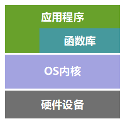

本文共3500余字，预计阅读时间12分钟，本文同步发布于知乎（账号silaoA）和微信公众号平台（账号伪码人）。
关注学习了解更多的Cygwin、Linux、Python等技术。

Python程序代码中经常需要import语句，从而调用已有的函数、方法等，但在多目录、多文件的项目程序中，容易遇到各种import错误，本文将通过合理化组织规避import带来的错误。**本文描述针对Python3，Python2已过时并将进入无人维护状态，如是初学者建议直接选Python3。**

<!--more-->
<!-- [toc] -->

# 0x00 module与package
## 代码复用性和分层思想
程序代码如果完成的功能比较简单，放在一个文件里比较正常。如果随着需求变多，要完成的功能越来越多样化，那么正常的做法都是按照功能模块做好设计，将程序代码分割成多个目录、文件组织，每个文件完成各自的那部分功能即可。这样做的好处，一方面是便于维护，一旦发现bug方便快速定位和调试；另一方面是可以提高代码复用性，比如最基础、最常用的那部分代码文件，还可以被其他项目所用，不必从零开始重写。

还没见过哪种编程语言不支持多文件程序设计（如果真有，那也该淘汰了），Python也不例外。

既然支持多文件组织程序了，那么`如何组织`就是个大学问。在[Cygwin系列（九）：Cygwin学习路线](Cygwin系列（九）：Cygwin学习路线.html)文中也提到了计算机系统粗略层次划分，在应用程序层面也可以照此继续细分更多层。


照这个思路，可以简单地把程序再分为`驱动`和`应用`层，`驱动`负责实现基本操作、屏蔽细节，也可以叫`底层`；`应用`层根据`驱动`提供的接口调用相关函数，实现更高级的功能，也可以叫`上层`。比如Python中`len`、`sum`等函数，我们不用关心它是怎么实现的，也不需要重写求长度、求和的函数，自己写的程序代码只要按照接口规定传入参数即可得到预期结果，从而实现更高级的功能需求，那么提供`len`、`sum`等函数的代码文件就称为`底层`，我们自己写的代码可称为`上层`。更进一步地，我们自己写的代码可以划分更多层次出来，不难理解,`底层`与`上层`是相对而言的。

把编程比作建大楼，层次可以划分为 水泥沙子制作、砖头制作、墙体制作、楼房制作 4层，楼房制作层直接取用墙体搭建房子，必要时可以取用砖头，墙体制作层直接取用砖头形成各式各样的墙体，砖头制作层直接取用水泥沙子形成不同规格的砖头，而水泥沙子一般是有做好的。并且到了某次需要建大桥的时候，水泥沙子制作、砖头制作这些功能可以再用，不必重新实现，减少了工作量。

## module
在Python中，一个.py文件就是一个module，即“模块”，**模块的名称是文件名去掉末尾的'.py'**。一个模块（A）中的变量、函数、类等符号，被其他模块（B）import之后，可被其他模块（B）引用。我们写程序代码的时候，就可以把代码分门别类地放在不同的.py文件中，按照各自的层级位置，实现各自的功能。

比如将程序分成`brick.py`、`wall.py`、`house.py`。
- `brick.py`实现砖头制作函数，不同的参数指定砖头规格；
- `wall.py`中`import brick`，调用函数得到不同规格砖头，组装形成墙体；
- `house.py`是主程序，`import wall`后调用函数得到墙体，必要时也可以`import brick`制作特定的砖头，最后统一组装成房子。

Python是“电池内置”型（battery included）语言，初次安装Python解释器时会一并安装很多基础的模块和包，称为“标准库（standard library）”，在Python安装路径的`lib`子目录下可看到。此外，用户可以自行安装其他第三方库，默认会放在`lib/site-packages`子目录下。

有的模块出于运行效率考虑，是被编译进Python解释器的，并不以`.py`文件形式存在，比如常用的`builtins`、`sys`等。内置的`len()`函数、加减乘除运算等就在`builtins`模块中，使用时甚至不需要我们import，Python解释器在启动时便已import好了，而`sys`模块需要先import才能使用。

## package
自己写的模块应该避免与Python内置模块重名，但不同人编写的模块名称相同怎么办？为解决名称冲突问题，Python引入按照目录组织模块的方法，创造了package（包）的概念。包是一个特殊的目录，其下**必须**含有名为`__init__.py`的文件，否则Python会将其当作普通目录而不是包，目录下`__init__.py`文件对应的模块名就是包（目录）名，**文件内容可以为空**。

有了包，只要顶层包名称与其他人不发生冲突，模块名称便不会冲突。如下目录组织，顶层包为`soud`目录，import成功后，相应模块名称为`sound.example`、`sound.formats.wavread`、`sound.effects.echo`、`sound.filters.vocoder`等，要引用模块中的变量、函数符号，按照`模块名.符号名`方式使用即可。
```bash
sound/                          # 顶层包
      __init__.py               # 初始化sound包
      formats/                  # 子包formats
              __init__.py
              wavread.py
              wavwrite.py
              ...
      effects/                  # 子包effects
              __init__.py
              echo.py
              surround.py
              reverse.py
              ...
      filters/                  # 子包filters
              __init__.py
              equalizer.py
              vocoder.py
              karaoke.py
              ...
      example.py
```

# 0x01 import
## 基本形式
import语句支持两种形式：
- import xx
*  `xx`是模块名（指含包路径的模块全名）的话，通过`xx.符号`的形式访问函数、变量、类。
*  `xx`仅是包名的话，只会import到包下子模块，并不会自动import子包，可以通过`xx.mod1.符号`的形式访问函数、变量、类，通常会在包下的`__init__.py`中写入import子包语句，这样便能通过`xx.subpack1.mod2.符号`形式访问mod2中的函数、变量、类，还有更多技巧进一步简化访问子包下模块内的符号。
*  `xx`不能定位到任何函数、变量、类名。
- from xx import yy
*  `xx`是模块名（指含包路径的模块全名）的话，`yy`就定位到具体的函数、变量、类。
*  `xx`是包名的话，`yy`可以定位到子包、模块或具体的函数、变量、类，比如`from sound import __version__`，Python解释器首先检测`__version__`是否为`sound/__init__.py`中定义的符号，若不是，再检测是否存在`sound.__version__`模块，如不存在便报错。如果`yy`是`*`，那么代表引入`xx`模块中定义的所有符号；对于包，可以在包下`__init__.py`文件定义`__all__`变量规定允许导出的所有符号或模块，如无`__all__`定义，则该语句只负责import`xx`包，执行包下`__init__.py`文件，当然文件内可以import子模块或子包。`from xx import *`形式容易造成命名冲突，建议慎用！
  
  以上两种形式，可以后续加`as`表达式，对import的对象取别名，如`import numpy as np`。

`equalizer.py`、`vocoder.py`文件在同级目录下，`equalizer.py`中使用`import vocoder`或者`from vocoder import xx`,然后运行`python sound/filters/equalizer.py`是不会报`ImportError`错误的。那么，不在同级目录下该怎么处理呢？

## relative import和absolute import
简单来说，相对导入（relative import）的语句通过使用`.`或`..`等相对路径的方式来定位要import的模块/包，基准路径是当前模块所在包，如在`sound/effects/reverse.py`中，基准路径是`sound.effects`包，使用下属语句都是合法的。
```python
from . import echo                # 对应模块 ./echo.py
from .surround import XXX         # 对应模块 ./surround.py内的XXX符号
from .. import formats            # 对应包 ../formats
from ..filters import equalizer   # 对应模块  ..filters/equalizer.py
from ... import example           # 对应模块 ../../example.py
```
但在执行`python sound/effects/reverse.py`时便会报`ModuleNotFoundError`错误，这是因为执行语句将`sound/effects/reverse.py`当做主模块（main module），主模块的名称在运行时会被Python强制命名为`__main__`，从而找不到`__main__.echo`模块，规避的正确方式是使用`-m`选项运行指定模块，即`python -m sound.effects.reverse`运行正常。相对导入方式可以解决导入当前目录、上级目录、上上级目录下模块的需求，但**使用相对导入的文件不能直接以脚本方式运行，只能以模块方式（-m选项）运行，并且当前路径要处于import语句定位的路径或更高层路径**。

绝对导入（absolute import）与上相反，不使用`.`或`..`定位要import的模块/包的路径，而使用完整路径定位模块/包，Python根据`sys.path`的值逐路径搜索要导入的模块/包，而对于内置的和安装第三方的模块/包，其路径都在`sys.path`值中。**绝对导入的方式无法导入上级目录的模块**，虽然可以通过在程序中改写`sys.path`追加特定路径的方式规避，但不推荐，会增加风险；**使用绝对导入的文档，应使用脚本方式直接运行**。

# 0x02 项目组织建议
为提高代码复用和有效模块化组织，建议使用主程序+包的方式组织项目，其中包内按分层思想放置若干模块，包内模块间使用相对导入（relative import），项目根目录下放置主程序文件。仍以开头建大楼为例，组织如下：
```bash
projectname/              # 项目目录
    #__init__.py          # 也可以变成包，供今后其他项目import
    construct/            # 子包construct用于建造过程
        __init__.py
        brick.py          # 制作砖头
        wall.py           # 制作墙体
        misc.py           # 其他不好归类的功能
        ...
    decoration/           # 子包decoration用于装修装饰过程
        __init__.py
        room.py           # 放间装修装饰
        clean.py          # 清洁
        ...
    doc/                  # 项目文档目录
    buildhouse.py         # 项目主程序，如果较复杂应继续分拆
    README.md             # 项目简介
```
- 在`construct`包下，对`brick`模块都使用`from .brick import (XX, YY, ZZ)`的形式，明确要import的变量、函数、类名称；
- 同时，在`__init__.py`中使用`from .brick import (XX, YY, ZZ)`、`from .wall import (AA, BB, CC)`等把这些**可以对外导出**的符号import一遍，这样`construct`包被`construct`包下模块或主程序`buildhouse.py`导入时，可以简化为`from ..construct import (XX, CC)`、`from construct import (AA, BB, CC, XX, YY, ZZ)`或`import construct`。
- 尽可能地减少在import语句使用 "\*" 符号，实在无法避免时，为限制 "\*" 符号带来的命名冲突，在`construct/__init__.py`、`decoration/__init__.py`文件中，定义`__all__`变量，明确限定允许被导出的所有符号。
- 主程序运行时，先切换到`projectname`目录下，再执行`python buildhouse.py`，或者直接`python path/to/projectname/buildhouse.py`

若项目进一步复杂，一方面可能增加更多的包，另一方面在包目录之下可以增加子包，使层次更加清晰明了。

# 参考
* [Python的import陷阱](https://medium.com/pyladies-taiwan/python-%E7%9A%84-import-%E9%99%B7%E9%98%B1-3538e74f57e3)
* Python 3.6.7 Documentation - The Python Tutorial.

# 更多阅读
* [Cygwin前传：从割据到互补](2019-02-05-Cygwin前传：从割据到互补.html)
* [Cygwin系列（一）：Cygwin是什么](2019-02-14-Cygwin系列（一）：Cygwin是什么.html)
* [Cygwin系列（九）：Cygwin学习路线](Cygwin系列（九）：Cygwin学习路线.html)
* [Linux Cygwin知识库（一）：一文搞清控制台、终端、shell概念](2019-04-04-Linux Cygwin知识库（一）：一文搞清控制台、终端、shell概念.html) 
* [Linux Cygwin知识库（二）：目录、文件及基本操作](2019-05-04-Linux Cygwin知识库（二）：目录、文件及基本操作.html)

---
**如本文对你有帮助，或内容引起极度舒适，欢迎分享转发或点击下方捐赠按钮打赏** ^_^