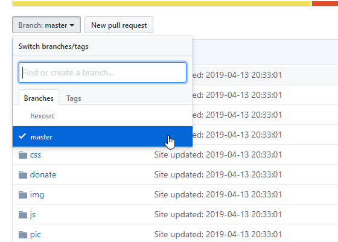

本文共2800余字，预计阅读时间12分钟，本文同步发布于知乎（账号silaoA）和微信公众号平台（账号伪码人）。
关注学习了解更多的Cygwin、Linux技术。

理解本文内容需有git、github、hexo基本的预备知识。在网上搜索hexo建立博客站的内容，通常只介绍到在本地预览及推送到github，很少介绍内容版本管理。本文从github建repo开始，记录从零开始到博客站部署和版本管理过程。

<!--more-->

<!-- [toc] -->

# 0x00 目标与思路
本文有如下几个目标：
- 本地建立博客站；
- 输出的网页内容部署到github pages；
- 对文章原始文件使用git进行轻量级版本控制，同时便于多人/多台机器上协作。

`hexo`虽然可以较方便地通过git推送而部署博客站，但`hexo`是把输出的`Public`目录中的Web页面内容推送到`master`分支(默认，可 配置)，对更加重要的源文件反而不管不顾。那么，如何在便于`hexo`部署到github的同时又能把源文件管理起来呢？轻量级的思路是**分支**。

既然github pages默认反映repo的`master`分支内容，这也是`hexo`最后生成的结果，那么**用master分支跟踪hexo的输出，另用一个分支hexosrc跟踪源文件、主题、配置**等，再自然不过。但是，部署到github上的repo名称要求为`<username>.github.io`，hexo在本地博客站按sources、public、themes等目录组织，为了统一协调，不妨换个顺序。

提示：在进行下面的操作之前，确保本地已安装好`openssh`、`git`、`npm`、`hexo`，参考[hexo官方中文文档](https://hexo.io/zh-cn/docs/#%E5%AE%89%E8%A3%85)。

# 0x01 github新建repo并配置key
github pages要求用户/组织按照<username>.github.io名称建repo，其中`maser`分支内容反映到页面上。
1. 在github上新建名为`<username>.github.io`的repo，不添加其他任何文件，退出。
2. 为避免拉取和推送过程中反复输入账号密码，把本地公钥添加到github账户[设置](https://github.com/settings/keys)中，如果已在github账户部署好public key，这一步跳过；
```bash
ssh-keygen -t rsa -C <Email> # <Email>替换为git配置的用户邮箱
cat ~/.ssh/id_rsa.pub # 查看public key，复制内容到ithub账户设置页
ssh -T git@github.com # 测试ssh认证
```

经过这2步，github上已配好repo，下面就该在本地更新并向其提交了。

# 0x02 本地配好repo
在本地配置好hexo博客环境，让hexo自动推送输出文件至`master`分支。

3. 使用git协议克隆repo到本地 。
```bash
git clone git@github.com:<username>/<username>.github.io.git
```
4. 进入本地repo，并将`.git`移到别处，保证暂时是空目录。
```bash
cd <username>.github.io
mv .git <path_elsewhere> #将.git移到别处，否则下一步的hexo初始化无法进行
```
5. hexo初始化并安装必要软件包，写好配置（包括站点配置和主题配置）文件、markdown源文件。
```bash
hexo init
mv .git <path_elsewhere>
git clone https://github.com/tufu9441/maupassant-hexo.git themes/maupassant #安装maupassant-hexo主题，也可以选择别的或者就用hexo预装的landscape主题
npm install hexo-renderer-pug --save # 安装maupassant-hexo主题依赖
npm install hexo-renderer-sass --save  # 安装maupassant-hexo主题依赖
npm install hexo-deployer-git --save # 安装hexo部署插件，**必需**
npm install hexo-hey --save # 安装hexo后台管理插件，可选
```
6. 本地生成web页面并预览，确认无误后由hexo自动部署至github。
```bash
hexo s -g  # 本地生成web页面并预览
hexo d -g  # 本地生成web页面并部署至远端`<username>.github.io`的master分支
```

至此，可以看到hexo已在本地`<username>.github.io`下生成`public`和`.deploy_git`目录，文件与远端`<username>.github.io`的repo上master分支所见到的一致，在浏览器输入`https://<username>.github.io`可见博客站点页面，与在本地看到的效果一致，说明站点托管到github pages成功。本地编辑文件，由hexo生成页面并部署到github，这一系列流程已走通。


# 0x03 用新分支管理源文件
下面，将对markdown源文件进行版本管理。
7. 在本地repo创建并切换至`hexosrc`分支，追踪以下文件，确认无误后提交并推送至远端`<username>.github.io`的`hexosrc`分支。
   
   - .gitignore
   - README.md
   - _config.yml
   - source/
   - themes/
```bash
mv <path_elsewhere>/.git ./ #把刚才移出去的.git再放进来
git branch #查看本地repo的分支
git remote -v #查看repo远程主机信息，可以看到只有名为origin的主机
git checkout -b hexosrc #创建并切换至hexosrc分支
git add . #编辑完源文件后加入追踪，其中.gitignore写明忽略追踪文件的规则；也可以手动逐个文件（夹）添加，themes下maupassant中存在.git目录，即仓库中有子仓库，git add会失败，可以删除maupassant中的.git目录再添加，**注意**不是`<username>.github.io`下的.git
git status #确认下repo的状态
git commit -m "hexosrc分支首次提交，追踪源文件、theme和配置" 
git push origin hexosrc:hexosrc #推送本地hexosrc内容至远程主机的hexosrc分支
```
   
在github上看到`<username>.github.io`的repo中已有两个分支：`master`和`hexosrc`。其中`master`分支只有`hexo`最终生成的页面文件，`hexosrc`分支只有源文件。`git`在本地repo只需要在`hexosrc`分支工作就可以了，除非有额外需求并不需要更多分支。

# 0x04 在其他机器上协作
现实工作中，可能不止在一台机器上工作，如要在多台机器上协作，最简单直接的办法就是把整个`<username>.github.io`复制到另一台机器上，编辑修改文档之后提交并推送到远程主机的hexosrc分支。远程主机repo更新了，在任一机器上，直接拉取即可实现同步更新。

若是现实环境没法直接复制整个repo，那就按照上述2~7的步骤，拼凑一个本地repo来，但注意以下事项：
- 克隆第2步所指远端`<username>.github.io`的**hexosrc分支**，如果在工作机器上已克隆过repo，那么只需要拉取远端`<username>.github.io`的**hexosrc分支**即可；
```bash
git clone -b hexosrc git@github.com:<username>/<username>.github.io.git # 克隆hexosrc分支时会自动进入hexosrc分支
```
  or
  ```bash
  git checkout hexosrc && git pull origin hexosrc #切换到hexosrc分支再拉取更新
  ```

- 第4步要把repo中**所有内容**暂移别处，不仅仅是.git；
```bash
mv ./ <path_elsewhere>
```
- 第5步不需要再安装maupassant-hexo主题，因克隆repo时已包含；
- 第7步不仅仅是将暂移别处的.git目录放回来，而是**所有内容**；
```bash
mv <path_elsewhere> ./ 
``` 
- 第7步编辑修改文档之后，再回到第6步预览，直至确认无误再提交和推送。

---
**如本文对你有帮助，或内容引起极度舒适，欢迎分享转发或点击下方捐赠按钮打赏** ^_^