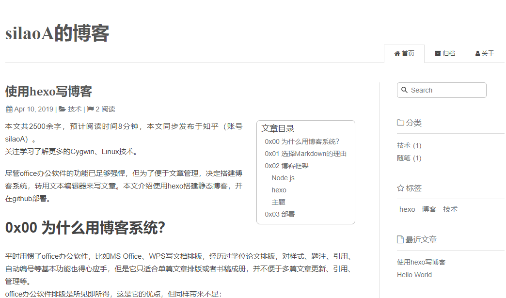

本文共2500余字，预计阅读时间8分钟，本文同步发布于知乎（账号silaoA）和微信公众号平台（账号伪码人）。
关注学习了解更多的Cygwin、Linux技术。

尽管office办公软件的功能已足够强悍，但为了便于文章管理，决定搭建博客系统，转用文本编辑器来写文章。本文介绍使用hexo搭建静态博客，并在github部署。

<!--more-->

<!-- [toc] -->

# 0x00 为什么用博客系统？
平时用惯了office办公软件，比如MS Office、WPS写文档排版，经历过学位论文排版，对样式、题注、引用、自动编号等基本功能也得心应手，但是它只适合单篇文章排版或者书稿成册，并不便于多篇文章更新、引用、管理等。
office办公软件排版是所见即所得，这是它的优点，但同样带来不足：
+ 内容与表现形式混杂在一起，如果要更换表现形式，必须逐一修改排版样式；
+ 格式私有，脱离了office办公软件，内容无法呈现，不同版本的office软件之间也存在不兼容性。

博客系统非常适合将零散的文章集中管理：
+ 内容与表现形式分离，写文档时专注内容即可；
+ 自动生成排版样式，要更换样式也非常方便，以Web页面呈现，只需浏览器打开即可，如果只想看内容，随便选个文本编辑器即可；
+ 可以将各个文档按照分类、标签等方式组织；
+ 可以部署建站。

# 0x01 选择Markdown的理由
Markdown是一种轻量级标记（Markup）语言，语法仅有简单的几条，要上手非常快。
主流托管平台都采用Markdown语言让用户撰写文档内容。个人随意拿个趁手的文本编辑器撰写好文档，复制进去即可。不同的编辑器或多或少对Markdown语法都有支持（非要用记事本那就算了），甚至支持排版效果预览。
本文不打算介绍Markdown语法，网上随便搜都能找到各种教程，比如 [Markdown简明介绍](https://mazhuang.org/markdown-intro/) 。

# 0x02 博客框架
有多种博客框架供选择，本人选择hexo，因其相对轻量、简单。hexo是Node.js开发平台的博客框架，采用javascript语言编写，要运行hexo，需要有Node.js运行时支持。
## Node.js
很不幸Node.js不支持Cygwin，没有适用于Cygwin环境的Node.js软件包，也无法在Cygwin中源码编译。但Node.js原生支持Windows，但是当你真要在Windows上安装、跑Nodejs，你会遇到一个又一个坑，比如安装某些包的时候需要编译工具，在Windows上一般指向Visual Studio，这么个庞然大物实在太重，再比如有时候Visual Studio编译也不支持。
为此，我选择WSL。WSL比虚拟机轻量，直接支持Linux二进制文件，一众票Linux工具命令也可以在WSL中跑起来。
在Windows中跑UNIX/Linux兼容环境，优先选Cygwin，如果有时候Cygwin也不行了那就选WSL。
要了解更多有关Node.js内容，访问 [Node.js中文网](http://nodejs.cn) 或者 [nodejs官网](https://nodejs.org) 。

## hexo
**hexo最大的作用，是将Markdown文本转换为Web页面，还内置了一个Web服务器，方便本地预览渲染效果。** hexo还支持在Markdown文本中使用 [Front-matter](https://hexo.io/zh-cn/docs/front-matter)定制部分选项，这超出了Markdown的语法规定，要取消或者迁移到其他博客框架的话，注释即可。
本文不打算介绍怎么使用hexo，直接参考 [hexo官网中文文档](https://hexo.io/zh-cn/docs) 。

## 主题
hexo支持选用某种主题渲染Markdown文本，hexo官网列出了许多受欢迎的![主题] (https://hexo.io/themes)。
hexo自带了一款轻量主题landscape，默认配置好，开箱即用。但是本人偏好简洁风格，推荐如下：
+ [maupassant-hexo](https://github.com/tufu9441/maupassant-hexo)
+ [hexo-theme-sky](https://github.com/iJinxin/hexo-theme-sky)
+ [hexo-theme-cafe](https://github.com/giscafer/hexo-theme-cafe)

本人偏爱简洁清爽风格，博客使用了maupassant主题，渲染效果如图：

# 0x03 部署
如果仅是为了建博客站，完全可以从头手工编写html+css+javascript，但框架存在的意义就是辅助我们完成这些繁琐的细节工作，专注于创作内容，解放双手。
hexo支持Markdown文本目标，一条命令`hexo g`生成Web页面，同时还内置了Web服务器，一条命令`hexo s`即可在本地运行，在浏览器输入地址即可看到生成好的页面。这相当于把博客网站部署在本地，但我们写好的文档，更希望有更多人在网上看到，需要部署到固定的网站上。
github很好地满足了这一需求，github支持静态网页托管。要了解如何将博客部署到github，网上搜索`hexo github部署`，再此前**先参考[hexo官网中文文档](https://hexo.io/zh-cn/docs)**。

---
**如本文对你有帮助，或内容引起极度舒适，欢迎分享转发或点击下方捐赠按钮打赏** ^_^