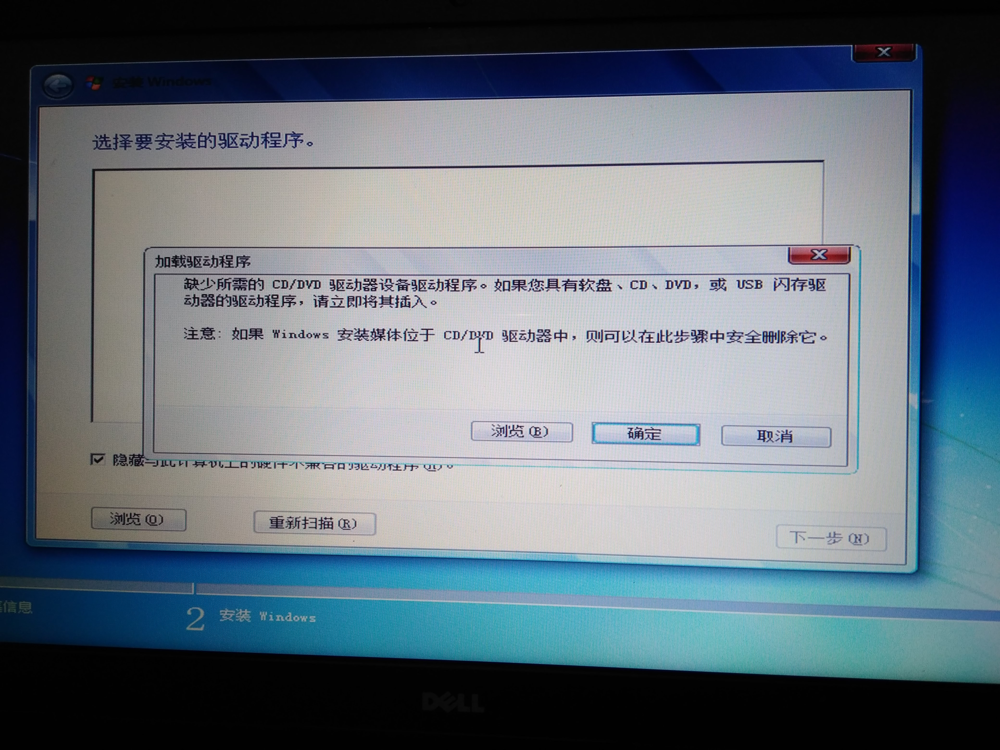

本文共1500余字，预计阅读时间6分钟，本文同步发布于知乎（账号silaoA）和微信公众号平台（账号伪码人）。
关注学习了解更多的Cygwin、Linux、Python等技术。

给笔记本电脑装系统，本是件稀松平常的事情，时至今日（2019年8月）Windows 7已成为老旧系统，在10多年后的硬件上出现了水土不服。本文记录在Dell笔记本电脑安装Windows 7遇到“缺少所需的 CD/DVD 驱动器设备驱动程序”报错，以及解决过程。

<!--more-->
<!-- [toc] -->

# 0x00 常规操作
朋友的Dell笔记本电脑，换了固态硬盘，打算安装Windows 7，系统镜像为微软原生版本，试过PE、启动盘多个方法，总是存在问题而安装失败。
交给我后，做了如下常规操作：
1. 进入BIOS，对Secure Boot、Legacy BIOS兼容、引导介质顺序等选项做了确认；
2. 在U盘安装Windows PE环境，从U盘启动，确认了固态硬盘的分区表；
3. 在PE环境下，使用`Windows安装器`安装Windows 7旗舰版，但在重启后计划进入`sysprep`阶段时，引导失败，屏幕报错“缺少可引导介质”。

至此，确认了硬盘分区、BIOS设置是没问题的，同时放弃了PE环境`Windows安装器`的方法。

# 0x01 问题显现
将U盘格式化，使用`rufus`直接制作USB启动盘，使用`rufus`默认分区方案。从U盘引导启动顺利，熟悉的Windows安装程序界面也已出现，就在准备选择安装磁盘时，弹出“缺少所需的 CD/DVD 驱动器设备驱动程序”报错。



改换另一个老旧的U盘，使用相同方法制作成USB启动盘，从U盘引导启动顺利，熟悉的Windows安装程序界面也已出现，然而尴尬的是鼠标只能在屏幕左上角显现，移动、点击均无反应，键盘输入正常。

在网上包括微软官网查询了相关问题，给出的原因是，**Windows 7已属老旧系统，原生镜像未包含USB 3驱动，在新一代CPU、固态硬盘、USB 3.0接口U盘时会出现安装问题**，给出的方案包括：
- 更换老旧的U盘制作启动盘，或者插到USB 2.0的接口，重新启动；
- Windows安装程序到了报错的时候，重新插U盘，选择驱动程序路径；
- Intel官网下载`Windows 7 USB 3.0 Creator Utility`，往镜像里注入USB 3驱动。

以上方案尝试均未起作用，Intel官网也没有`Windows 7 USB 3.0 Creator Utility`页面。

# 0x02 问题解决
在搜索`Windows 7 USB 3.0 Creator Utility`时发现，Intel官网虽然没有了页面，但找到了Intel为Windows 7提供的USB 3.0设备驱动[介绍](https://downloadcenter.intel.com/download/26254/Intel-USB-3-0-Device-Driver-for-Windows-7-for-NUC6i7KYK)，也找到了相关文档，问题描述跟前面报错一样。

对照文档，了解了整个解决方案的思路：构造一个“Admin system”文件夹，准备好Intel USB 3.0 XHCI设备驱动程序，利用`dism`重新打包生成新的install.wim和boot.wim，再放回原启动盘里。

假使“Admin system”根路径为`C:\win7`，文件布局如下：
```bat
C:\win7\
    intall.wim      : 从启动盘sources目录下复制而来
    boot.wim        : 从启动盘sources目录下复制而来
    mount\          : 临时文件夹，用于挂载映像文件
    USB3\           : 手动创建
        x64\        : USB 3（64位）驱动程序路径 <- Intel_USB_3.0_xHC_Driver_AlpineRidge_PV_5.0.0.32\Drivers\Win7\x64
```

`dism`工具注入USB 3.0驱动程序，分为3个过程：①改造`install.wim` ②改造`boot.wim`第一阶段 ③改造`boot.wim`第二阶段。可以使用`dism`命令行完成改造工作，也可以使用`dismgui`图形界面程序完成。由于未下载到`dismgui`，本文使用`dism`命令逐句操作，以下命令在一台运行着Windows系统的电脑上使用管理员身份打开cmd窗口再执行。
```bat
REM 挂载install.wim，注意index选项后的4,4是旗舰版、3是专业版、2是家庭专业版、1是家庭普通版
dism /Mount-wim /WimFile:"c:\win7\install.wim" /index:4 /MountDir:"c:\win7\mount"
REM 增加USB3（64位） 驱动
dism /image:"c:\win7\mount" /Add-Driver /driver:"c:\win7\USB3\x64" /ForceUnsigned /recurse
REM 提交修改至install.wim并卸载
dism /Unmount-wim /mountdir:"c:\win7\mount" /commit

REM 同样的操作施加于boot.wim(阶段1，注意index选项值是1)
dism /Mount-wim /WimFile:"c:\win7\boot.wim" /index:1 /MountDir:"c:\win7\mount"
dism /image:"c:\win7\mount" /Add-Driver /driver:"c:\win7\USB3\x64" /ForceUnsigned /recurse
dism /Unmount-wim /mountdir:"c:\win7\mount" /commit

REM 同样的操作施加于boot.wim(阶段2，注意index选项值是2)
dism /Mount-wim /WimFile:"c:\win7\boot.wim" /index:2 /MountDir:"c:\win7\mount"
dism /image:"c:\win7\mount" /Add-Driver /driver:"c:\win7\USB3\x64" /ForceUnsigned /recurse
dism /Unmount-wim /mountdir:"c:\win7\mount" /commit
```
最后，将C:\win7（“Admin system”）下新的`install.wim`、`boot.wim`复制至启动盘`sources`目录，替换掉原来的版本，重新引导，安装正常。

# 参考
- [rufus官网](https://rufus.ie/zh_CN.html)
- [Intel USB 3.0 XHCI设备驱动下载链接](https://downloadcenter.intel.com/download/26254/Intel-USB-3-0-Device-Driver-for-Windows-7-for-NUC6i7KYK)
- [Windows 7镜像注入USB 3.0驱动用户文档](https://www.intel.com/content/dam/support/us/en/documents/mini-pcs/nuc-kits/Install-Win7-to-USB3_0-Computers.pdf)
- [DISM命令行选项](https://docs.microsoft.com/zh-cn/windows-hardware/manufacture/desktop/dism-image-management-command-line-options-s14)

# 更多阅读
* [Cygwin前传：从割据到互补](2019-02-05-Cygwin前传：从割据到互补.html)
* [Cygwin系列（一）：Cygwin是什么](2019-02-14-Cygwin系列（一）：Cygwin是什么.html)
* [Cygwin系列（九）：Cygwin学习路线](Cygwin系列（九）：Cygwin学习路线.html)
* [Linux Cygwin知识库（一）：一文搞清控制台、终端、shell概念](2019-04-04-Linux Cygwin知识库（一）：一文搞清控制台、终端、shell概念.html) 
* [Linux Cygwin知识库（二）：目录、文件及基本操作](2019-05-04-Linux Cygwin知识库（二）：目录、文件及基本操作.html)
* [Python项目如何合理组织规避import天坑](Python项目如何合理组织规避import天坑.html)

---
**如本文对你有帮助，或内容引起极度舒适，欢迎分享转发或点击下方捐赠按钮打赏** ^_^