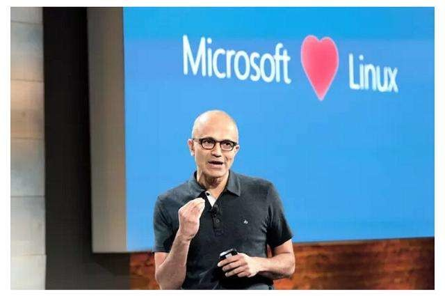
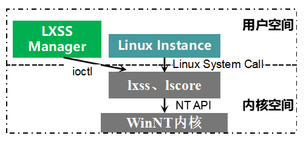

本文共3500余字，预计阅读时间11分钟，本文同步发布于知乎（账号silaoA）和微信公众号平台（账号伪码人）。
关注学习了解更多的Cygwin、Linux技术。

微软一年一度的[build大会](https://register.build.microsoft.com)都是Windows开发者的盛会，往往发布酷炫的软硬件产品和新服务。为期3天的build 2019抢在[Google IO 2019](https://events.google.com/io/)之前于2019年5月6日召开，在首日的主题演讲中微软发布了一系列软件和服务，其中就包括新一代WSL——**WSL2**和微软自家的终端模拟器**Windows Terminal**。

<!--more-->
<!-- [toc] -->

自从Satya Nadella执掌微软帝国以来，微软对开源社区态度发生180度转变，也不再视Linux为毒瘤，开始以实际行动践行“Microsoft love Linux”的誓言：微软的Azure支持Linux、开源.Net Core、开源VS Code、完善命令行对POSIX支持、搞`Windows Subsystem for Linux`黑科技、收购GitHub等。

微软在Windows上不断完善对命令行的支持，官方[开发博客](https://devblogs.microsoft.com/commandline/)中特辟了commandline系列，积极接受用户反馈。此次发布的`WSL2`和`Windows Terminal`颇受关注，也在博客中给出了相关说明。以下称原版`Windows Subsystem for Linux`为WSL1，新版为WSL2。

# 0x00 回顾WSL1
在前文[Cygwin系列（三）：盘点与Cygwin相似和相反的项目](/2019/2019-02-26-Cygwin系列（三）：盘点与Cygwin相似和相反的项目.html)简单介绍过WSL1。WSL1的机制，总体上是在运行时将Linux System Call**翻译**为NT API调用，从而在NT内核基础之上模拟实现Linux内核。微软官方博客[windows-subsystem-for-linux-overview](https://blogs.msdn.microsoft.com/wsl/2016/04/22/windows-subsystem-for-linux-overview/)描述了WSL1的架构组件，可以简化为下图。

- `LXSS Manager`是普通的win32进程，相当于Linux子系统驱动的代理，还负责管理Linux进程。Linux Instance不是普通的win32进程，微软称为`Pico Process`，是Linux EFL程序的宿主进程，实现了沙盒技术中的一种机制。
- `lxss`、`lscore`两个组件是WSL1的核心，负责将Linux程序中的System Call “翻译”为等价的NT API调用，如`fork`翻译为`NtCreateProcess`、`open`翻译为`NtOpenFile`，`kill`翻译为`NtTerminateProcess`等。这两个组件根据洁净室（clean room）原则构建，完全不含Linux代码。

WSL1在运行时处理Linux System Call，模拟Linux内核，在ABI层面保持兼容性。Cygwin项目的思路其实也是构建和`lxss`、`lscore`作用一样的模拟层，但外人是无从得知NT API的详细情况的，因此Cygwin项目只能在Win32 API基础上构建`Cygwin DLL`，只能在API层面保持兼容性。Wine项目的角色与WSL1、Cygwin类似，只是作用方向相反。

无论是在ABI还是API层模拟，Linux/UNIX与Windows NT毕竟是两类内核，**设计理念、设计标准等多方面差异甚大，无法实现完全对等模仿**，WSL1和Cygwin都无法兼容所有Linux System Call，Wine也无法兼容所有Win32 API。这就造成有的程序无法在WSL1中运行，源码也无法在Cygwin中重新编译；同样有的程序无法在Wine中运行，源码无法在Linux/UNIX中重新编译。

# 0x01 WSL2
也许是因为WSL1靠翻译System Call来模拟Linux内核的坑太大填不下去了，这种黑科技思路此次被微软完全抛弃，换成了虚拟机/容器的思路，仅仅是名字上延续了WSL，再也不是当初那个WSL了。**WSL2引入了修改版的Linux内核**，基于最新的[Linux 4.19](https://www.kernel.org)，这也是Linux内核最新的长期支持版，**新的内核经过了微软悉心改造**，以便与Windows相配合，获得更好的用户体验。根据官方博客的说法，这个微软自家出品的内核也将在不久之后在Github上开源，届时不仅可以更加清楚地了解WSL2工作机制，玩家还可根据自身需要随心定制。WSL2将Linux内核塞到一个轻量级的虚拟机（Virtual Machine，VM）中运行，使用过程与WSL1保持一致，VM的启动、管理都藏在背后。

使用虚拟机的方式带来了运行效率和兼容性两方面的提升。根据微软自己的测试，与WSL1相较，在WSL2中解压zip文档速度提升了惊人的20倍，使用`git clone`、`npm install`、`cmake`提升大约2~5倍。由于使用了真正的Linux内核，意味着WSL2全面兼容Linux System Call，理论上能在GNU/Linux上运行的程序也都能在WSL2中不经修改直接运行。另外还带来一个好处是，可以更新Linux内核换取更高的效率和安全性，背靠微软这棵大树更新（微软背靠Linux基金会大树）。 

WSL2首个版本会在2019年6月底Windows insider中推送。

# 0x02 Windows Terminal
Windows以图形界面起家而大获成功，但长久以来Windows对命令行的支持欠缺饱受诟病，命令提示符/Powershell界面丑陋、cmd/Powershell解释器语法怪异、不支持POSIX标准，最重要地没有GNU、BSD系的众多高效命令程序。在社区反馈下，微软近几年也在不断努力完善命令提示符、cmd解释器、PowerShell，如增加Unicode/UTF8支持、24色支持、更好看的字体、更灵活的配置等，但在Windows Console API上修修补补，始终是治标不治本。

此次微软发布的Windows Terminal是一款终端模拟器（terminal emulator）。老兵命令提示符、PowerShell继续履行历史兼容的职责，**Windows Terminal抛掉了历史包袱另起炉灶**，支持连接WSL、cmd解释器、Powershell、Powershell Core、SSH远程主机，主要有以下几个功能特性：
- 多标签页，这也是对众多终端模拟器呼声最高的功能需求，不同的标签页可以连接上述不同的解释器/主机，即同时可以作为本地终端和远程终端使用；
- 美化字体，使用GPU加速的字体渲染引擎，支持常规字符、特殊符号、emoji、图标，而且相较原来Console的GDI引擎速度更快，微软给终端另外配备了一款现代的等宽型字体；
- 灵活配置，以结构化文本保存设置项，可以给每个标签页、应用程序独立配置。

build大会之后，Windows Terminal在[github](https://github.com/Microsoft/Terminal)一经开源便迅速冲上人气榜，预览版将于2019年夏天在Windows Store中提供。

# 0x03 小结
市面上已经有相当不错的终端模拟器，如Comemu、putty等，相对来说Windows Terminal只是个锦上添花的产品，没有WSL，Windows Terminal只是个好看一点的命令提示符而已。

Win10确确实实因WSL而不同，不管微软选择hard模式的黑科技路线还是常规无奇的虚拟机路线，对于用户而言，只要达成在Windows上高效运行Linux ELF程序这个目的就足够了，更何况虚拟机路线在运行速度、兼容性方面都有了很大的提升。可以说，**一个Win10=Windows+Linux Server+Terminal**，在Win10上同时享受Windows图形界面和Linux命令行的待遇，而且这两部分还有着很好的互操作性，图形界面和命令行不必彼此隔离，不必担心顾此失彼。

对比各种GNU/Linux桌面发行版惨淡的硬件驱动支持、图形环境与生俱来的不稳定性和低效、二流水准的界面设计，以及不同发行版之间严重的分裂（不一致性），**Win10绝对担当得起最佳Linux发行版的称号。**

诚如一部分评论所言，微软未来在不断优化WSL的同时，可能对NT内核也做出相应调整。想想[Cygwin系列（三）：盘点与Cygwin相似和相反的项目触屏9-02-26-Cygwin系列（三）：盘点与Cygwin相似和相反的项目.html)所述毛德操教授发起的[Longene](https://github.com/tsuibin/longene)项目半途废止，统一内核的宏愿在Win10上实现亦未可知。

# 参考
- <https://blogs.msdn.microsoft.com/wsl/2016/04/22/windows-subsystem-for-linux-overview/>
- <https://devblogs.microsoft.com/commandline/announcing-wsl-2/>
- <https://devblogs.microsoft.com/commandline/shipping-a-linux-kernel-with-windows/>
- <https://devblogs.microsoft.com/commandline/introducing-windows-terminal/>

---
**如本文对你有帮助，或内容引起极度舒适，欢迎分享转发或点击下方捐赠按钮打赏** ^_^